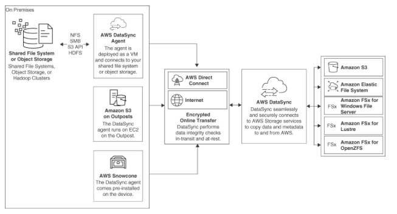

AWS DataSync
---

- A data transfer service for moving `large amounts` of data between on-premises storage and Amazon S3, Amazon EFS, or Amazon FSx` for Windows File Server.
- can `transfer data between any NFS, SMIB, or Amazon S3-compatible storage`, so you can use it to move data between a variety of different storage solutions.
- enables you to `sync data from an on-premises NFS storage array into EFS storage`.
- provides `end-to-end security with encryption and integrity validation` for `in-transit and at-rest` security.
- is available as an `installable agent` that is `installed to your AWS account`.
- used to `copy files` from EFS file systems `hosted in different AWS regions` and to transfer data between AWS storage services with the exception of EBS volumes.
- is much faster than standard Linux copy commands: `uploads utilize encrypted parallel data transfer` to the selected storage destination.
- securely accesses AWS storage controlled by a service-linked IAM role.
- supports `connections to VPC endpoints`, allowing the transfer of data using the private AWS network.

> Fig: AWS DataSync
