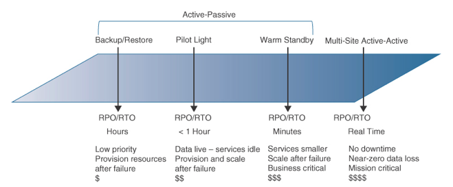
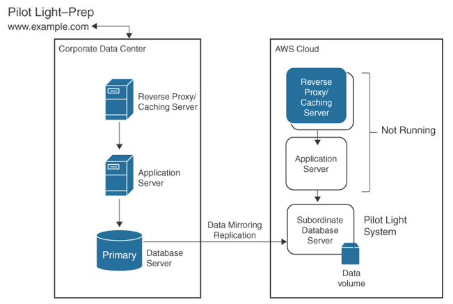
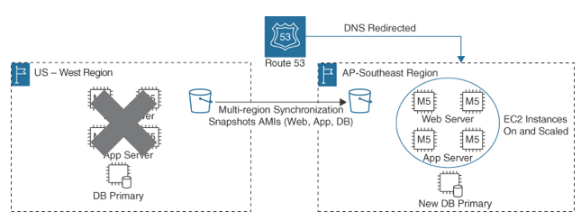
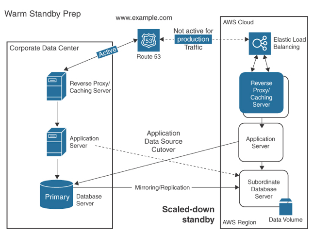
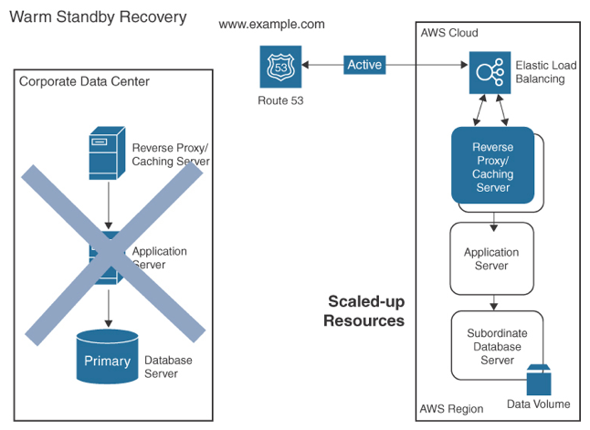
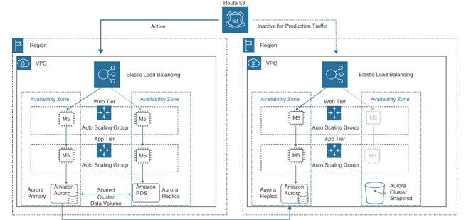
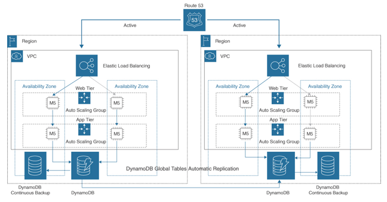

Disaster Recovery
---

# Disaster Recovery Metrics

## Recovery point objective (RPO)

- RPO is defined as the `maximum acceptable amount of time since the last data recovery point or the acceptable loss of data`.
- If your RPO is defined as 5 minutes, then the disaster recovery process needs to be designed to restore the data records to within 5 minutes of when the disaster occurred.

## Recovery time objective (RTO)

- RTO is defined as the `maximum acceptable delay between a service interruption and a return to normal service`.
- If RTO is set to 1 hour, for example, the workload should be up and functional within that 1-hour time-frame.

> Fig: Disaster Strategies Compared

# Pilot Light

- A disaster recovery pilot light is a disaster recovery strategy in which a `minimal system is kept running at all times, ready to be expanded into a full-scale workload in the event of a disaster`.
- Pilot light deployments could have synchronized database records and idle compute services.
- The `primary site` could be on premises in an AWS AZ or regional location.
- The `standby web and application servers` are ready to launch but are not powered on.
- The primary database server located in the primary site `replicates data updates and changes to the standby database` server.
- When planning the AWS location for your disaster recovery site, the compliance rules and regulations that your organization adheres to may dictate which region should be used. In addition, you might want the DR location to be as close as possible to your physical corporate location if latency is a concern.

> Fig: Pilot Light Setup

> Fig: Multi-region Pilot Light Response

# Warm Standby

- A warm standby solution `speeds up the recovery time` because all the components in the warm standby location are already in active operation—hence the term warm—but at a `smaller scale of operation` when compared to the primary site.
- The secondary system in the standby location is maintained and updated in a similar manner to the system’s primary location, but it is not actively in use.
- In the event of a disaster, the warm standby `can be quickly activated and replace the primary`, enabling the organization to maintain critical operations and minimize downtime.
- Warm standby is `more comprehensive than a disaster recovery pilot light`, because the secondary system location is fully functional and ready for use instead of being a minimal recovery solution that needs to be turned on and scaled.
- Standby web and workload servers are online and in operation.
- The `database servers are also online and functional`, and load balancing (ELB) and auto-scaling (EC2 Auto Scaling) have been deployed.

> Fig: Warm Standby Setup

> Fig:  Warm Standby Response

AWS Multi-Region Service With  AWS Continuous Asynchronous Replication
---

- Amazon S3 Multi-region access points
- Amazon RDS read replicas
- DynamoDB multi-region tables

## Active-Active Failover

- refers to a scenario in which `two or more systems are operating simultaneously` and either system can take over if web, databases, or storage services fail or become unavailable.
- allows for `increased availability and reliability` of the system because there is always a backup server ready to take over in the event of a failure.
- Two or more AWS regions can accept requests. When a failure occurs, requests are rerouted from the region with issues to the other AWS region.

> Fig: Warm Standby with Aurora Global Database

> Fig: DynamoDB Deployed as a Global Table

<h1 style="background-color:lightgreen"># Single and Multi-Region Recovery Cheat Sheet</h1>

- Availability goals are typically defined as a percentage such as 99% or 99.9%.
- Recovery solutions could use AZs within a single AWS region, or use multiple AWS regions, for failover and recovery.

## Single or Multi-Region Scenario Tasks

Task  | 99% Scenario  | 99.9% Scenario  | 99.99% Scenario | 99.999% Scenario (Multi-Region)
--  | --  | --  | --  | --
Monitor resources | Monitor website OK status | Amazon CloudWatch metrics and | alarms for web and DB tier issues | Amazon CloudWatch success and failure metrics with alerts for web and DB tier issues  | Amazon CloudWatch metrics and alarms for all web, database, and region failure
Adapt to changes in demand with automated responses | Hardware failures, software updates | EC2 Auto-Scaling based on 70% CPU utilization | AWS Auto-Scaling and Aurora with regional read replicas  | Auto-scaling and Aurora multi-region database with regional read replicas
Implement changes | CloudFormation stacks | CloudFormation stacks | Blue/green or canary deployments on schedule  | Blue/green or canary deployments every month
Back up data  | Back up to Amazon S3; enable Versioning; WORM policy  | Amazon RDS backups (snapshots transaction logs); backup to Amazon S3; enable Versioning; WORM policy  | RDS backups (snapshots, transaction logs); backup to Amazon S3; enable Versioning; WORM policy  | RDS backups (snapshots, transaction logs); backup to Amazon S3; enable Versioning; WORM policy
Architect for resiliency  | One region, one AZ  | Two AZs; ELB; Auto Scaling; RDS Multi-AZ; ELB health checks | Three AZs; Aurora read replicas in each zone; Amazon CloudFront CDN  | Three AZs; Aurora read replicas in each zone; Amazon CloudFront CDN; regional failover
Test resiliency | Limited testing of EC2 instances  | Limited testing of EC2 instances  | Game day testing  | Game day testing
Disaster recovery | Redeploy in same or alternate AZ  | Recovery with runbooks  | Recovery with runbooks using regional backups | Active-active multi-region deployment; workload and data operating in separate AWS regions
Availability  | Recover from failure in 2 hours | Recover from failure in 1 hour  | Recover in 15 minutes | Recover within 1 minute automatically

<h1 style="background-color:lightgreen"># Disaster Recovery Cheat Sheet</h1>

## Single Region DR

- Multiple AZs and ELB provide high availability for Amazon EC2 instances and Amazon ECS.
-  `Multiple AZs, ELB, and EC2 Auto Scaling` provide high availability, automatic scaling, and self-healing web and workload tiers.
- Amazon `Aurora` can be deployed as a regional deployment `across three AZs` per region.
- Use AWS Backup to back up AWS data resources and hybrid VMware deployments to S3 storage.

## Multi-region DR

- Route 53 health checks monitor the health and performance of web servers and are used to route traffic to healthy resources.
- `Route 53 health checks` monitor endpoints, other health checks, and CloudWatch alarms.
- `Route 53 DNS active-active failover` configurations are for scenarios where all resources are available. All records have the same record type and routing policy (for example, weighted, geo-proximity, or latency policies).
- `Route 53 DNS active-passive failover` configurations use Failover as the routing policy. Scenarios are where the primary resource is available, with secondary resources on standby when primary resources become unavailable.
- `Route 53 Workload Recovery Controller (ARC)` is a special health check that determines when workloads and resources are ready for recovery and coordinates the failover process.

## Single/Multi-region DR

- `Aurora` can also be deployed as a `global database` across multiple AWS regions.
- AWS `RDS` can be deployed `Multi-AZ` or in a `cluster` (primary plus two standby DB replicas).
- `DynamoDB` can be deployed as a regional deployment across `three AZs` per region or as a `global table` across multiple AWS regions.
- AWS `CloudFormation` can be used to define and deploy infrastructure across AWS Regions. AWS CloudFormation Stack Sets enables you to create and update CloudFormation stacks across multiple accounts and regions.

<h2 style="background-color:lightgreen"># AWS Service Quotas Cheat Sheet</h2>

- AWS Service Quota manages usage across AWS accounts and regions where workloads are running.
- Service quotas are tracked per AWS account.
- Service quotas are `region-specific`.
- Most service quotas are specific to the AWS region where the service is located, as most AWS services are region-specific. You can also create CloudWatch alarms for a specific quota and be alerted when you are close to reaching your quota.
