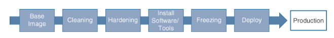

High Availability in the Cloud
---

Availability (%) | Potential Unavailability per Year | Use Case
-- | -- | --
99%     | 3 days, 15 hours    | Batch processing, data transfer
99.9%   | 8 hours, 45 minutes | Project management
99.95%  | 4 hours, 22 minutes | Point of sale (POS), online retail
99.99%  | 52 minutes          | Video delivery
99.999% | 5 minutes           | ATM transactions

> Availability = Uptime / (Uptime + Downtime)
> Availability with Dependency = A1 * A2 * ... * An
> Availability with Redundancy = 

-  Design with `security at all layers`, ensuring each service is as reliable and dependable and as responsive and as fast as it can be performance-wise, without sacrificing any security or reliability requirements.

Availability
---

- refers to the proportion of time that a system, service, or resource is able to function and be accessed as a percentage, indicating the amount of time that a system, service, or resource is expected to be operational and accessible to end users.
- is usually defined as a `percentage of uptime ranging from 99.9% to 100%` over a defined period, typically per year.

Availability (%)  | Potential Unavailability per Year | Use Case
--  | --  | ---
99%     | 3 days, 15 hours    | Batch processing, data transfer
99.9%   | 8 hours, 45 minutes | Project management
99.95%  | 4 hours, 22 minutes | Point of sale (POS), online retail
99.99%  | 52 minutes          | Video delivery
99.999% | 5 minutes           | ATM transactions

# AWS Regions and Availability Zones

## Region

- is located in a specific geographic area of the world.
- has, at a `minimum, two availability zones`.
- Additional data centers within each AWS region and availability zone locations host various AWS-managed cloud services for storage, databases, and managed services used by workloads.
- is completely isolated from other regions.

### Choosing an AWS Region

- Compliance rules
  - Where is your organization allowed to operate?
- Latency issues
  - How far away are your customers from the desired cloud service?
- Services offered
  - In what region is the cloud service that you require offered?
- Pricing
  - Are infrastructure costs the main driver for migrating to the cloud?

## Availability Zone

- physical locations within a region where data centers are located. 
- has a minimum of one data center for hosting `customer workloads`.
- Each AZ is `linked` to the other AZs in the same region through `private dedicated, redundant, low-latency fiber network connections` that Amazon owns.
- Design with multiple availability zones to provide `high availability, fault tolerance, and reliability`.
- are spaced apart by a minimum of 10–15 miles and are powered by different electrical grids and external support services such as ISPs and third-party services.
- Primary reasons for using AZs in your infrastructure design are high availability with automatic workload failover and primary/standby/read replica database replication.

## Local Zone

- is deployment of AWS infrastructure in a `single data center`, including compute, storage, and database services, resulting in single-digit millisecond latency speeds for customers located in these locations.
- can be associated with an AWS region by linking the Local Zone with an organization’s existing region’s AWS VPC network infrastructure by including Local Zone subnets.

## Wavelength Zones

- Compute and storage services in the telecommunications provider’s data center.

AWS Service     | What is it?   | FT and HA Use Case  | Deployment  | Considerations  | Use Case
--  | --  | -- | --  | --  | --
Amazon EC2 | Virtual servers  | Multiple AZs with ELB, EC2 Auto Scale | Requires Amazon Machine Image (AMI), VPC, security group  | Reserved pricing, Savings Plans, Spot Instances | On-demand, GPU; web apps; databases; EBS optimized, General purpose, and Memory Optimized instances
Amazon ECS  | Docker containers | A cluster of EC2 instances across AZs | Task Statement  | AWS Fargate management  | Hybrid environment, batch processing, microservices
Amazon EBS  | Virtual hard drives | Multiple copies | Attach to EC2 instances | SSD, IOPS, Throughput optimized, EBS Block Express, Lifecycle Manager (Snapshots) | Boot and data drives, Multi-attach
EC2 Auto Scaling  | Scale compute automatically | Across multiple AZs with ELB  | Scheduled, step, simple, target tracking, Predictive scaling  | Works with ELB and Elastic Beanstalk  | Automatically scale compute
AWS Auto Scaling  | Compute auto scaling  | Across multiple AZs | Predictive scaling  | Amazon EC2, Amazon ECS, Amazon DynamoDB, Amazon Aurora  | Automatically scale workloads
Amazon CloudFront | CDN | Origin Shield | Edge locations, Regional edge caches, HTTPS, Field-Level Encryption | Caching static content, Lambda@Edge, AWS WAF, OAI | Live streaming, distribute static and dynamic content
Application Load Balancer (ALB) | HTTPS load balancing service  | EC2 instance and Docker container failover, health checks | Supports operation across multiple AZs  | Routing based on host name, path, query string parameter, HTTP headers, source IP address, or port number | Server Name Indication (SNI) support for serving multiple domain names, authentication support, WAF
Network Load Balancer (NLB) | TCP load balancing service  | Workload failover, health checks, TLS end-to-end encryption | Supports operation across multiple AZs  | TCP, UDP, and TCP connections encrypted with TLS  | High performance, EIP support; supports targets outside of AWS

PCI Checklist for Compliance
---

PCI DSS Requirement | Details | Customer Responsibilities | AWS Responsibilities  | AWS Solution
--  | --  | --  | --  | --
Install and maintain firewalls to protect cardholder data | Shared responsibility | Firewalls on instances, firewalls at the subnet levels  | Firewalls at the cloud perimeter between AWS clients  | Security groups and network ACLs
Don’t use vendor defaults for passwords and security  | Customer’s responsibility | Workloads | Network devices | AWS Identity and Access Management (IAM)
Protect stored cardholder data  | Customer’s responsibility | Encrypted data  | Secured storage arrays  | AWS Marketplace
Encrypt transmission of cardholder data across public networks  | Customer’s responsibility | Encrypted transmissions | Supplied security controls  | VPN connections
Use and update antivirus software | Customer’s responsibility | Third-party software  | N/A   | AWS Marketplace options
Develop and maintain secure systems | Shared responsibility | EC2 instance  | Hypervisor security | Secure API calls and certificates
Develop and maintain secure workloads | Customer’s responsibility | On the instance | Hypervisor security | AWS Marketplace options
Restrict access to cardholder data  | Customer’s responsibility | Access controls | Physical security | AWS IAM
Assign unique IDs to each person with computer access | Customer’s responsibility | Access controls, password policy  | Strong authentication | AWS IAM
Restrict physical access to cardholder data | Amazon’s responsibility | N/A | Physical security | AWS responsibility
Track and monitor all access to network resources and cardholder data | Shared responsibility | Customer’s virtual environment  | Physical infrastructure and hypervisor  | CloudTrail, CloudWatch, and AWS GuardDuty
Test security systems and processes regularly | Shared responsibility | Customer’s virtual environment  | Intrusion detection system/intrusion prevention system (IDS/IPS)  | AWS Config and AWS Inspector
Define security policies for information security | Shared responsibility | Customer’s security policy  | ISO security policies | AWS IAM
Additional PCI DSS requirements for shared hosting providers  | Amazon’s responsibility | N/A | PCI DSS audits  | N/A

Single Points of Failure
---

- is a `critical component` in a system that, `if it fails, will cause the entire system to fail`.
- is a major concern in system design because they can lead to significant disruptions and downtime.
- To avoid SPOF, `design with redundant components or backup systems` in place.

Avoiding Single Points of Failure
---

Possible Single Point of Failure  | Mitigation Plan | Reason
--  | --  | --
On-premises DNS | Route 53 DNS  | Anycast DNS services are hosted across all AWS regions and edge locations. Health checks and traffic patterns support workload failover.
Third-party load balancer | Elastic Load Balancing (ELB) services | ELB load-balancers are deployed per AZ. Elastic IP addresses provide fast failover.
Web workloads | ELB/Auto Scaling  | Scale workload compute resources automatically up and down to meet demand.
RDS database servers  | Redundant data nodes (primary/standby/cluster)  | Synchronized replication between primary and multiple standby nodes provides a minimum of three or more copies of data.
EBS data volumes  | Snapshots and retention schedule  | Automatically copy snapshots across regions for additional redundancy using Lifecycle Manager.
Authentication problems | Redundant authentication nodes  | Multiple Managed AD domain controllers provide alternate authentication options.
Data center failure | Multiple availability zones | Each region has multiple AZs providing high-availability and failover design options.
Regional disaster | Multi-region deployment with Route 53 | Route 53 routing policy provides geo-redundancy for workloads hosted across AWS regions.

Planning for High Availability, Fault Tolerance, and Redundancy
---

AWS Service | High Availability | Fault Tolerance | Redundancy  | Multi-Region
--  | --  | --  | --  | --
EC2 instance  | Additional EC2 instance | Multiple availability zones | EC2 Auto Scaling  | Route 53 health checks
EBS volume  | Cluster design  | Snapshots | AMI | Copy AMI/snapshot
Load balancer | Multiple AZs  | Elastic IP addresses  | Server farm | Route 53 geoproximity load balancing options
Containers  | Elastic Container Service (ECS) | Fargate management  | Workload load balancer/Auto Scaling | Regional service not multi-region
RDS deployment  | Multiple AZs  | Synchronous replication | Snapshots/backup EBS data volumes and transaction records | Regional service, not multi-region
Custom EC2 database | Multiple AZs and replicas | Asynchronous/synchronous replication options  | Snapshots/backup EBS volumes  | Custom high-availability and failover designs across regions with Route 53 Traffic Policies
Aurora (MySQL/PostgreSQL) | Six copies of data replicated across three AZs  | Multiple writers  | Clustered shared storage VSAN | Multi-region deployment database hosted and replicated across multiple AWS regions
DynamoDB (NoSQL)  | Six copies of data replicated across three AZs  | Multiple writers  | Continuous backup to S3 | Multi-region deployment across multiple AWS regions
Route 53  | Health checks | Failover routing  | Multi-value answer routing  | Geo-location/geo-proximity routing
S3 bucket | Same-region replication | Built-in  | Built-in  | Cross-region replication

Immutable Infrastructure
---

- Immutable architecture is a design in which `select components of a workload`, such as a web or application server, `are replaced rather than modified or updated`.
- Changes are not allowed in immutable infrastructure; therefore, the state of an immutable server is always known.
- Creating an immutable server starts with an image called a golden image or golden AMI.
- Canary deployments should be used to minimize the risk of failure when new server versions are deployed into production.
- All servers (web, application, database) that are part of the same workload are `version controlled`.
- Immutable infrastructure is supported by the following services at AWS:
  - AWS CloudFormation
  - AWS Elastic Beanstalk
  - Amazon EC2 Auto Scaling
  - ELB Application and Network Load Balancers
  - Multiple VPCs can be created for dev, test, and production environments.
  - Amazon EC2 Image Builder with AWS CodePipeline
- Advantages:
  - they are `not affected by changes that might have been made to the old resources`.
  - it is `easier to revert to a previous version` of the system if necessary. 

> Fig: Deploying Immutable Servers

