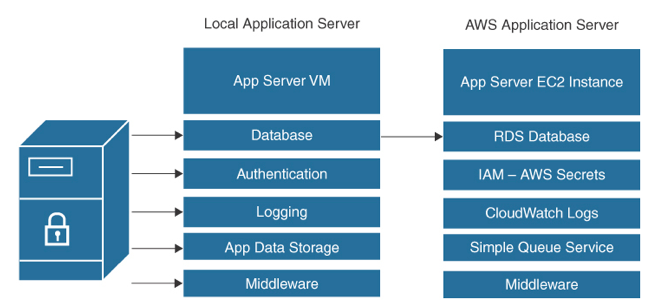

Resilient Architecture
---

# Stateful Versus Stateless Application Design

> Fig: Locally Hosted Application Server Versus AWS Hosted Server

## Advantages of Stateless design

- Scalability
- Fault tolerance
- Flexibility

Type of Data Stored | Stateful or Stateless | AWS Service
  -- |  --  | -- 
User account data | Stateful  | AWS Managed Active Directory (AD), Amazon Cognito, IAM Identity Center, IAM users and roles
Database queries  | Stateful  | Amazon RDS database/read replicas, DynamoDB and DAX
Session information data  | Stateless | DynamoDB, Amazon ElastiCache for Redis, Amazon ElastiCache for Memcached
Load balancer | Stateless | ELB, sticky sessions, cookies
Application state data  | Stateless | Amazon SQS, Amazon MQ
Event notification data | Stateless | Amazon Simple Notification Service (SNS), AWS EventBridge

