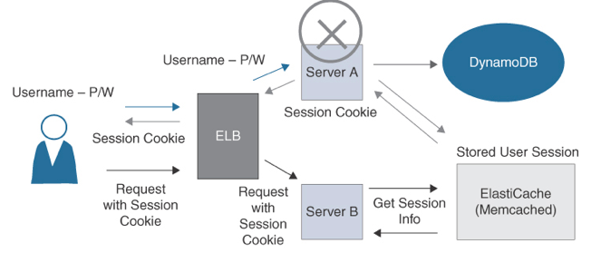

User Session Management
---

# Sticky Sessions

- When you deploy an ALB, you can `enable sticky sessions by changing the default attributes on the target group` of registered servers binding a user's session to a specific server.
- The term `sticky means` that `once a user session is started with a specific application server, the session will continue with that application server` until the user session has been completed.
- The `drawback` of sticky sessions is that `if the application server fails, session information is lost`.
- If an application creates its own session cookie, application-based stickiness can be selected. If an application does not generate a session cookie, duration-based stickiness can be selected, generating a load balancer session cookie.

# Distributed Session Management

- Another way to address `shared data storage for user sessions is to use an in-memory key-value store` hosted by Amazon `ElastiCache` caching the user session state.
- For a `simple deployment with no redundancy`, you could choose to employ ElastiCache for Memcached, but this solution provides no replication of the in-memory nodes.
- For a `redundant distributed session` solution, you could deploy ElastiCache for Redis, which `supports replicating` user session information between `multiple nodes across multiple availability zones` (AZs), adding redundancy and durability to the cached user session information.

> Fig: An ElastiCache for Redis Distributed User Session Cache

