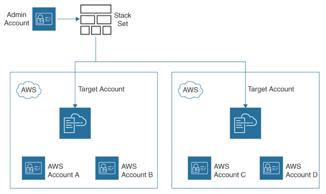

AWS CloudFormation
---

- enables developers to `create, manage, and deploy infrastructure` in the AWS cloud.
- is an AWS-hosted `orchestration engine` that works with `JSON and YAML` templates to `deploy AWS resources on demand` and on predefined triggers.
- Control variables can be added to each CloudFormation template to manage and control the precise order of the installation of resources.

# CloudFormation Template

- is an AWS `resource blueprint` that can create a complete application stack or a simple stack, such as a VPC network complete with multiple subnets, Internet gateways, and NAT services, all automatically deployed and configured.
- can have `multiple sections`. However, the only `mandatory section is Resources`.
- There are many standardized CloudFormation templates, called AWS Blueprints, available from AWS.

# Change Set Template

- helps visualize how proposed changes will affect AWS resources deployed by a CloudFormation template.

# Change Set

- is a `summary of changes` that will be made to a stack in AWS CloudFormation.
- allow you to `preview how your existing AWS resources will be modified` when a deployed CloudFormation resource stack needs to be updated.
- Select an original CloudFormation template to edit and input the desired set of changes. CloudFormation then analyzes your requested changes against the existing CloudFormation stack and produces a change set that you can review and approve or cancel.

## Change Set Update Behaviors:

- Updates with No Interruption
  - The resource is updated without disrupting the operation of the resource.
- Updates with Some Interruption
- Replacement
  - CloudFormation re-creates the resource during an update, which also generates a new physical ID.
  - CloudFormation first creates the replacement resource, then changes references from other dependent resources to point to the replacement resource, and then the old resource is deleted.
  - For example, if you update the Engine property of an Amazon RDS DBInstance resource type, CloudFormation creates a new resource and replaces the current DB instance resource with a new database instance.

# CloudFormation Stacks

- AWS has many sample CloudFormation templates that you can download from online CloudFormation documentation.

# CloudFormation Stack Sets

- enables you to `create a single CloudFormation template to deploy, update, or delete` AWS infrastructure across multiple AWS regions and AWS accounts.
- When a CloudFormation template is deploying infrastructure across multiple AWS accounts, the AWS resources that the template references must be available in the AWS account and region.
- Region-specific resources must be copied to each AWS region where the CloudFormation template is executed.
- For example, EC2 instances, EBS volumes, AMIs, and key pairs are always created in a specific AWS region. It is also important to review global resources such as S3 buckets created by the CloudFormation template to make sure there are no naming conflicts during creation, as global resources such as S3 bucket names must be unique across all AWS regions.
- Once a stack set is updated, all instances of the stack created are also updated.
- All corresponding stack sets are deleted if a stack set is deleted.

> Fig: A Stack Set with Two AWS Target Accounts

