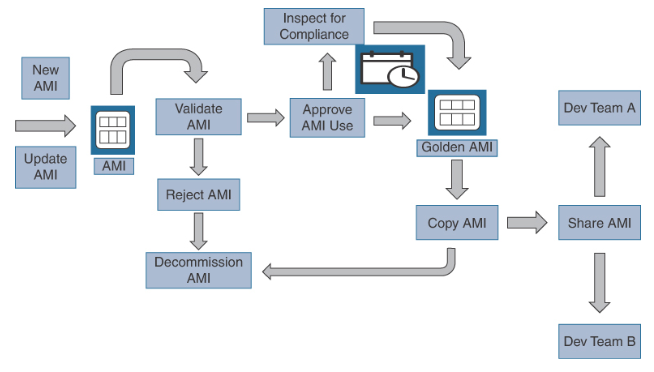
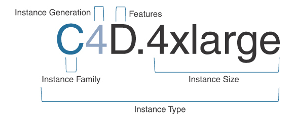

AWS EC2 Instances
---

- EC2 instances are `virtual servers` that let you run applications in the AWS cloud.
- Each EC2 instance is a virtual server running `Windows, Linux, or macOS` as a guest operating system hosted by the Xen or Nitro hypervisor.
- All new EC2 instances offered by AWS since 2017 are hosted on the Nitro hypervisor, called the Nitro System.

# Nitro System

## Nitro Hypervisor

- A lightweight hypervisor designed to provide efficient resource isolation and high performance for EC2 and ECS instances at bare-metal speeds.

## Nitro Security Chip

 Minimizes the attack surface for EC2 and ECS instances, protecting against physical attacks, and prohibits all administrative access, including AWS employees.

## Nitro Controller

Several what are called nitro cards offload I/O operations for increased performance, including the Nitro Card for VPC, Nitro Card for EBS, Nitro Card for Instance Storage, and the Nitro Security Chip.

## Nitro TPM

Provides cryptographic proof of EC2 instance integrity. The Trusted Platform Module (TPM) 2.0 helps migrate existing on-premises TPM workloads to EC2.

## AWS Nitro Enclaves

Enables organizations to create isolated and secure compute environments deploying EC2 instances deployed with hardware-based isolation and memory protection to securely process highly sensitive workloads such as financial transactions, healthcare data, and government applications.

# EC2 Configuration

- Amazon Machine Images (AMIs)
- Authentication using a unique public/private key pair
- Amazon Elastic Block Store (EBS) and/or temporary storage volumes
- A mandatory firewall called a security group that protects each basic or elastic network interface
- Basic or elastic network interfaces (ENI)
- Multi-tenant, single-tenant, dedicated, or bare-metal instance deployment

# Amazon Machine Images

- a `virtual machine image` used to launch EC2 instances.
- a `template containing a software configuration` including the operating system, application software, and any additional software or configuration required.

## AMI Components

### Boot volume
---

- can be either an EBS boot volume created from a snapshot or a local instance storage volume copied from an Amazon S3 bucket.
- are created `from EBS snapshots stored in AWS-controlled storage`.
- An EC2 instance storage volume has the root volume created from a template is stored in S3 storage.

### Launch permissions

- define the AWS account permitted to use the AMI to launch instances.
- Default launch permissions are set to private, which means that only the AWS account where the AMI was created can use that AMI.
- Launch permissions can also define a select list of AWS accounts.
- Switching AMI launch permissions from private to public means any organization in the overall AWS cloud has access.

### Volumes to Attach

- Volumes attached to the EC2 instance at launch are contained in a block device mapping document.
- Local instance temporary volumes are listed as ephemeral0 to ephemeral23, depending on the number of instance store volumes created.
- Instance ephemeral volumes are SSD or NVMe drives.

### Default Region

- AMIs are stored in the local AWS region where they are created.
- After creation, AMIs can be manually copied or backed up to other AWS regions as necessary.

### Operating System

- Choices are Linux, Windows, or macOS.

### Root device storage

- Amazon EBS or an EC2 instance storage volume.

## AMI Build Considerations

- Are your EC2 instances `in an Auto Scaling Group`?
- The EC2 instance and AMI are `documented` in the `Launch Template` or `Launch Configuration` used by the Auto Scaling Group.
- Are there `any licensing requirements`?
- How often do you `plan to update your AMIs`?
  - By default, AMIs supplied by AWS have security and maintenance updates applied to the repository for each supported AMI.

## Amazon EC2 Image Builder

- helps `organizations create, manage, and maintain customized AMIs`.
- You can `automate the process of building, testing, and distributing AMIs`.
- provides `prebuilt image pipelines` that enable you to `quickly create custom AMIs` without having to write any code.
- includes `built-in testing capabilities` that allow a variety of supplied tests and custom tests to validate the functionality and security of your AMIs before they are distributed.
- integrates with AWS IAM and Amazon S3 for secure distribution of AMIs to designated administrators and AWS accounts.

> Fig: Building and Maintaining AMIs

### Considerations when creating AMI for production

- Use AWS IAM `roles` and AWS `Secrets Manager` instead of embedding any `password/secret`.
- Use a `standard bootstrapping process with user data scripts` to customize the initial boot process.
- User data scripts allow you to `automate the initial boot of your instances with required updates and configurations`.
- Properly `tag your AMIs for identification purposes`.
- `Tags` can be used for `monitoring, automation, security`, and creating custom `cost and billing` reports.

# EC2 Instance Types

EC2 instances are members of several compute families grouped and defined using a name and generation designation. In each instance’s name, the first letter indicates the family that the instance belongs to (see Figure 13-1); the family dictates the resources allocated to the instance and the workloads that the instance is best suited for. The letter c stands for compute, r for RAM, and i for input/output operations per second (IOPS).

> Fig: Decoding an Instance’s Name

The next number in the instance name is the generation number. This number is very much like a software version number, so a c5 instance is newer than a c4 instance, and so on. (And, interestingly, a newer c5 instance is cheaper than the older c4 instance.)

The next letter, if present, indicates additional features that define the special characteristics of the instance. For example, in c4d, the “d” denotes solid-state drives (SSDs), for instance storage. The last component of the instance’s name deals with the size of the instance; this is sometimes called a T-shirt size. Sizes range from small up to 32 times larger than the smallest size. (The size of an instance is based on the number of vCPU cores, the amount of RAM, and the amount of allocated network bandwidth.) For example, c4.8xlarge is eight times larger than c4.Large in terms of vCPU cores, RAM, and network bandwidth. Note that this example does not have an additional number or letter that would indicate additional features.

When you run a smaller instance at AWS, a smaller portion of the physical server’s resources are allocated to the EC2 instance. When you run an x32-sized instance, you could possibly have all the resources assigned. Regardless of the instance type ordered, the allotted memory, vCPU cores, storage, and network bandwidth are isolated for each AWS instance. Customers are virtually isolated from each other, and this isolation is a key element of cloud security.

## What Is a vCPU?

AWS defines the amount of CPU power assigned to each instance as a virtual CPU (vCPU). A vCPU is a part of a physical CPU core. A process called hyperthreading associates two virtual threads to each physical core—an a thread and a b thread working in a multitasking mode (see Figure 13-2). You can think of each physical core as a brain that can be split into two logical brains; a thread is a communication channel that links each instance to a specific amount of processing power. Linux and Windows process these virtual threads differently: The Linux operating system enumerates the first group of “a” threads before the second group of “b” threads. The Windows operating system interleaves the threads, selecting the “a” thread and then the “b” thread. Dividing the vCPU count shows the actual physical core count, which might be important if the licensing for your software requires a physical core count (for example, an Oracle database).

## EC2 Instance Choices

- General purpose: General purpose instance types are well suited for a wide range of workloads, including web and application servers, development, and test environments, and small to medium-sized databases. Examples include the m4, m5, and t3 instance types.
Compute optimized: Compute optimized instance types are designed for compute-intensive workloads, such as batch processing, scientific simulations, and high-performance computing (HPC) applications. Examples include the c5, c6g, and c7g instance types.
Memory optimized: Memory optimized instance types are designed for workloads that require high memory-to-vCPU ratios, such as in-memory databases and real-time processing of large data sets. Examples include the r5 and x1e instance types.
- Storage optimized: Storage optimized instance types are designed for workloads that require high I/O performance or large amounts of local storage, such as data warehousing, Hadoop, and NoSQL databases. Examples include the d2 and h1 instance types.
GPU instances: GPU instances are designed for workloads that require graphics processing units (GPUs) for tasks such as video transcoding, machine learning, and scientific simulations. Examples include the p2 and g4 instance types.
Bare-Metal instances: For developers who like to host databases on bare-metal servers for maximum performance, a bare-metal server might be an acceptable option to consider. Bare-metal instances were first created for VMware to be able to host ESXi deployments at AWS. Examples include the m5.metal and zlb.metal.

# Dedicated Host

A Dedicated Host is a physical server with Amazon EC2 instance capacity dedicated to a single customer. A Dedicated Host enables you to use your own existing software licenses—for example, Windows Server or Microsoft SQL Server—and to meet compliance requirements. A Dedicated Host also allows you to control the affinity, or placement of your EC2 instances, on the Dedicated Host. Dedicated Hosts support per-socket, per-core, or per-VM software licenses. Here are some benefits to deploying Dedicated Hosts:

- Cost savings: Dedicated Hosts can be a cost-effective option for organizations that have many EC2 instances and can take advantage of volume pricing discounts.
- License compliance: Dedicated Hosts can help meet licensing requirements for software that requires a specific underlying hardware configuration.
- Improved security: Dedicated Hosts can provide an additional layer of security by isolating your instances on physical hardware that is dedicated to your use.

There are some AWS limitations and restrictions when ordering and using Dedicated Hosts:

- The instance size and type of instance placed on a Dedicated Host must be the same type.
- To run RHEL, SUSE Linux, and Microsoft SQL Server on Dedicated Hosts, AMIs must be provided by each customer. RHEL, SUSE Linux, and SQL Server AMIs provided by AWS on AWS Marketplace can’t be used with Dedicated Hosts.
EC2 instances hosted on a Dedicated Host must be launched in a VPC with single tenancy enabled.
Amazon Relational Database Service (RDS), placement groups, and EC2 Auto Scaling groups are not supported.
Billing charges are just the hourly charge for each active, dedicated server host; you’re not billed for the hosted instances on the dedicated host. Pricing is based on the on-demand dedicated host price or Reserved instance pricing.

## Dedicated Hosts Cheat Sheet

- Dedicated hosts are physical servers dedicated completely to your usage and targeting of instances.
- Dedicated hosts are useful for server licenses that require per-core, per-socket, or per-VM metrics.
- Each dedicated host can run one EC2 instance type.
- Billing is per dedicated host.

# Dedicated Instances

Organizations may choose to use a dedicated instance if compliance rules and regulations require complete compute instance isolation for a single virtual server. Each dedicated instance runs in a VPC on hardware resources dedicated to the customer. Dedicated instances have the same performance and security as instances hosted on a dedicated host but also have some limitations to be aware of, including the following:

- No access or control of the sockets and physical cores of the physical host is allowed.
- EBS volumes that are attached to a dedicated instance are standard EBS volumes.

# Placement Groups

Amazon EC2 placement groups are logical groupings of EC2 instances within a single AZ. Placement groups are used to ensure that instances are physically isolated from each other within the same AZ.

There are three types of placement groups:

Cluster placement groups: Cluster placement groups group instances that require low network latency and high network throughput. Cluster placement groups are recommended for applications such as HPC, big data, and other applications that require high-performance networking.
Spread placement groups: Spread placement groups are used to distribute instances evenly across distinct hardware. Spread placement groups are recommended for applications that have a small number of critical instances that should be kept separate from each other, such as database masters.
Partition placement groups: Partition placement groups are used to group instances across logical partitions so groups of instances in one partition do not share the underlying hardware with groups of instances located in different partitions. Recommended for large, distributed workloads, such as Kafka and Cassandra.

# Reserved Instances

Reserved instances (RI) are a cost-saving offering that enables you to reserve capacity for your Amazon EC2 instances in exchange for a discounted hourly rate. Reserved instances are automatically applied to running on-demand instances provided that the specifications match.

Once a Reserved instance is ordered, you will be charged the discounted hourly rate, which can be significantly lower than the on-demand rate. With Reserved instances, you pay for the entire term regardless of actual usage. You will be billed for the reserved term whether you run an instance that matches your reservation or not.

For EC2 instances or specific compute-related AWS services that are constantly in use, Reserved instance pricing will save a great deal of money. Organizations need to consider several variables when ordering Reserved instance pricing; for example, the AWS region they are operating in and the specific availability zone location. Note that a c5a.8xlarge EC2 instance is not available in each AZ in the Northern Virginia region, which has six AZs (see Figure 13-6). Reserved instance pricing can be ordered for standard 1-year or 3-year durations. A Reserved instance reservation provides a billing discount that applies to EC2 instances hosted in a specific AZ or region. The billing discount could be as high as 72% compared to the standard on-demand hourly rate. Each RI is defined by the following attributes:

Instance type: The instance family and the size of the instance
Scope: The AWS region or availability zone location of the Reserved instance
Regional: The AWS region location of the Reserved instance
Zonal: The AWS availability zone location of the Reserved instance
Tenancy: Shared default hardware or single-tenant, dedicated hardware
Platform: Windows or Linux

Once a purchased RI matches the attributes of a running EC2 instance in your AWS account, the RI is applied immediately. To reiterate: An RI is a billing discount; it is not an EC2 instance; rather, it is a billing discount that you have purchased for a type of EC2 instance.

For applications or web servers that are online and operational 24/7, RI pricing is essential. For example, selecting a c5a.8xlarge instance, the RI discount shown in Figure 13-7 could be as high as 75% when compared to the on-demand instance price.

## Term Commitment

A Reserved instance can be purchased for a 1-year or 3-year commitment; the 3-year commitment provides a larger discount.

## Payment Options

Reserved instance pricing has several options to consider. Paying all monies upfront results in the biggest discount (refer to Figure 13-7).

All upfront: Full payment at the start of the term; no other costs or charges will be incurred for the term.
Partial upfront: A portion of the cost must be paid upfront, and the remaining hours in the term are billed at a discounted hourly rate—regardless of whether the Reserved instance is being used.
No upfront: A discounted hourly rate is billed for every hour within the term—regardless of whether the Reserved instances are being used.

## EC2 Reserved Instance Types

There are two flavors of Reserved instances:

Standard Reserved instance: A standard Reserved instance gives you the biggest discount and can be purchased as repeatable 1-year terms or as a 3-year term. After you’ve purchased a standard Reserved instance, you can make some changes to your reservation: You can change the AZ where the instance will be hosted, the instance size, and the networking type. What happens if your needs don’t match the reservation that was purchased? You can register and try to sell your standard Reserved instance reservation through the Reserved Instance Marketplace.

Convertible Reserved instance: If you may have to change instance types, operating systems, or switch from multi-tenancy to single-tenancy compute operation—then you should consider a convertible Reserved instance reservation. The convertible reserved discount could be over 50%, and the term is a 1- or a 3-year term. A convertible Reserved instance reservation has more flexibility than a standard Reserved instance reservation because of the additional changes that can be made during the convertible Reserved instances term. However, you cannot sell a convertible reservation in the Reserved Instance Marketplace.

Reserved instance pricing reservations, once expired, do not automatically renew. Billing alerts can be created in the Billing Dashboard to warn when any pricing reservations are due to expire.

## Scheduled Reserved EC2 Instances
A scheduled RI reservation allows you to buy capacity reservations for a daily, weekly, or monthly term. The specific length of reservation time that can be requested is a maximum of 1 year. Once instances have been reserved as scheduled, you pay for the reserved compute time, regardless of whether the instances are used. You also can’t modify or resell a scheduled instance reservation.

Note

Scheduled instances are supported by c3, c4, c5, m4, and r3 instance types.

Regional and Zonal Reserved Instances

Scope is the important caveat related to the purchase of Reserved instances: The scope of the Reserved instance request is regional or zonal.

A Reserved instance for a region is a regional reservation that can be used anywhere in the region.

A zonal Reserved instance involves a discount for a specific AZ within an AWS region. A zonal reservation is also a capacity reservation for the selected AZ, in addition to the discounted RI price. Therefore, by purchasing zonal Reserved instances, the capacity—that is, the number of instances you wish to run in a specific AZ is defined.

The Reserved instance price is based on the AWS region in which the instances will be hosted.

- A zonal reservation provides you with a capacity guarantee per AZ as well as a discounted price.
- A regional reservation does not provide you with a capacity reservation; however, it provides flexibility to use the EC2 instances in any AZ.

## Regional Versus Zonal Reserved Instance Reservations

Factor  | Regional RI |Zonal RI
--  | --  | --
Availability zone flexibility | A discount applies to instance usage in any AZ in the region. | A discount applies to instance usage in the specified AZ only.
Reserve capacity  | A regional RI does not reserve capacity.  | A zonal RI reserves capacity in the specified AZ.
Instance size flexibility | A discount applies to any instance within the selected instance family, regardless of size, for Linux instances using default shared tenancy. | A discount applies to instance usage for the specified instance type and size only.
Queuing purchases | Regional RIs can be ordered for a future date and time to ensure that RI coverage continues at the regional level.  | RIs cannot be pre-purchased for zonal reservations; zonal reservations apply immediately after purchase.

When purchasing EC2 instances, you need to consider the following factors:

What AWS region are you going to be operating in?
How many AZs are you going to use?
How many EC2 instances do you want to run in each AZ?
What size of EC2 instance are you planning to run?
How many EC2 instances need to be running 24/7?
What are your AWS account limits for each on-demand EC2 instance type required per AWS region?
Do you need to request a service quota increase for each EC2 instance type to match your needs?
Do you require a Reserved Instance Standard or Convertible reservation?
Reserved instance pricing provides pricing discounts for many AWS Services that use on-demand instances by default at AWS. Table 13-5 shows the compute choices where RI can be applied.

# Savings Plans

Savings Plans are a cost savings option that provides discounts on Amazon EC2, AWS Fargate, and AWS Lambda usage in exchange for a commitment to a consistent amount of usage (measured in dollars per hour) for a one- or three-year term. You will be charged the discounted Savings plan price for your use of resources up to your defined commitment. For example, if you’ve committed to $50 of compute usage per hour, the savings plan price for that usage will be charged the commitment amount every hour; any computer usage beyond the defined commitment will be charged the current on-demand rate.

Three types of Savings Plans are available:

- Compute: Compute Savings Plans provide discounts on EC2 instance usage across all instance families, sizes, and regions, and on Fargate usage for all regions and AWS compute platforms.
- EC2 Instance: EC2 Instance Savings Plans provides savings up to 72% in exchange for a 1- to 3-year commitment to usage of EC2 instance families in a specific AWS region, regardless of availability zone, EC2 instance size, operating system, or tenancy. Customers can change instance sizes if staying within the selected EC2 instance family. EC2 instance usage will be automatically charged at the discounted price; compute usage beyond the per hour commitment will be charged at the current on-demand instance rate. Payment options are all upfront (which provides the best price break), partial upfront, and no upfront. A savings plan also works with AWS Organizations; benefits are applicable to all AWS accounts within an AWS organization.

- SageMaker: SageMaker Savings Plans helps you reduce SageMaker costs by up to 64% regardless of instance family, size, or AWS region.
Note

With consolidated billing, AWS treats all AWS Organization accounts as one account with regard to consolidated pricing. Usage data is combined from all AWS accounts belonging to the AWS organization, applying the relevant volume pricing tier providing the lowest total price on the consolidated resources.

# Spot Instances

A spot instance is spare compute capacity that AWS is not currently using that is available for much less than Reserved instance pricing. Organizations can potentially save up to 90% of their compute purchase price. However, if and when AWS takes your spot instance back, it only provides a 2-minute warning, and then—poof—your spot instance is gone. Spot instance pricing is based on EC2 availability, and as just mentioned, a spot instance is available until AWS reclaims it. Spot instances are not guaranteed to always be available; however, they are useful in these use cases:

- Batch processing: Spot instances can be used to run batch processing workloads, such as data analysis, machine learning, and video rendering. These types of workloads can be easily interrupted and are often time-sensitive, making spot instances a good choice.
- Test and development environments: Spot instances can be used to create test and development environments, where you can test new applications or perform experimentation.
- High-performance computing (HPC) workloads: Spot instances can be used to run HPC workloads, such as simulations and modeling, that require a large number of compute resources for a short period of time.
- Web servers and application hosting: Spot instances can be used to host web servers and applications, as long as the workload can tolerate the potential for interruption.

Spot instances can be used with EC2 Auto Scaling groups, Elastic Map-Reduce instances (EMR), the Elastic Container Service (ECS), and AWS Batch.

- Spot instance pool: The EC2 instances of the same instance type, operating system, and AZ location that are currently unused.
- Spot price: The current per-hour price of a spot instance.
- Spot instance request: Request for a spot instance, includes the maximum price you’re willing to pay. If you don’t specify a maximum price, the default maximum price is the on-demand price. When your maximum spot price is higher than Amazon’s current spot price, as long as capacity is available, your spot request will be fulfilled. You can request a spot instance request as a one-time purchase, or as a persistent request; when a spot instance is terminated, Amazon EC2 automatically resubmits a persistent spot instance request, which will remain queued until spot capacity becomes available once again.

- Spot instances: The Spot Fleet service evaluates your spot instances request and selects a number of spot instance pools, using available instance types that meet or exceed your needs and launching enough spot instances to meet the desired target capacity (see Figure 13-8). Spot Fleets maintain the requested target capacity by default by launching replacement instances after spot instances in the current Spot Fleets are terminated. Note that a Spot Fleet can also include on-demand instances if requested; if your requested criteria cannot be met, on-demand instances should be launched to reach the desired target capacity. If on-demand instances used in the Spot Fleet deployment match a current RI billing discount, the discount is applied to the on-demand instances when they are running.

- Spot Fleet: A Spot Fleet is a group of EC2 instances, created from a single request, that share a common set of options. To use a Spot Fleet, you specify the number and type of instances you want, as well as the maximum price you are willing to pay for each instance type. The Spot Fleet then uses this information to launch the optimal mix of instances to meet your capacity needs at the lowest possible cost. You can also use a Spot Fleet to specify the number of instances you want to maintain in each AZ, enabling you to distribute your workloads across multiple AZs for increased fault tolerance. A Spot Fleet could be helpful if you want to launch a certain number of instances for a distributed application, a long-running batch-processing job, or a Hadoop cluster.
Spot Fleet request: When making a Spot Fleet request, first define the desired total target capacity of your desired fleet and whether you want to use a combination of on-demand and spot instances, or just spot instances. Using on-demand instances provides protection for your workload and ensures that you always have a set amount of capacity available. In Figure 13-9, the Spot Fleet request has, by default, a fleet allocation strategy of maintain target capacity.

You can also include multiple launch specifications in the launch template and can further define a number of variables, including the EC2 instance type, AMI, AZ, and subnet to be used. The Spot Fleet service then attempts to select a variety of available spot instances to fulfill your overall capacity request based on your specifications.

Note

The number of spot instances that you can request depends on your defined account spot service quota limit for the AWS region in which you are operating.

## Spot Fleet Optimization Strategies

To optimize the costs of using spot instances, you can deploy several allocation strategies:

Lowest price: This strategy involves deploying the least expensive combination of instance types and availability zones based on the current spot price. This is the default Spot Fleet optimization strategy.
Diversified: This strategy involves distributing spot instances across all available spot pools.
Capacity optimized: This strategy involves provisioning from the most available spot instance pools.
Capacity rebalancing: This strategy involves allowing the Spot Fleet service to replace spot instances that are at risk of interruption with new spot instances.
Instance pools to use: This strategy involves distributing spot instances across the spot pools that you specify.

For Spot Fleets that run for a short period of time, you probably want to choose the lowest price strategy. For Spot Fleets that run for an extended period, you likely want to distribute spot instance services across multiple spot pools. For example, if your Spot Fleet request specifies five pools and a target capacity of 50 instances, the Spot Fleet service launches ten spot instances in each pool. If the spot price for one of the spot pools exceeds your maximum price for this pool, only 20% of your entire fleet is affected.

Note

Spot instances can also be provisioned for other AWS services, including EC2 Auto Scaling and EMR, as well as through the use of CloudFormation templates.

## Spot Capacity Pools

To design resiliency with spot instances, you can create spot capacity pools, as shown in Figure 13-10. Each pool is a set of unused EC2 instances that has the same instance type, operating system, and network platform.

To ensure that you always have the desired capacity available, even if some of your spot instances are suddenly removed, you can direct the Spot Fleet service to maintain your desired compute capacity by using on-demand instances if there are not enough spot instances available that match your launch specifications. The Spot Fleet service attempts to save you money by launching the lowest-priced instance type it can find—either a spot instance or an on-demand instance. Therefore, your spot capacity pools could contain both spot and on-demand instances, depending on what spot instances are available at the time of your request.

After your fleet is launched, the Spot Fleet service can maintain the desired target compute capacity when there are changes in the spot price or available capacity. The allocation strategy for your defined spot instances is based on Capacity Optimized. Other choices include Price Capacity Optimized or Lowest Price. You can also choose to distribute the available spot instances across the spot instance pools by selecting Diversified Across All Pools.

Each spot capacity pool can also have a different price point. The built-in automation engine helps you find the most cost-effective capacity across multiple spot capacity pools when requesting a Spot Fleet. Both Linux and Windows operating system instances are available as spot instances. Remember that Spot Fleets operate within the defined service quota limits of your AWS account, which include the number of Spot Fleets per region, the number of launch specifications per fleet, and Spot Fleet target capacity.

Although spot instances can be terminated after a 2-minute warning, according to Amazon’s analysis, most spot instance interruptions are due to customers terminating their spot instances when work is completed.

A Spot Fleet cannot span different subnets within the same AZ.

You can choose to have a spot instance hibernated or stopped when it is interrupted instead of just having it terminated. When your spot instances are hibernated, the data held in RAM is stored on the root EBS drive of the hibernated instance, and your private IP address is held. Spot hibernation is not supported for all instance types and AMIs, so make sure to check the current support levels for hibernated spot instances.

# EC2 Pricing Cheat Sheet

On-demand instances require no long-term commitments but have the highest price.
On-demand capacity reservations allow you to guarantee that compute capacity is available when you need it. However, you pay for the reservation 24/7 whether you use it or not.
Reserved instances offer up to 75% savings because you prepay for capacity.
Zonal Reserved instances have capacity guarantees.
Regional Reserved instances do not have capacity guarantees.
A Savings Plan enables you to set a baseline hourly price that you are willing to pay.
Savings Plans used for EC2 instances have increased flexibility and reduced operational costs.
Spot instances requests run on spare compute capacity in AWS data centers and can save you up to 80%.
To obtain a spot instance, you create a spot instance request.
Spot Fleets can be created specifying the desired number of spot instances to launch to fulfill the capacity request.
Spot requests can be one-time or persistent requests.
Spot Fleets attempt to maintain the desired compute instance capacity.
A Spot Fleet is a collection of different spot instance types and, optionally, on-demand instances.

# Compute Tools and Utilities

For the AWS Certified Solutions Architect – Associate (SAA-C03) exam, you need to understand the following AWS tools and utilities for assisting in evaluating compute costs and EC2 instance usage:

AWS CloudWatch: Continuous monitoring of EC2 instances using CPU utilization, network throughput, and disk I/0 metrics allows customers to observe peak values of each metric to help select the most efficient and cheapest instance type.
AWS Cost Explorer: EC2 Usage Reports are updated several times each day, providing in-depth usage details for all your running EC2 instances.
AWS Operations Conductor: Use recommendations from Cost Explorer to automatically resize EC2 instance.
AWS Trusted Advisor: Inspect and identify underutilized EC2 instances.
AWS Compute Optimizer: AWS Compute Optimizer uses machine learning to recommend optimal AWS resources for your workloads to reduce costs and improve performance. Compute Optimizer helps you choose optimal configurations for EC2 instance types, EBS volumes, and Lambda functions.
Compute-optimized instances with CPU usage and memory usage less than 40% usage over a one-month period should be rightsized to reduce operating costs.
Storage-optimized instances IOPS settings should be monitored to make sure EC2 instances are not overprovisioned IOPS-wise.
Amazon RDS instance performance baselines should be created and monitored using the RDS metrics Average CPU utilization, Maximum CPU utilization, Minimum available RAM, and Average number of bytes written and read to and from disk per second.
Steady-state workloads that operate at a constant level over time should be switched to Savings Plans.
Temporary workloads with flexible start and stop times should be deployed using spot instances instead of On-demand instances.
Use spot instances for workloads that don’t require high reliability.
Schedule EC2 instances to ensure they run only during business hours using the AWS Instance Scheduler.

# Strategies for Optimizing Compute

AWS has greatly increased its hybrid compute options to include AWS Local Zones, Wavelength Zones, and AWS Outposts (see Table 13-6) to allow customers to run AWS infrastructure and services anywhere.

## Distributed Compute Strategies Processing at the Edge

. | CloudFront  | Wavelength Zones  | AWS Local Zones | AWS Outposts
--  | --  | --  | -- |  --
Location  | Edge cache for static and dynamic data  | Hosted 5G applications in third-party data centers  | AWS compute, storage, database, and services closer to customers  | On-premises racks or servers running AWS infrastructure and services
Latency | Edge location close to the customer | Single-digit ms | Single-digit ms | Fastest
Use Case  | Web servers, S3 static data | 5G gaming, video streaming from the telco data center | High-bandwidth and secure connections between local workloads and AWS | Local applications running on AWS Services, VMware, Amazon EKS Anywhere
Performance | Better  | Faster  | Fast  | Fastest

Customers that still remain cautious about moving to the cloud due to latency concerns or compliance regulations may find that AWS Local Zones, AWS Wavelength Zones, or AWS Outposts matches their requirements:

- AWS Local Zones: AWS infrastructure including compute, storage, and database services closer to customers in a single data center that can be linked to an existing VPC within an AWS region. Currently, EC2, VPC, EBS, Amazon FSx, Elastic Load Balancing, Amazon EMR, and RDS services can be deployed in a Local Zone, allowing local applications running in on-premises data centers to have high-speed connections into the AWS cloud.

- AWS Wavelength Zones: AWS compute and storage services infrastructure deployed into third-party telecommunication providers’ data centers located at the edge of the 5G network (see Figure 13-11). Applications deployed in a Wavelength Zone data center can locally connect to application servers without leaving the Wavelength Zone. Use cases include gaming, live video streaming, and machine learning.

- AWS Outposts: AWS Outposts allows companies to run AWS infrastructure services on premises or at co-locations. Available server form factors are 1U/2U Outpost servers on 42U Outpost racks (see Figure 13-12). A custom VPC can be extended to include an on-premises AWS Outposts location running AWS services locally. Customers can run workloads on Outpost racks or Outpost servers on premises and connect to any required cloud services hosted at AWS.
  - AWS Outpost racks support the following AWS services locally: Amazon Elastic Compute Cloud (EC2), Amazon Elastic Container Service (ECS), Amazon Elastic Kubernetes Service (EKS), Amazon Elastic Block Store (EBS), Amazon EBS Snapshots, Amazon Simple Storage Service (S3), Amazon Relational Database Service (RDS), Amazon ElastiCache, Amazon EMR, Application Load Balancer (ALB), CloudEndure, and VMware Cloud.
  - AWS Outpost servers support the following AWS services locally: Amazon EC2, Amazon ECS, AWS IoT Greengrass, or Amazon SageMaker Edge Manager.

# Matching Compute Utilization with Requirements

. | EC2 Instance  | Elastic Container Service | ECS Anywhere  | Amazon EKS Anywhere | Amazon Elastic Kubernetes | AWS App Runner  | Outposts
--  | --  | --  | --  | --  | --  | --  | --
Pricing | On-demand, RI, Spot Instances, Savings Plans  | On-demand, RI, spot instances, Savings Plans, Fargate Launch Type Model | $0.01025 per hour for each managed ECS Anywhere on-premises instance  | No upfront commitments or fees to use Amazon EKS Anywhere | $0.10 per hour for each Amazon EKS cluster that you create  | Compute and memory resources used by the app  | Custom rack and server pricing
Placement | Per EC2 instance, Placement groups, Auto Scaling groups | Manual Task Scheduling, AWS Fargate, Auto Scaling groups  | AWS Fargate with any VM VMware, Microsoft Hyper-V, or OpenStack | Run on existing on-premises hardware  | EKS Cluster on EC2 instances, AWS Fargate | No infrastructure or container orchestration required | Secure, low latency, data residency
Location  | AZs, Local Zones, AWS Outposts  | AZs, Local Zones, AWS Outposts  | AZs, Local Zones, AWS Outposts  | AWS Outposts  | AZs, Local Zones, AWS Outposts  | AWS Cloud | On-premises, co-locations

# Compute Scaling Strategies

Depending on the workload being deployed, both vertical or horizontal scaling and hibernation can also be an option (see Table 13-8):

Every EC2 instance can be vertically scaled to a larger size EC2 instance, improving the available RAM, storage size and IOPS, and network speeds.
Auto Scaling groups provide automatic scaling of EC2 instances and containers, minimizing costs while providing the desired performance.
Spot instances can be set to hibernate when the EC2 service takes back a spot instance.
Amazon Aurora Serverless deployments can scale up and down and also hibernate after a defined period of inactivity.

 
. | Vertical Scaling  | Hibernation | Auto Scaling  | EC2 Auto Scaling
--  | --  | --  | --  | -- 
EC2 Instances | Yes | No
Containers  | No  | No  |   | Yes
Spot Instances  | No  | Yes | | Yes
Amazon Aurora Serverless v1/v2  | | Yes | Yes | Yes

Note

Amazon EKS Anywhere allows customers to create and operate Kubernetes clusters on on-premises infrastructure using VMware vSphere.

Note

Amazon Compute Optimizer will identify EC2 instance types, EBS volume configurations, and Amazon Lambda function memory sizes, using machine learning to analyze historical utilization metrics. AWS Compute Optimizer also integrates with AWS Organizations for recommendations within the organization.

