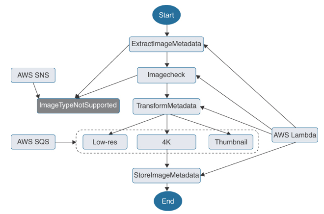

AWS Step Functions
---

- provides a way to `model and automate complex, multi-step processes` and applications using a `graphical workflow editor`.
- is based on the concepts of `tasks and state` machines, and can track, monitor, and manage the execution of workflows.
- integrates with many other AWS services:
  - Amazon EC2
  - Amazon ECS
  - AWS Lambda
  - Amazon SQS
  - Amazon SNS
- can be used to build scalable, reliable, and efficient applications and microservices.
- enables you to `orchestrate numerous Lambda functions` and multiple AWS services into a serverless application process.
- Developers can create a state machine with multiple states.
- Each workflow has checkpoints that maintain each workflow throughout each defined stage.
- The output of each stage in the workflow is the starting point of the next stage.
- Defined steps within each state function execute in the precise order defined by the logic.
- At each stage, decisions are made based on the supplied input parameters, actions are performed, and the output is passed to the next stage.
- has built-in application-level controls, including `try/catch and retry and rollback capabilities`, to help automatically deal with errors and exceptions.

The following workflows are possible to design with AWS Step Functions:
  - Consolidating data from multiple databases into a unified report
  - Fulfilling orders or tracking inventory processes
  - Implementing a user registration process
  - Implementing a custom workflow

> Fig: Step Function Logic: Create a Workflow Using AWS SQS, AWS SNS, and AWS Lambda

# Activity and Service tasks can be used with state machine step functions:

## Activity Tasks

- Allow you to assign a specific step in your defined workflow to external software code.
- The external function polls the function associated with any required work requests; when required, it performs its work and returns the results.
- The activity task can run on any application that can make an HTTP connection from its location, such as an EC2 instance hosted at AWS, a mobile device, or an on-premises server.

## Service Tasks

- Allow you to connect steps in your defined workflow to a supported AWS service.
- In contrast to an activity task, a service task pushes requests to other AWS services; the service performs its action, reports to the workflow once the action is completed, and moves to the next step. 
- Examples of service tasks include the following:
  - Running an Amazon ECS or Fargate task hosted in a VPC
  - Submitting an AWS Batch job and waiting for completion
  - Retrieving or placing a new item into an Amazon DynamoDB table

# Types of Workflows

## Express Workflows

- Use express workflows for workloads with `high event rates` of more than 100,000 per second and `short durations` of less than 5 minutes.

## Standard Workflows

- Use standard workflows for `long-running, durable, and auditable workflows`, such as machine learning models, generating reports, and the processing of credit cards.
- Standard workflows `guarantee one execution of each workflow step`, with a `maximum duration of 1 year`.
- Developers can inspect a processed workflow during and after the workflow execution has been completed.

