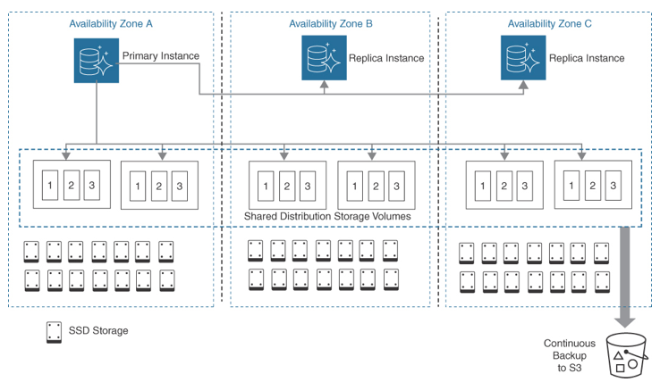
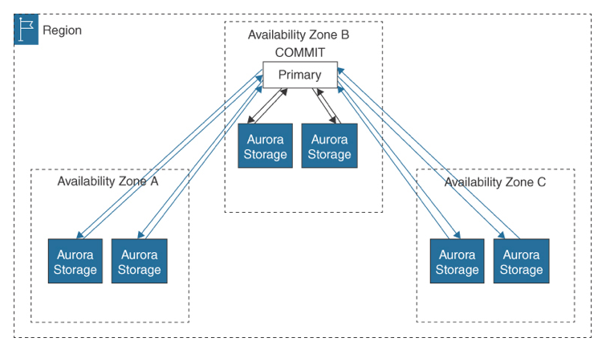
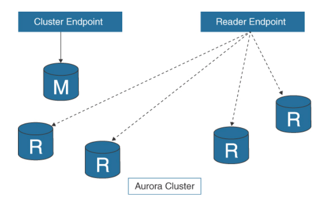

Amazon Aurora
---

- is a fully compatible `MySQL or PostgreSQL` managed database as a service (`DBaaS`) solution
- is `MySQL and PostgreSQL compatible`, storing data records in clustered shared storage deployed across `single or multiple AWS regions`.
- `global database` has `one primary` region and can have `up to five read-only` secondary regions.
- allows you to create `up to 16 additional read-only database instances in each AWS region`.
- is `deployed across three AZs` per region or as a global database across multiple AWS regions.
- If the Aurora primary region fails, one of the secondary regions can be promoted to take over the reading and writing responsibilities in less than 1 minute, with an effective RPO of 1 second and an RTO of less than 1 minute.
- has performance increases of `up to five times the throughput of AWS RDS MySQL` and `three times the throughput of Amazon RDS PostgreSQL`. 
- Read-Local/Write-Global Strategy
  - An organization could define one region as the primary for all database writes.
  - Data would be replicated for reads to the other AWS region.
  - If the primary database region fails, failover to the secondary site occurs.
  - Both workload tiers are online; when issues occur with one workload tier, traffic gets redirected automatically.

# Features of Amazon Aurora

## Backtracking

- Return the state of an Aurora cluster to a specific point in time within seconds without having to restore data from a backup.

## Aurora Global Database

- A single database consisting of a primary DB cluster in one region and `up to five secondary DB clusters in different regions`, enabling very low latency reads and recovery from regional outages.

## Machine learning (ML)

- Machine learning models are exposed as SQL functions, using standard SQL queries to build applications that call ML models.

## Parallel queries

- Parallel queries can speed up queries while maintaining a very high transactional throughput.

## Aurora Serverless

- Automatically start up, shut down, and scale capacity as required by your application.

# When deploying Aurora, there are four choices:

## Aurora Provisioned

- This is the standard deployment, where the `customer defines the database engine` (MySQL or PostgreSQL), instance class, and the advanced details of placement, accessibility, encryption, backup, and failover required.

## Aurora versions that support the parallel query feature

- A single query can be distributed across all the available CPUs in the storage layer to greatly speed up analytical queries. More than 200 SQL functions, equijoins, and projections can run in parallel format.

## Serverless

- When a serverless Aurora database cluster is deployed, it operates, and scales based on the minimum and maximum performance requirements that have been defined at creation.
- When your application enters a period of light or minimal activity, the associated Aurora database is scaled down to the minimum allocated size but remains online and continues to service application requests, scaling back out as required.
- When no activity is detected for a prescribed period of time, the Aurora database is paused, and you are not charged for the inactivity.

## Global deployments

- Aurora deployments are for globally distributed Aurora deployments across `multiple AWS regions`.
- Aurora storage-based replication typically has latency of less than 1 second. In the case of a regional outage, a secondary region can be promoted to read/write capability in less than 1 minute.
- Typical use cases include financial, travel, or gaming applications that have strict uptime requirements. Up to 16 database instances can be deployed in each AWS region of a globally deployed Aurora database.
- Deploying Aurora as a global database has the following advantages:
  - Global reads with local latency
    - A global deployment keeps the main database updated in the primary AWS region. Users in other regions access the database records from their own secondary cluster hosted in their own AWS region.
  - Scalable secondary Aurora DB clusters
    - Secondary clusters can be scaled by adding more read-only instances to the secondary AWS region.

# Aurora Storage

- When comparing to a standard RDS deployment of MySQL, there is `no need to provision storage in advance` for future growth.
- The internal design of the Aurora storage engine allows for the `automatic scaling` of its distributed storage architecture from a starting point of 10 GB up to 64 TB, in 10-GB increments; this storage is spread across multiple SSDs across multiple AZs.
- Aurora `replicates six copies of its data records across three AZs`, providing enhanced durability and greater than 99.99% availability.

> Fig: Aurora Data Storage Architecture

> Fig: Aurora Cluster Design

- The Aurora `shared storage architecture` results in `data records being independent from the DB instances in the cluster`; therefore, `computation capacity is separated from the storage array`.
- `Adding an Aurora DB instance` results in the `new DB instance connecting to the shared storage` volume that already contains the existing data records.
- `Removing an Aurora DB instance` from the cluster does not remove any existing data from the cluster.
- Data records remain in the cluster until the entire cluster is deleted.

# Aurora Replication

- Each DB cluster has `automatic built-in replication between the multiple DB instances` located in the same cluster.
- Replication can also be set up with an Aurora cluster as either the source or the target of the replication.
- As you create additional DB instances in an Aurora provisioned DB cluster, `replication is automatically set up from the writer DB instance to all the other DB instances in the cluster`.
- These `additional DB instances are read-only` and are defined as Aurora Replicas, as `reader instances`.
- Aurora `Replicas are used for queries` that have been issued from the `reader endpoint` of the cluster, spreading the query load across the available Aurora Replicas in the cluster.
- If a writer instance in a cluster becomes unavailable, `one of the reader instances is automatically promoted to take its place as a writer instance`.
- An Aurora DB cluster can contain `up to 15 Aurora Replicas`, which are `distributed across the AZs` within a `single AWS region`.
- An `Auto Scaling policy` can be created to automatically add or remove Aurora Replicas based on the following metrics:
  - Average CPU Utilization
  - Average Connections of the current Aurora Replicas
- The data contained in the Aurora DB cluster volume had its own high-availability and reliability design completely independent from the DB instances in the cluster.
- When failover occurs, the failover process usually takes seconds; the canonical name record `(CNAME) is changed to point to the Aurora replica` that has been promoted to be the new primary database.
- In the background, Aurora constantly `checks and rechecks the data blocks and discs, performing repairs when necessary`, automatically using validated data records from the other volumes in the cluster.
- Aurora `Replicas can also be created in different AWS regions`.
- The first Aurora Replica created in a different region `acts as the primary Aurora replica DB in the new region`. You can also add Aurora Replicas in different AWS regions that will then share the same storage plane.

# Communicating with Amazon Aurora

## Cluster Endpoint

- is a single URL containing a host address and a port address to simplify `connectivity to the primary database instance` for all `writes`, including `insertions, updates, deletions, and changes`.
- When failover occurs, the cluster endpoint automatically points to the new primary database instance.

## Reader Endpoint

- `connects to one of the available Aurora Replicas` for the database cluster; if there are multiple Amazon Aurora Replicas, the endpoint `uses load balancing` to support the read requests.
- If your Aurora deployment is small, containing a single primary instance, the reader endpoint services all read requests from the primary database instance.

## Instance Endpoint

- `points to the current primary database` instance of the database cluster.

> Fig: Aurora Endpoints

- For write statements, directly connect to the primary instance DB.
- To perform queries, connect to the reader endpoint.
- Aurora will `automatically load balance the queries among the available Aurora Replicas`.
- `Custom endpoints` can also be created to connect to a specific instance endpoint (for example, for diagnostics testing).

# Amazon Aurora Cheat Sheet

- Each Amazon Aurora cluster has a set of compute nodes and a copy of the shared storage volume.
- The storage volume consists of six storage nodes located across three availability zones.
- Each database node in a cluster is also a writer node and can execute read and write statements.
- A database change carried out by a writer node is written to six storage nodes and three availability zones.
- Amazon Aurora scales storage up in 10-GB increments.
- Amazon Aurora can lose two copies of data without affecting database writes.
- Amazon Aurora can have up to 15 read replicas per region.
- Amazon Aurora Serverless is an on-demand auto-scaling Aurora deployment.
- Aurora Serverless scales up and down based on the database requirements.
- Automated backups are stored in S3 storage.
- Amazon Aurora does not support Local Zones.

