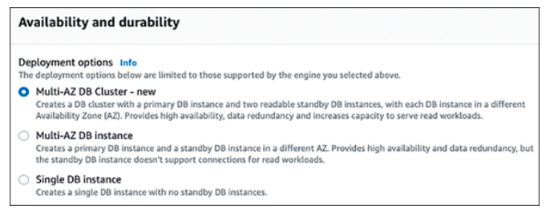
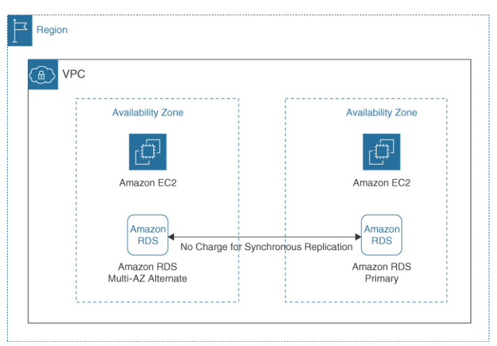
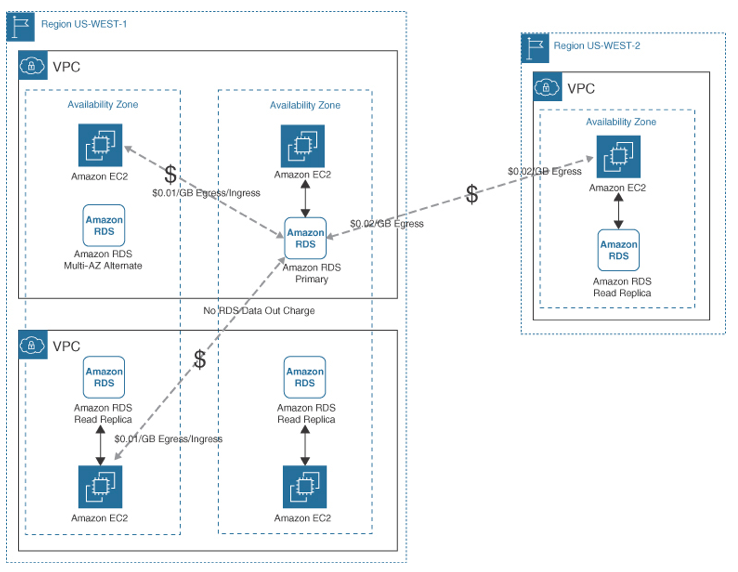
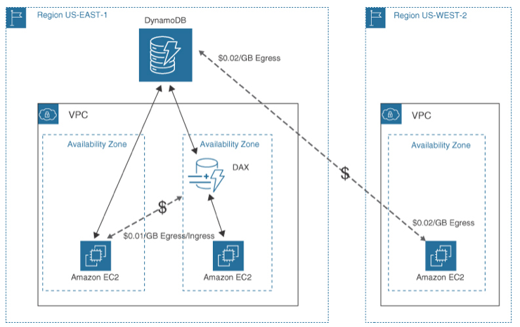
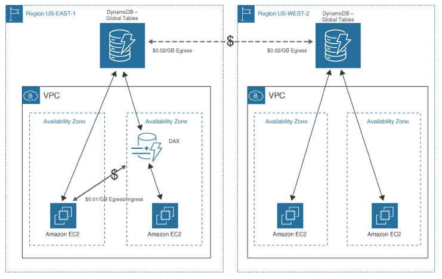
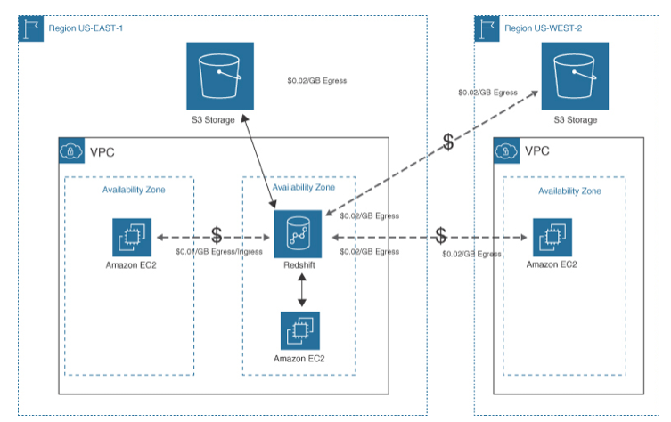
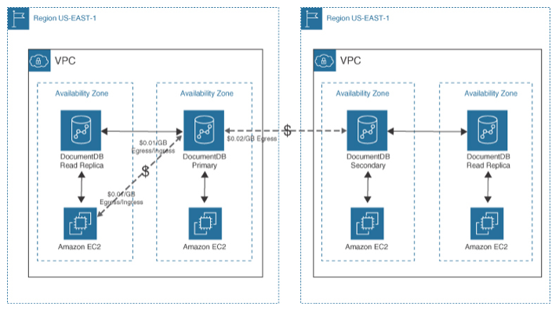

Database Design Choices
---

- Production databases should be designed with a `minimum of two database servers running in separate AZ` within the same AWS region.
- Customers should always plan to `deploy and maintain` at least `three separate copies of data`.
- `RDS disaster recovery` is managed through `scheduling automatic snapshots`, and `transaction logs` are backed up every 5 minutes.
- Customers must make decisions about the desired resiliency, failover, and recovery of their database records and manage the overall costs of their database operations.

# RDS Deployments

- At a minimum `a primary database and a standby database` are both kept up to date with `synchronous replication`.
- can be deployed in a single region or across multiple regions.
- `Microsoft SQL licensing is bundled` with the RDS database instance cost; customers that want to bring their own Microsoft SQL license to AWS must build a custom RDS SQL deployment.
- RDS `Oracle` deployments `also have a BYOL` option for On-demand DB instances.

## AWS Database Service Comparison

Database Engine | Amazon RDS  | Amazon Aurora | Amazon Aurora Serverless 1  | Amazon Aurora Serverless 2  | Amazon Redshift | Amazon ElastiCache
--  | --  | --  | --  | --  | --  | --
Compute | EC2 instances | EC2 instances | Serverless  | Serverless  | Provisioned EC2 -leader and compute nodes, Serverless | EC2 instances
Replication | Multi-AZ cluster deployment of one primary and two read replicas  | Across three AZs  | Across three AZs  | Across three AZs  | Single AZ deployment, cross-region sharing  | Single AZ, multi-AZ cluster
Data type | SQL | PostgreSQL, MySQL | PostgreSQL, MySQL | PostgreSQL, MySQL | PostgreSQL  | Redis, Memcached
Read replicas | 5 | Up to 15  | Up to 15  | Up to 15  | — | —
Workload  | Transactional (Simple)  | Analytical (simple/parallel queries)  | Infrequently used applications, Test DB deployments | Demanding business-critical applications  | Online analytical processing (OLAP) | In-memory caching Redis: complex applications | Memcached: read replicas
Regional  | Yes | Yes | Yes | Yes | Yes | Yes
Multi-region  | No  | Global Datastore, storage-based replication (< 1 second), secondary region  | No  | Global Datastore  | No  | Redis – Global Datastore
Performance | EC2 instance, EBS volume size | Five times of RDS, parallel query | Scaled transactions to match requirements | Scaled transactions to match requirements | Dense compute (DC) clusters, parallel processing  | EC2 instance size, EBS volumes  | Auto Scaling Storage  | Yes | In 10-GB chunks | In 10-GB chunks | In 10-GB chunks | Elastic resize, Redshift managed storage  | No
Auto Scaling Compute  | No. Manual compute sizing | Yes | Yes | Yes | Manual, automatic | No
Backup options  | Snapshots, manual snapshots | Automatic, continuous, incremental, S3, point-in-time restore, manual snapshots, Backtrack  | Automatic, continuous, incremental, S3, point-in-time restore, manual | Automatic, continuous, incremental, S3, point-in-time restore, manual | Automatic backup to S3 or another region  | Redis—automatic backup
Cost management | On-demand, Reserved Instances, Savings Plans, data transfer costs | Provisioned on-demand, reserved instances, database storage and I/O charges, data transfer costs, globally replicated read-writes | Serverless Aurora Capacity Units (ACUs) | Serverless Aurora Capacity Units (ACUs) | On-demand, RA3 nodes with managed storage and automatic backup to S3, DC2 nodes with local storage (Best Price), Serverless (Base–Max), Data transfer costs | On-demand, reserved instances, data transfer costs

## RDS Costs Cheat Sheet

- PostgreSQL, MySQL, and MariaDB have similar costs for storage, provisioned IOPS, and data transfer costs.
- AWS RDS costs are specific to the AWS region of deployment.
- Oracle and Microsoft SQL Server deployments can be double the price due to licensing fees.
- Amazon Aurora can be deployed using provisioned EC2 instances or serverless compute.
- Amazon Aurora can be deployed as a multi-region Global Datastore.
- AWS RDS instance pricing includes vCPU, RAM, and network speeds per chosen RDS database instances.
- AWS RDS Reserved instances can save up to 60% in compute costs for 1 to 3 years.
- Auto-provisioning with a defined Amazon Aurora storage maximum is for unpredictable storage needs.
- AWS RDS snapshot backups are free and are performed every day.
- AWS RDS retention periods determine how many automatic backups are kept. The default is 7 days; the maximum is 35 days.
- AWS RDS Multi-AZ deployments create a standby database instance with a separate replicated database instance.
- On-demand RDS instances can be stopped for 7 days, during which time compute is not charged but EBS storage volumes are still charged.
- Data transfer costs are charged when data exits the source location and enters the target location, AZ-to-AZ, or Region-to-Region.
- The amount of retained backup storage can be lessened by reducing the backup retention period.
- Manual snapshots created by customers are never removed from storage.
- CloudWatch metrics for RDS that can help monitor database instance costs include network usage, CPU utilization, and memory utilization.

## RDS Database Design Solutions

### Reserved instance pricing

- RDS deployments and provisioned versions of Amazon Aurora where customers choose the compute size can be powered by reserved instances to save money. On-demand and spot instances should not be used for database instances that are always online; on-demand instances may be too expensive for 24/7 operation, and spot instances are not guaranteed to be always available.

### RDS Cluster deployment

- Creates a DB cluster with a primary DB instance and two readable standby DB instances. RDS DB instances are located in different AZs, providing high availability, data redundancy, and increased query capacity.

> Fig: RDS Cluster Deployment Choices

### RDS across multiple availability zones

- RDS high-availability and failover designs are especially effective for database deployments. In addition, durability can be provided by keeping primary and alternate database instances up to date with synchronous replication. When you deploy RDS solutions, AWS does not charge for replication between database instances located in different AZs (see Figure 14-2); when you deploy custom EC2 instances across multiple AZs with a custom database design, there will be data transfer charges for the replication between the primary and alternate database instances across separate AZs and regions.

### RDS in a single availability zone

- A single AZ does not have any high-availability or failover options because the single database server is on a single subnet. High availability or failover might not be a concern due to prudent planning and backup procedures. Perhaps hourly snapshots and transaction logs are automatically created on a schedule and backed up into multiple S3 buckets hosted in different AWS regions. If your recovery time objective (RTO) allows you to be down for a longer period of time (for example, 6 hours), a single AZ deployment may be more economical than a multi-AZ design.

> Fig: RDS Multi-AZ Deployment

### Manual snapshots

- Snapshots can be created from RDS EBS volumes at any time. RDS deployments automate snapshots created based on a schedule; however, manual snapshots can also be created and stored in other AWS regions for safekeeping, allowing you to rebuild any EC2 instance (web, application, database, or software appliance).

### Managing snapshots

- Without any long-term management, long-term storage of snapshots is expensive. The Amazon Data Lifecycle Manager allows you to create lifecycle policies to schedule the creation and deletion of EBS snapshots.

### Read replicas

- A read replica is a copy of the primary database that is kept up to date with asynchronous (rather than synchronous) replication. Read replicas can be promoted to a standalone RDS instance as part of a manual disaster recovery solution if the primary RDS database fails (see Figure 14-3). MySQL, MariaDB, Oracle, and Microsoft SQL Server read replicas can be promoted and made writable, whereas a PostgreSQL read replica cannot be made writable. Read replicas provide the ability to scale read traffic horizontally and also provide additional durability for the database tier.

### Amazon Aurora Serverless

- Deploying Aurora Serverless allows you to pay for only the minimum capacity database resources (LCU and database storage) that you consume. You can choose either of two serverless versions:
  - Version 1 is for a single-region database deployment of a MySQL- or PostgreSQL-compatible engine. The term capacity unit refers to the amount of compute and memory resources assigned. Read or write capacity units (RCU/WCU) can be set from 1 capacity unit, which selects a minimum capacity of 2 GB of RAM, up to 256 capacity units, which selects 488 GB of RAM. Based on the minimum and maximum capacity unit settings, auto-scale compute capacity read/write rules are defined for the required CPU utilization, the number of connections, and required memory. When the workload for a serverless Amazon Aurora database drops below the maximum defined capacity unit threshold, Amazon Aurora automatically reduces the CPU and RAM resources made available for the database cluster.
  - Amazon Aurora version 2 can scale from hundreds to thousands of transactions completed in milliseconds both within and across AWS regions. In the background, the auto scaling service uses step scaling to ensure the proper sizing of database resources at any given time.
  - Serverless deployments of Amazon Aurora v2 can be paused after a defined period of activity (see Figure 14-4). There are no charges for an Amazon Aurora database instance when it is not running, potentially saving a high percentage of your database costs when compared to a provisioned deployment of Amazon Aurora.

# NoSQL Deployments

- NoSQL databases have several advantages when compared to SQL databases, including horizontal scaling to a cluster of servers, built-in high availability.

## Data Structures Supported

### Key-value stores

- Data is defined as a collection of key-value pairs with an attribute name and an associated value, for example, <company name-location>. Use cases include gaming applications and high-traffic applications.
The most popular NoSQL deployment at AWS is DynamoDB, which supports both document and key-value data structures for both regional and global deployments for IoT, mobile, web, and gaming workloads. The main features of DynamoDB are single-digit millisecond data access, serverless deployment with no servers to manage, auto-scaling to handle any spikes, and automatic data encryption by default. DynamoDB has two pricing models:
  - On-demand capacity: Charges on a per request basis for reading and writing requests to the associated DynamoDB table.
  - Provisioned capacity: Billing is charged hourly for utilized read and write capacity units and the maximum amount of resources required by each database table. Provisioned capacity should be selected when your workload’s application traffic is consistent and the maximum workload for your application is known. Table 14-3 compares the available NoSQL deployment options, including workload use cases, performance, backup options, and managing costs.

### Graph

- Graph data is composed of a set of nodes and a set of edges connecting the nodes. For example, mammal, the node and shark, the edge relationship would be defined as “is a type of fish.” Use cases include fraud detection and recommendation engines. AWS service: Amazon Neptune.

### Wide-column

- Uses tables and rows and columns just like a relational database; however, the names and the format of each column can vary from row to row within the same table. Use cases include written optimization and fleet management. AWS Service: Amazon Keyspaces (for Apache Cassandra).

### Document

- Data is stored in a document using a standard encoding such as JSON, XML, or YAML. Use cases include user profiles and content management. AWS services: DynamoDB, DocumentDB.

### Times series

- Data is stored in time-ordered streams. Nodes contain individual data values; edges are the relationships between the data values. Use cases include social networking and recommendation engines. AWS service: Amazon Timestream.

### Ledger

- Based on logs that record events that are related to specific data values. Ledger logs can be verified cryptographically, proving the authenticity and integrity of the data. Use cases for ledger databases include banking systems, supply chains, and blockchain. AWS service: Amazon Quantum Ledger Database (QLDB).

## NoSQL Costs Cheat Sheet

- For managing consistent workload usage, choose provisioned mode DynamoDB tables with auto scaling enabled to handle expected changes in demand.
- An on-demand DynamoDB table costs more than provisioned tables.
- A DynamoDB table uses auto scaling to manage the read and write capacity units assigned to each table (see Figure 14-5). Each scaling policy defines what should be scaled—read or write capacity or both—and the maximum provisioned capacity unit settings for the DynamoDB table. The defined auto scaling policy also defines a target utilization; default utilization is set at 70% target utilization, and utilization values can be defined between 20% and 90% for both read and write capacity units.

## AWS NoSQL Database Service Comparisons

Database Engine | Amazon DynamoDB | Amazon S3 | Amazon Keyspaces  | Amazon DocumentDB | Amazon Neptune  | Amazon TimeStream
--  | --  | --  | --  | --  | --  | --  
Compute | Serverless  | Serverless storage array  | Serverless  | EC2 Cluster | On-demand EC2, memory optimized | Serverless
Datatype  | Transactional Key-Value/Document store supports ACID transactions | Key-Value | Hybrid backup, Database backup, Tape backup (Storage Gateway) | PostgreSQL  | JSON  | Apache TinkerPop; Gremlin; SPARQL—supports ACID transactions  | Store and retrieve trillions of events in real time
Use case  | Mobile applications | Object storage  | Route optimization  | Mongo compatible  | Fraud detection | Analytics
Read replicas/cache | ElastiCache, DynamoDB Accelerator (DAX) | — | — | Up to 15 read replicas  | Up to 15 read replicas  | —
Regional  | Across three AZs  | Across three AZs  | Across three  | AZs | Yes | Across three AZs  | Across three AZs
Multi-region  | Yes | Yes | No  | Global Clusters | No  | No
Performance | Scale to 10 trillion requests per day over petabytes of storage | First-byte latency retrieval in ms  | On-demand/provisioned, AWS Keyspace tables scale to match application traffic | Manually scale memory/vCPU  | Manually scale memory/vCPU  | Data ingest and query auto-scale based on workload
Scaled storage  | Yes | Yes | Provisioned capacity  | Up to 64 TB | Up to 64 TB | Memory store (recent data) and read-optimized HDD (queries)
Scaled compute  | Provisioned throughput  | Yes | Provisioned throughput  | Automatic | Manual scaling  | Automatic
Backups | On-demand backups, AWS Backup, point-in-time recovery—restore to any given second | AWS Backup  | Point-in-time recovery—restore to any given second  | Automatic/manual snapshots, point-in-time backup to S3  | Manual snapshots, automatic, continuous, incremental, and point-in-time backup to S3  | Data retention policies from memory to HDD storage
Pricing | Standard table, standard Infrequent access. On-demand capacity (data read/writes charged). Provisioned capacity, data transfer costs | Storage classes, S3. Intelligent-tiering, S3 Glacier (instant, flexible), Deep archive, data transfer costs  | Write requests units/read requests units, data transfer out costs | Four dimensions: on-demand instances, database I/O, database storage, backup storage, data transfer costs | EC2 instance, database I/O, backup, data transfer costs | Data writes, data stored, queries, data transfer costs

## DynamoDB Scaling Policy

- Provisioned capacity deployments with a high amount of read and write capacity units should purchase reserved capacity for one or three years.
- Automatic DynamoDB backups use additional write capacity units, raising costs, but backups provide valuable high availability.
- One read capacity unit (RCU) performs one strongly consistent read request per second for items up to 4 KB in size, and two eventually consistent read requests. Transactional read requests require two RCUs.
- One write capacity unit (WCU) performs one standard rate request per second of items up to 1 KB in size. Transactional write requests require two WCUs.
- Replicated WCUs are used with global tables. Replicated write requests are automatically written to multiple AWS regions.
- To reduce workload costs, host DynamoDB deployments in AWS regions with the lowest operating cost if possible.
- Unnecessary data can be purged using the Time to Live (TTL) feature.
- Queries for data stored in DynamoDB use the primary or index key and only charge for RCUs for the items returned.
- Scans for data stored in a DynamoDB table are much more expensive as you are charged for all rows scanned regardless of how many items are returned.
- Store infrequently accessed data in standard infrequent access DynamoDB tables.
- Use DynamoDB metrics and CloudWatch to monitor usage and storage trends.
- Use the Trusted Advisor Amazon RDS Idle DB instances check to identify DB instances with no connection over the last seven days.

# Migrating Databases

Database migration can be carried out using AWS Database Migration Service (DMS). DMS performs a live migration into AWS with little to no downtime. Databases to be migrated can be hosted on an EC2 or RDS instance or located on premises. The DMS server is an EC2 instance hosted in the AWS cloud running replication/migration software. Source and target connections inform DMS where to extract the source database from, and where to deploy the migrated database (see Table 14-4). Scheduled tasks run on the DMS server and replicate the database from the source to the destination server location. DMS can also create database tables and associated primary keys if these items don’t exist on the target instance.

AWS Database Migration Service charges for the compute resources used by the replication instance during the migration. Ingress data transfer into AWS is free of charge. Migrating from a supported target to Amazon Aurora, Amazon Redshift, Amazon DynamoDB, and Amazon DocumentDB is free for up to six months.

## Database Migration Service Source and Destination Migrations

DMS On Premises, EC2 Instances, Third-Party Cloud | DMS Target (On Premises/EC2 Database Instances)
--  | --
Oracle Database 10.2 up to 11g and up to 12.2, 18c, and 19c Enterprise, Standard, Standard One, Standard Two editions | Oracle Database 10g, 11g, 12c, 18c, and 19c Enterprise, Standard, Standard One, Standard Two editions
Microsoft SQL Server 2005–2019 Enterprise, Standard, Workgroup, and Developer Editions  | Microsoft SQL Server versions 2005, 2008, 2008R2, 2012, 2014, 2016, 2017, and 2019 Enterprise, Standard, Workgroup, and Developer editions (Web and Express editions not supported)
MySQL versions 5.5, 5.6, 5.7, and 8.0 | MySQL versions 5.5, 5.6, 5.7, and 8.0
PostgreSQL version 9.4 and for versions 9.x, 10.x, 11.x, 12.x, 13.x and 14.0  | PostgreSQL version 9.4 and later (for versions 9.x), 10.x, 11.x, 12.x, 13.x, and 14.0
MongoDB versions 3.x, 4.0, 4.2, and 4.4.  | DynamoDB
SAP Adaptive Server Enterprise (ASE) versions 12.5, 15, 15.5, 15.7, 16, and later | SAP Adaptive Server Enterprise (ASE) versions 15, 15.5, 15.7, 16, and later
IBM Db2 z/OS for Linux, UNIX, and Windows | Aurora MySQL, Aurora PostgreSQL, MySQL, and PostgreSQL
Microsoft Azure SQL Database  | Microsoft SQL Server versions 2005, 2008, 2008R2, 2012, 2014, 2016, 2017, and 2019 Enterprise, Standard, Workgroup, and Developer editions (Web and Express editions not supported)
Google Cloud for MySQL  | MySQL versions 5.6, 5.7, and 8.0
RDS instance databases (Oracle, Microsoft SQL Server, MySQL, PostgreSQL, MariaDB), Amazon Aurora (PostgreSQL/MySQL) | Amazon RDS instance databases.  Amazon Redshift, Amazon DynamoDB, Amazon S3, Amazon OpenSearch Service, Amazon ElastiCache for Redis, Amazon Kinesis Data Streams, Amazon DocumentDB, Amazon Neptune, and Apache Kafka
Amazon DocumentDB | Amazon DocumentDB
Amazon Redis, Microsoft SQL, NoSQL  | Amazon Redis

## AWS Schema Conversion Tool

- AWS SCT `converts an existing database schema from one database engine to another`.
- The converted schema can be used with the following Relational Database Service engines:
  - MySQL, MariaDB
  - Oracle
  - SQL Server
  - PostgreSQL DB
  - Amazon Aurora DB cluster
  - Amazon Redshift cluster
- The AWS SCT can convert tables, indexes, and application code to the target database engine.
- After a schema is converted, it is not immediately applied to the target database.
- Within the AWS SCT project, you can review and make changes to the converted schema before applying the converted schema to the target database.

## Database Data Transfer Costs

Data transfer costs are calculated differently for the various managed database services that can be deployed at AWS. As a reminder, there is no charge for inbound data transfer for all services in all regions at AWS (see Figure 14-7). Transferring data from an Amazon resource across the Internet results in charges for each AWS service based on the region where the service is hosted. Outbound data transfer is currently charged at $0.09 per GB.

### Data Transfer Costs and RDS

Workloads that use RDS deployments utilize EC2 instances and the EBS volumes. With multi-AZ deployment of primary and secondary database instances, read replicas will not have any charges for data transfer to and from any EC2 and RDS instances located in the same AWS region, availability zone, and virtual private cloud. Data charges apply as follows for data transfers (see Figure 14-8) between instances:
  - EC2 and RDS instances that are located across AZs within the same VPC are charged $0.01 per GB ingress and egress.
  - EC2 and RDS instances that are located across AZs and across different VPCs are charged $0.01 per GB ingress and egress.
  - EC2 and RDS instances that are located across AWS regions are charged on both sides of the data transfer from the EC2 instance to the RDS instance and vice versa at $0.02 per GB ingress and egress.

> Fig: EC2 and RDS Data Transfer Across VPCs with Multiple AWS Regions

There are no data transfer charges for data replication in a multi-AZ deployment, or to any read replicas located within the same AWS region. There will also not be charges for the transfer of snapshots to the S3 bucket used for backup storage in the same AWS region. However, there will be data transfer charges for asynchronous data updates to read replicas that are located across different regions at $0.02 per GB egress. There will also be charges for any regional transfers for RDS snapshot copies or any automated cross-region backups at $0.02 per GB egress.

### Data Transfer Costs with DynamoDB

Workloads that use DynamoDB and DynamoDB Accelerator (DAX) will not have data transfer charges for:

  - Inbound data transfers to DynamoDB
  - Any data transfers between DynamoDB and EC2 instances located in the same region
  - Any data transfers between EC2 instances and DAX in the same AZ (see Figure 14-9)

> Fig: Amazon Aurora and Data Transfer Costs

For DynamoDB global table deployments, as shown in Figure 14-10, the following data transfer charges will apply:

- Data transfer charges are charged between DynamoDB and a DAX deployment located in a different AZ.
- Global tables for cross-region replication charged at the source region rate of $0.02 per GB egress.
- Any data transfers between DynamoDB and EC2 instances located in different AWS regions are charged on both sides of the data transfer at $0.02 per GB egress.

> Fig: Amazon Aurora and Global Tables

### Data Transfer Costs with Amazon Redshift

Workloads that use Amazon Redshift can analyze data stores using standard SQL queries and common business intelligence tools. For an ODBC application connecting to Redshift across multiple AWS regions, there are data transfer costs. For communication within the same availability zone and any data transfers to S3 storage in the same AWS region for backup and restore, there are no data charges. For deployments utilizing multiple AWS regions, as shown in Figure 14-11, the following data transfer charges will apply:

  - EC2 and RDS instances that are located across AZs and across different VPCs are charged $0.01 per GB ingress and egress.
  - EC2 and RDS instances that are located across AWS regions are charged on both sides of the data transfer from the EC2 instance to the RDS instance and vice versa at $0.02 per GB ingress and egress.

> Fig: Amazon Redshift Data Transfer Costs

### Data Transfer Costs with DocumentDB

Workloads that use DocumentDB are using a database service with MongoDB compatibility. An application using an EC2 instance using DocumentDB deployed as a global cluster as the data store across two AWS regions with cross-region replication will have data transfer charges (see Figure 14-12). However, read replicas in multiple AZs will have no data transfer charges for communication between any EC2 and DocumentDB instance located in the same AZ, or for data transferred between DocumentDB instances within the same AWS region. There will also be data transfer charges for:

  - EC2 instance and DynamoDB communication across availability zones
  - Cross-region replication between the DocumentDB primary and secondary instances

## Data Transfer Costs Cheat Sheet

- Calculate data transfer charges on both sides of the communication channel. “data transfer in” to a destination is also “data transfer out” from the source.
- Use regional read replicas and alternate replicas to reduce the amount of cross-availability zone or cross-region traffic.

> Fig: DocumentDB Data Transfer Charges

- Use data transfer tiered pricing when estimating workload pricing for data transferred out to the Internet across EC2 and - RDS instances, Redshift, DynamoDB, and S3 buckets.
- Backup and snapshot requirements and how data transfer charges may apply.
- AWS offers various purpose-built, managed database offerings. - Selecting the right database service for your workload can help optimize performance and cost.
- Review your application and how queries are designed, looking to reduce the amount of data transferred between your application and its data store.

# Database Retention Policies

Database retention policies refer to the length of time that database backups are retained. During the defined backup window of each RDS deployment (see Figure 14-13), automatic backups of your DB instances are created and saved in controlled S3 storage. RDS creates a storage volume snapshot of the standby database; the automated backups of the RDS instance are saved according to the defined backup retention period currently specified. The automated backup contains a complete system backup, including a full database backup, transaction logs, and the DB instance properties. DynamoDB, Neptune, and DocumentDB also support continuous backup with point-in-time restoration.

# Database Backup Policies Cheat Sheet

- The first DB snapshot contains all the data for the complete DB instance.
- Subsequent snapshots of the same DB instance are incremental; only the data that has changed after the most recent snapshot will be saved.
- Databases can be recovered at any point in time during the backup retention period.
RDS retains backup DB instances for a default retention period of 7 days.
Retention periods can be set to up to 35 days.
Point-in-time restores can specify any second during your retention period up to the latest restorable time.
The preferred backup window is the period of time during which your DB instance is backed up.
Amazon Aurora backs up your cluster volume automatically and retains the restored data for the length of the defined backup retention period.
Amazon Document DB and Amazon Neptune back up your cluster volume continuously and retain the restored data for the length of the defined retention period.
Amazon DynamoDB enables you to back up your table data continuously by using point-in-time recovery (PITR), backing up your table data automatically with per-second granularity allowing restores to any given second in the preceding 35 days.
On-demand backups of DynamoDB can be performed using the DynamoDB service or AWS Backup.
Amazon DocumentDB (with MongoDB compatibility) continuously backs up your data to S3 storage, allowing restoration to any point within the backup retention period of 1 to 35 days.
Multi-AZ DB cluster deployments can be backed up with a Multi-AZ DB snapshot.
RDS can replicate snapshots and transaction logs to another AWS region for Oracle version 12 and higher, PostgreSQL 9.6 and higher, and Microsoft SQL Server 2012 and higher.
Manual snapshots can also be created at any time. Manual snapshots are not automatically deleted.
Customers can have up to 100 manual snapshots per AWS region.
Backups of RDS DB instances can be managed using AWS Backup. Resource tagging must be used to associate your DB instance with a backup plan.
RDS snapshots can be exported to an S3 bucket from automated, manual, and AWS Backup snapshots.
When a DB instance is deleted, a final DB snapshot can be created before deletion; the final DB snapshot can be used to restore the deleted DB instance later.

