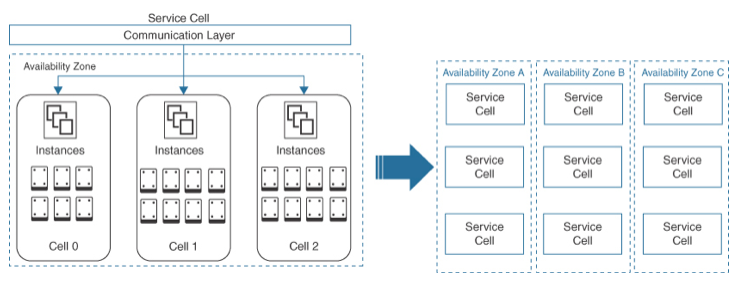
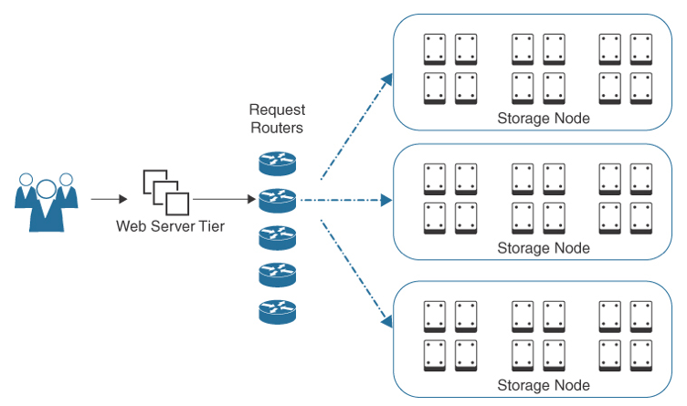

Amazon DynamoDB
---

- provides high availability and horizontal scaling of `regional tables` that can also be `synchronized across multiple regions`.
- is a `fully managed NoSQL database` service providing fast and predictable performance with `horizontal scalability across availability zones and regions`.
- DynamoDB tables can be created for storing and retrieving any amount of data with a `very high number of requests`.

# Features of DynamoDB

## Key-value and document data models

- enable a `flexible schema`.
- Each row can have `any number of columns` at any point in time, allowing customers to easily adapt their table design when requirements change.

## DynamoDB Accelerator (DAX)

- `In-memory cache` provides `fast read performance` for DynamoDB tables, improving table performance from milliseconds to microseconds at millions of read requests per second.

## Global tables

- `Replicate DynamoDB table` data `automatically across multiple AWS regions` scaling capacity to match workload requirements, providing single digit millisecond `read and write performance` within each AWS region.

## Supports streaming applications

- `Capture item-level changes` in an DynamoDB table `as a Kinesis data stream`.
- Kinesis Data Streams and DynamoDB can work together to `store and process large amounts of streaming data` from Amazon Kinesis in near-real time.

## Read/write capacity modes

- On-demand capacity modes can manage capacity automatically, or provision capacity with automatic scaling of throughput and storage based on defined capacity limits.

## Track item data with triggers

- Integrate with AWS `Lambda functions` with custom triggers when `item-level changes are detected`.

## ACID transactions

- DynamoDB has native service-side support for transactions for multiple items within and across tables.

## Encryption at rest

- All data is `encrypted at rest` by default with encryption keys stored in the AWS Key Management service.

## Point-in-time recovery (PITR)

- `Continual backups` of DynamoDB table data `to Amazon S3` allows organizations to restore table data at any point in time, up to the second, during the preceding 35 days.

## On-demand backup and restore

- Create full backups of DynamoDB tables for data archiving of any size.

# SQL and DynamoDB Comparison

Feature | SQL Server  | DynamoDB
--  | --  | --
Database type | Relational database management system (RDBMS) | NoSQL database management system
Structure | Tables with rows and columns  | Collection of JavaScript Object Notation (JSON) documents (key/value pairs)
Schema  | Predefined  | Dynamic
Scale | Vertical  | Horizontal
Language  | SQL structured  | JavaScript
Performance | Good for online analytical processing (OLAP)  | Built for online transaction processing (OLTP) at scale
Optimization  | Optimized for storage | Optimized for read/write
Query type  | Real-time ad hoc queries  | Simple queries

# DynamoDB Tables

- DynamoDB table `stores data as groups of attributes`, also known as items.
- Each item stored in an DynamoDB database can be `stored and retrieved using a primary key` that uniquely identifies each item in the table.
- You must define a primary key. A hash value is computed for the primary key, and the `data in the table is divided into multiple partitions`, each linked to the primary key hash for the table.
- You can also choose to have a `secondary index`, such as LastName.

# Provisioning Table Capacity

Performance is `defined in terms of capacity unit (CU) sizes`:

- A `single` read capacity unit (`RCU`) means a strongly consistent read per second, or two eventually consistent reads per second for items `up to 4 KB` in size.
- A `20-KB object would need 5 RCUs` to perform the full read of the object
- A `single` write capacity unit (`WCU`) means a strongly consistent write per second for items `up to 1 KB` in size.
- The `default provision capacity` is `5 RCUs and 5 WCUs`.
- You can make changes to the read and write capacity units for your table by `switching from the default provisioned read/write capacity to on-demand` and quickly adjusting the amount of scale that your application and, therefore, your DynamoDB table, require.

# Adaptive Capacity

- solves the problem of a table being throttled when it runs out of `burst credits`.
- `increases the fill rate to the token bucket based on several parameters`:
  - Traffic to the table
  - Provisioned RCU capacity
  - Throttling rate
  - Current multiplier
- also provides `additional burst tokens`, so you have a longer period for bursting and don’t run out of tokens as quickly as you would if adaptive capacity were not enabled.
- There are still `limits to how many burst credits you get`, which is why DynamoDB introduced Auto scaling.
- `Auto scaling` allows you to set `lower and upper limits of performance capacity and a desired level of utilization`.
- DynamoDB metrics for monitoring table performance and alarms are defined to alert Auto scaling when additional or less performance capacity is required for table reads and writes.

> Fig: DynamoDB Cell-Based Design

# Data Consistency

- Because data is written into three partition locations across each AZ, data is not initially consistent in all storage partitions; however, after some time, all data locations across all AZs will be consistent. With DynamoDB, `you have a choice of how consistent you want your data to be`:

## Strongly consistent

- A strongly consistent read produces a result from the storage nodes that performed a successful write of the information being requested.

## Eventually consistent

- The leader node makes a random decision about which of the storage nodes that are hosting the partition to read from.

Leader Node & Other Nodes
---

- The odds are that you will get a consistent read even with eventual consistency because `two storage partitions out of the three will always contain up-to-date data`.
- One of the associated storage nodes will be assigned as the leader node—that is, the node that performs the first data write.
- Once two of the associated storage nodes have acknowledged a successful write process, the leader storage node communicates with the request router that the write process is successful, and that router passes that information back to the application and the end user.
- Each `PUT` request talks to the leader node first. Then the data is distributed across the AZs.
- The leader node is always up to date, as is one of the other storage nodes because there must be an acknowledgment that the PUT is successful in storage locations for a write process to be successful.

> Fig: DynamoDB Storage Node Design

- `Paxos` is the defined technical method to get the multiple storage systems to agree on a particular leader for the peer storage nodes.
- The leader storage node is always up to date.
- The leader and the peer storage nodes are also joined with a heartbeat that fires every 1.5 seconds with the associated storage peers.
- If the peer storage nodes fall out of sync with the leader storage node, an election is performed, and one of the peer storage nodes becomes the new leader node.
- The request routers are themselves stateless devices; any selected request router communicates with the leader node of the associated storage partition where your database is located.
 - As your DynamoDB database table scales in size, the internal design ensures predictable performance through a process called burst capacity.
 - When partitions start to get overloaded, the partition is automatically split into multiple partitions so that the current read and write capacity units are spread across the available partitions to be able to better serve the required reads and writes of the DynamoDB table.

## ACID and DynamoDB

### ACID Principles

- Atomicity
  - Each database transaction completes successfully, or it’s not accepted.
- Consistency
  - Database transactions are successfully written to disk and validated.
- Isolation
  - Database transactions are isolated and secure during processing.
- Durability
  - Database transactions are committed to persistent storage and logged.

- DynamoDB also supports ACID across tables hosted within a single or multiple AWS regions.
- Two internal DynamoDB operations handle these transactions:
  - TransactWriteItems
    - A batch write operation with multiple PUT, UPDATE, and DELETE item operations that check for specific conditions that must be satisfied before updates are approved.
  - TransactGetItems
    - A batch read operation with one or more GET item operations.
    - If a GET item request collides with an active write transaction of the same item type, the read transactions are canceled.
- With replicated DynamoDB data, the records must also be exact copies stored on the primary and standby database instances.
- The process of data replication can be fast, but updating replicated data records always takes some time, and the process of verification takes additional time.

# Global Tables

- is `multiple synchronized copies of a local DynamoDB table` with the same data records replicated across multiple `AWS regions`.
- Data is transferred from one AWS region to another using a `synchronized replication engine` in the source and destination AWS regions.
- AWS `IAM service-linked roles` ensure that the proper level of `security is enforced when writing records to the global` DynamoDB table partitions.
- This can be useful for a variety of reasons, such as `reducing latency for users in different regions`, improving the availability of your data in the event of a region-wide outage, and enabling disaster recovery.
- To set up global tables, first `create a table in a primary region and then specify one or more secondary regions`.
- Once the global table is set up, DynamoDB automatically replicates updates made to the table in the primary region to the secondary regions.

# DynamoDB Accelerator (DAX)

- increases DynamoDB `response times to eventually consistent data levels` with microsecond latency by adding an in-memory cache to the design.
- Your DAX cluster, once provisioned, will be hosted in the VPC of your choice.
- Applications can use the DAX cluster after the `DAX client is installed on the EC2` instances hosting the associated application.
- DAX can be designed to be highly available, with multiple DAX nodes hosted across `multiple AZs` within an AWS region, and can scale out up to ten replicas.
- Read operations that DAX responds to include GetItem, BatchGetItem, Query, and Scan API calls.
- Write operations are first written to the table and then to the DAX cluster.
- Write operations include BatchWriteItem, UpdateItem, DeleteItem, and PutItem API calls.

# Backup and Restoration

## Point-in-time recovery (PITR) backup

- allows you to restore your DynamoDB table to `any point in time up to 35 days`.
- This is a fixed maximum value of retention and cannot be changed.
- A point-in-time restore point can be chosen up to 1 second before the current time.
- Once PITR has been enabled for DynamoDB, continuous backups are performed to controlled S3 storage.

## On-demand backup

- allows you to create `full backups of DynamoDB tables for long-term storage`.
- An on-demand backup is `created asynchronously`, applying all changes that are made to a snapshot stored in S3 storage.
- `A restored table`, regardless of the backup type, includes `local and global secondary indexes`, `encryption settings, and the provisioned read and write capacity` of the source table at the time of restoration.
- After a table has been restored you must `manually re-create any Auto scaling policies, IAM policies, tags, and TTL settings` that were previously applied to the backed-up table.

# DynamoDB Cheat Sheet

- DynamoDB supports both key/value and document data models.
- DynamoDB Global tables replicate your data across AWS regions.
- DynamoDB automatically scales capacity to match your workload demands.
- Amazon Kinesis Data Streams can capture item-level changes in your DynamoDB table as a Kinesis data stream.
- DynamoDB has two capacity modes: On-demand and Provisioned.
- DynamoDB performs automatic scaling of throughput and storage.
- DynamoDB triggers integrate with AWS Lambda functions when item-level changes occur in an DynamoDB table.
- DynamoDB supports ACID transactions.
- DynamoDB encrypts data at rest by default.
- DynamoDB supports point-time recovery up to the second, up to 35 days.
