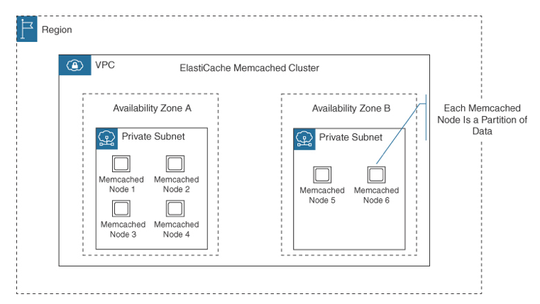
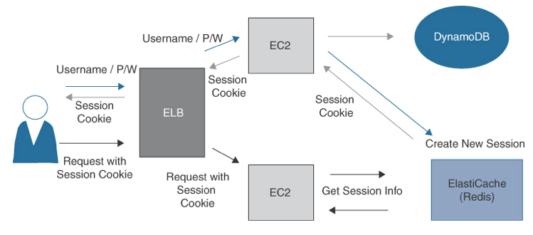
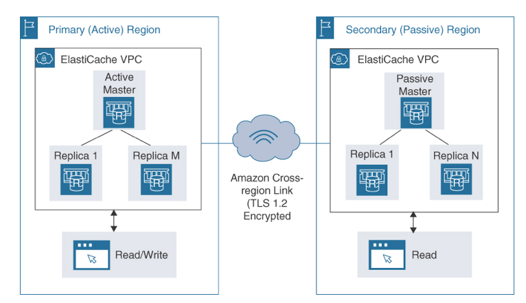

Amazon ElastiCache
---

- is a `fully managed in-memory` caching service supporting Amazon ElastiCache for `Redis`, Amazon ElastiCache for `Redis—Global Datastore`, and Amazon ElastiCache for `Memcached`.

# Amazon ElastiCache for Memcached

- is a `Memcached-compatible in-memory key-value store` service that can be used as either a cache or a data store:
  - As a `cache`, ElastiCache for Memcached helps increase throughput and decrease access latency from RDS deployments or NoSQL databases such as Amazon DynamoDB.
  - As a `session store`, ElastiCache for Memcached can be deployed using the Memcached hash table, which can be distributed across multiple nodes.
- Use cases:
  - Application caching for database performance as an in-memory cache and session stores.
- `uses EC2` instances as `nodes`, and each node utilizes a fixed chunk of secure network-attached RAM running as an instance of Memcached deployment.
- `nodes are deployed in clusters`, and each `cluster is a collection of one single node or up to 40 nodes`.
- For additional `fault tolerance`, place your Memcached `nodes in select AZs across the AWS region`.

## Features of ElastiCache for Memcached

- Automatic recovery from cache node failures
- Automatic discovery of nodes added or removed within a cluster
- Availability zone placement of nodes and clusters
- Ability to deploy cache clusters across multiple AZs within a region.
  - Deploying a cache cluster across multiple AZs can improve the availability and durability of the cache.
  - If one AZ becomes unavailable due to a failure or maintenance event, the cache cluster can continue to operate from the remaining AZs.
  - This can help ensure that your application remains available and responsive even in the event of an infrastructure failure.

> Fig: ElastiCache for Memcached Cluster

<h2 style="background-color:lightgreen"># Amazon ElastiCache for Memcached Cheat Sheet</h2>

- ElastiCache for Memcached does not provide persistent data storage.
- Each node represents a partition of data.
- ElastiCache for Memcached cannot be used as a data store.
- ElastiCache for Memcached scales out and in through the addition and removal of nodes.
- ElastiCache for Memcached can be deployed as a read replica for RDS and Amazon DynamoDB databases.
- ElastiCache for Memcached is useful for storing users’ session state.
- ElastiCache for Memcached does not support multi-region failover or replication.
- Local Zones are supported for ElastiCache clusters.

# Amazon ElastiCache for Redis

- is a `fully managed in-memory cache` service that makes it easy to deploy and operate a `distributed cache environment` in the cloud.
- is based on the popular `open-source Redis cache engine` and enables you to store and retrieve data from memory using the Redis data model.
- is well suited for `use cases` that `require fast data access and low latencies`, such as `real-time analytics, gaming, and social media`.
- can be used to `cache frequently accessed data in memory`, which can significantly improve the performance of applications that rely on databases or other persistent storage systems.
- would be a `good choice for storing user state session state` for a user session; the user session information needs to be stored, but not for the long term.

> Fig: User State Information Stored in ElastiCache

## Features of ElastiCache for Redis

- ElastiCache for Redis has automatic recovery from cache node failures.
- Multi-AZ deployment is supported for ElastiCache for Redis cluster nodes.
- ElastiCache for Redis cache data can be partitioned up to 500 shards.
- ElastiCache for Redis supports encryption in transit and encryption at rest, with authentication for HIPAA-compliant workloads.
- ElastiCache for Redis manages backups, software patching, failure detection, and recovery.

<h2 style="background-color:lightgreen"># Amazon ElastiCache for Redis Cheat Sheet</h2>

- Redis is widely adopted as an in-memory data store for use as a database, cache, message broker, or queue.
- The ElastiCache for Redis data store is persistent.
- ElastiCache for Redis can be used as a data store.
- ElastiCache for Redis scales through the addition of shards, which is a grouping of one to six related nodes.
- Each multiple-node shard has one read–write primary node and one to five replica nodes.
- Nodes are charged on a pay-as-you-go basis or reserved nodes.
- ElastiCache for Redis supports automatic and manual backups to S3.
- Maximum backup retention limit is 35 days.
- ElastiCache for Redis supports automatic detection and recovery from cache node failures.
- ElastiCache for Redis autoscaling allows you to increase or decrease the desired shards or replicas automatically.
- Redis Version 3.2 and later supports encryption in transit and at rest for HIPAA-compliant applications.

## ElastiCache for Redis: Global Datastore

- ElastiCache for Redis provides a fast and secure `cross-region` replication designed for real-time applications such as media streaming, real-time analytics, and gaming operating with a global footprint across multiple AWS regions.
- supports `cross-region replication latency under 1 second` between primary and secondary clusters.
- A multiple-region deployment of the Global Datastore provides `geo-local reads closer for end users` operating in each AWS region.
- The global data store consists of a primary active cluster which accepts writes that are then replicated to all secondary clusters within the defined Global Datastore.
- The `primary cluster also accepts read requests`.

> Fig: ElastiCache Global Data Store

- A `secondary cluster accepts only read requests` and replicated data updates from the associated primary active cluster.
- Secondary clusters must be located in a different AWS region than the primary cluster; data records are replicated from the primary active cluster to the secondary cluster using automatic asynchronous replication.
-  Designs using remote replica clusters in other AWS regions with synchronized data records help reduce data latency by serving geo-local reads across each region.
