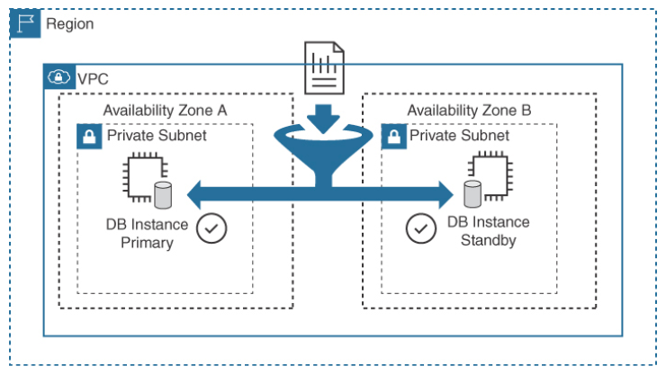
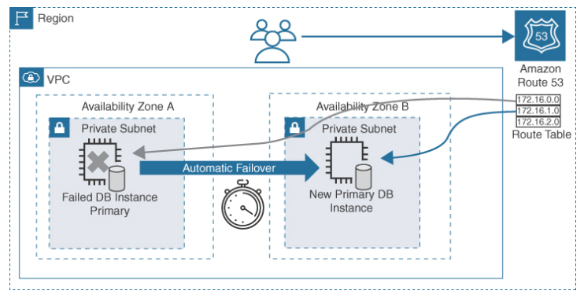

Amazon Relational Database Service (RDS)
---

- RDS recommends `Multi-AZ deployments`, which automatically `create one or more secondary copies` of the database in `multiple availability zones`, providing additional protection against outages and data loss.
- is a managed database service which hosts a variety of popular relational database engines.
- Monitoring, backup, and failover of your database instances are managed by AWS.
- To maintain complete control, you can build your own EC2 database instances and manage every aspect of your database infrastructure as a self-managed infrastructure as a service (IaaS) deployment by deploying RDS Custom.

Database Engine | Data Recovery Support | SSL/TLS Support | Replication | Encryption  | Real-Time Monitoring  | Compliance Support
--  | --  | --  | --  | --  | -- | --
MariaDB 10.0.1–10.0.6 | InnoDB Version 10.2 and XtraDB Versions 10.0 and 10.1 | yaSSL, Open SSL, or TLS | Point-in-time restoration | AES-256 | Yes | HIPAA
MySQL 5.5–8.0 | InnoDB  | yaSSL, Open SSL, or TLS | Point-in-time restoration | AES-256 | Yes for 5.5 or later  | HIPAA, PCI DSS, FedRAMP
SQL Server 2008–2019  | All versions support data recovery  | SSL | SQL Server database mirroring, SQL Server AlwaysOn  | AES-256, TDE  | Yes | N/A
Oracle Database 12c and 11g | All versions support data recovery  | SSL or NNE  | Point-in-time restoration | AES-256, TDE  | Yes | N/A
PostgreSQL 9.6, 10–14 | All versions support data recovery  | SSL | AWS synchronous replication | AES-256 | Yes | HIPAA, PHI DSS; FedRAMP

# Amazon RDS Database Instances

- When you order an RDS database instance, you order the `CPU, memory, storage, and required storage performance` (input/output operations per second [IOPS]).
- RDS supports a variety of `standard, memory-optimized, and burstable performance EC2 instances` that support Intel hyper-threading technology.
- Threads connect the physical processor on the bare-metal server to the virtual CPUs (vCPUs). AWS RDS pricing supports on-demand and RDS Reserved Instance (RI) pricing. The odds are that you want to use RI pricing because it provides price breaks up to 70%.
- Amazon RDS database instance `data is stored on EBS` volumes, which are automatically striped to provide additional performance.
- EBS volume types can be either general-purpose SSDs, provisioned IOPS SSDs, or magnetic hard drives.
- Amazon RDS supports database engines:
  - MySQL
  - MariaDB
  - PostgreSQL
  - Oracle
  - Microsoft SQL Server

## Database Instance Class Types

- determines the amount of compute, memory, and network speed assigned to the RDS instance.

### Standard

- range from general-purpose instances `optimized for low latency and high random I/O performance and high sequential read throughput`.

### Memory Optimized

- are designed for `memory-intensive databases`.

### Burstable Performance

- provide a `baseline of performance` with the `ability to burst to full CPU usage when required`.
- These general-purpose instances may be useful for initial testing purposes.

# High-Availability Design for RDS

- Production databases can and should at a minimum utilize `Multi-AZ deployments`, which provide `automatic failover` support with the primary database instance located in one AZ and the standby database instance, or instances located in another AZ.
- Most Amazon RDS deployments use AWS’s failover technology; however, Microsoft SQL Server uses `SQL Server mirroring to perform failover`.
- Amazon RDS failover design is an `active-passive` design that will typically take `30–40 seconds to complete the failover process` once enabled.
- Amazon provisions and maintains the primary and standby replicas in different AZs.
- The `primary database` instance data records and any `changes are automatically synchronously replicated to the standby replica`, ensuring that there are always two copies of up-to-date database data records and data redundancy.
- The `transaction logs are also backed up every 5 minutes`.
- The process of synchronous data replication between the Amazon RDS database instances creates increased write and commit latencies between the primary and the standby instances.
- Therefore, your Amazon RDS database instances and volumes must be properly sized with the required computer power to be able to perform synchronous replication quickly and reliably without affecting the overall performance required for your database.

> Fig: RDS Multi-AZ Synchronous Replication

## Production Deployment Consideration

- To test whether your working data set can operate while being completely contained in memory, use the RDS metrics ReadIOPS and WriteIOPS.
- When your Amazon RDS database instances are under load, both metric values should be less than the allocated IOPS.
- To help improve the performance of database queries, additional read replicas can be created for MariaDB, MySQL, Oracle, PostgreSQL, and Microsoft SQL Server engines using AWS RDS.
- A single AZ, two AZs, or a Multi-AZ DB cluster can be selected for deploying the MariaDB, MySQL, Oracle, PostgreSQL, and Microsoft SQL Server engines.

## RDS Failover

- When failure occurs, during the failover process, `RDS automatically switches over to the standby replica`.
- AWS recommends that the time to live `(TTL) for the CNAME record of 30 seconds` be set at the end user location `to ensure a timely failover`.

> Fig: RDS Failover

## Initial Amazon RDS Setup Options

Database Instance Setting | Details
--- | ---
License model | Bring your own license (BYOL) or general-purpose license included in the price
Database engine version | Select desired version to deploy
Database instance | Standard, memory-optimized, or burstable performance
Multi-AZ deployment | Synchronous AWS replication service; Native Mirroring or Always On for SQL Server
Multi-AZ DB cluster | DB cluster with a primary DB instance and two readable standby DB instances in different availability zones.
Storage type  | SSD, provisioned IOPS, or HDD volumes
Amount of storage to allocate | 1–64 TB (based on EBS volume types chosen)
Database instance identifier  | Unique identifier, if required by database engine
Primary username and password | For database authentication and access

## Advanced Amazon RDS Setup Options

Advanced Database Instance Setting  | Details
--  | --
Database port | The database engine default value
VPC | The virtual private cloud (VPC) to host/link to the database instances
Database subnet group | A predefined subnet for the database instance
Public accessibility  | Private by default
Availability zone | The number of AZs to use
Security group  | Firewall settings for controlling access to a database instance
Database name | A unique database name
Database port | The default access port of the database engine
Parameter group | A predefined group with a defined database engine, database instance specs, and allocated EBS storage
Option group  | Additional features for the database engine, such as encryption
Copy tags to snapshot | Tags to be added to database snapshots
Encryption  | The encryption type, which depends on the database engine deployed
Backup retention  | The number of days automatic backups of the database are retained
Backup window | The specific time for database backup
Enhanced monitoring | Gathering of metrics in real time
Log exports | Select logs published to CloudWatch log groups
Auto minor version upgrade  | Minor database engine version upgrades that occur automatically
Maintenance window  | Defined window to apply database engine modifications

## Monitoring Database Performance

### CloudWatch RDS Metrics

Metric  | Description | Reporting | Values
--  | --  | --  | --
Read I/O per second and write I/O per second  | Input and output operations per second  | Average read/write per second | IOPS
Read and write latency  | Time it took from request to completion | 1-minute interval | IOPS
Throughput  | Bytes transferred to or from the database volume  | 1-minute interval | Megabytes per second
Queue depth | I/O requests waiting to be carried out  | 1-minute interval | From zero to several hundred queue entries

# Best Practices for RDS

- Define scaling storage capacity limits that allow your MySQL database instance storage to scale out as required.
- Match provisioned IOPS storage with the desired EC2 instance for the best performance.
- Monitor your infrastructure with CloudWatch metrics and alarms to ensure that you are notified when you are about to overload your capacity.
- Monitor AWS RDS database performance to define what is acceptable as normal operation. Define baselines for the minimum, maximum, and average values at defined intervals (hourly, one-half day, 7 days, 1 week, and 2 weeks) to create a normal baseline.
- Evaluate performance metrics such as CPU utilization, available memory, amount of free storage space, read/write metrics (IOPS, latency, throughput), network receive and transmit throughput, database connections, high CPU or RAM consumption, and disk space consumption.
- For the best performance, ensure that each AWS RDS database instance has enough allocated RAM so that the working set of the database resides in memory.
- Use AWS Identity and Access Management (IAM) users and groups to control access to AWS RDS resources.
- Use AWS RDS metrics to monitor your memory, CPU, replica lag, and storage usage.
- Enable automatic backups and define the backup window, picking a time when backups will be least disruptive (for example, in the middle of the night).
- For client applications caching the DNS data records of your AWS RDS DB instance, set a TTL value of less than 30 seconds to ensure faster connectivity after a failover has occurred.
- Test the failover process for your AWS RDS DB instances and document how long the failover process takes. Also confirm that the application that regularly accesses your database can automatically connect to the new database instance after failover has occurred.

# Amazon Relational Database Service Proxy

- is a `fully managed`, `highly available database proxy` for Amazon RDS that makes it easier to connect to your database from your applications.
- can `improve the reliability and performance` of your database-driven applications by `automatically routing connections to the appropriate RDS DB instance`, based on connection and workload patterns.
- It also helps you scale your applications more easily by `automatically distributing connections among multiple RDS DB instances`.
- To use Amazon RDS Proxy, configure your application to connect to the RDS Proxy endpoint instead of the RDS DB instance.
- RDS Proxy then routes connections to the appropriate backend RDS DB instance based on the configured routing rules.

## Key benefits of using RDS Proxy

### Application availability

- It can `automatically failover to a standby` RDS DB instance if the primary instance becomes unavailable.

### Better connection performance

- It can `cache connections and reuse them` for subsequent requests, `reducing the overhead of establishing new connections`.

### Application scaling

- It can `distribute connections among multiple RDS DB instances`, helping you scale your application more easily as demand increases.

### Enhanced security

- It `supports SSL/TLS encryption for connections` to your RDS DB instances, helping you protect sensitive data.

<h2 style="background-color:lightgreen"># Amazon RDS Cheat Sheet</h2>

- A database subnet group is a collection of subnets designated for database instance deployment.
- When using encryption at rest, database snapshots, backups, and read replicas are all encrypted.
- With Multi-AZ deployments, you are not charged for synchronous database data replication from the primary database to the standby database in a single AZ or across multiple AZs.
- Changing the DB instance class or adding additional storage can be set to be applied during the specified maintenance window.
- During failover, configuration information, including the updated DNS primary location, is updated to point to the new primary database instance.
- You can have five read replicas for MySQL, Maria, PostgreSQL, and SQL.
- A read replica can be manually promoted to become a primary database instance.
- A restored database is a separate new RDS instance with a new DNS endpoint.
- The AWS Database Migration Service migrates the most widely used commercial and open-source databases to RDS.

