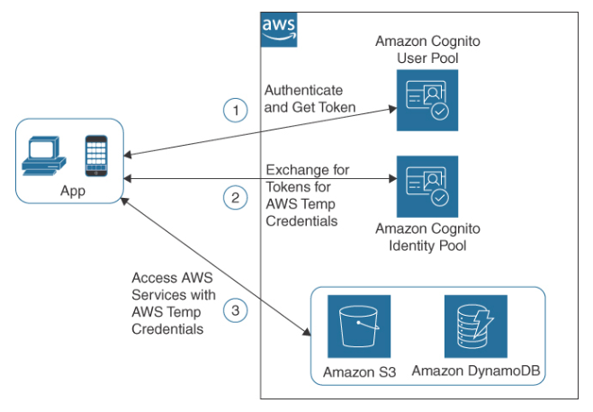

Amazon Cognito
---

- Provides `authentication, authorization, and user management`.
- Enables users to sign into applications hosted at AWS using popular identity providers, such as `Amazon, Facebook, and Google`, without having to create new credentials.
- End users sign in using `either a user pool or federated identity` provider.

# User Pool

- A `fully managed user directory` that enables you to `create and manage user accounts` for your application.
- Provide `sign-up and sign-in` options for your users, as well as user profile management and security features such as `multi-factor authentication` and `password policies`.

# Identity Pool

- Provides `temporary access` to AWS services
- Enable you to `grant your users access to AWS services`, such as Amazon `S3` and Amazon `DynamoDB`.
- Enable your users to `sign in` to your application and use AWS resources without having to create AWS credentials.

> Fig: User Pool and Federated Identity Pool

