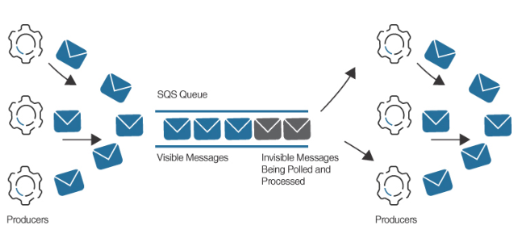

Amazon Simple Queue Service (SQS)
---

- `a fully managed message queue` that allows developers to `decouple communications` between distributed workload components such as applications and microservices.
- allows messages to be `sent, stored, and received` between applications and cloud services.
- Use cases:
  - System-to-system messaging and request offloading.
- Messages can be stored and retrieved at `any volume`.
- In Amazon SQS, a message is a discrete unit of data stored in SQS queues.
- provides different options for sending and receiving messages, including the ability to send and receive messages in `batches`, to specify the `order` in which messages are processed, and set the `visibility timeout` for them.
- Messages can be stored for `up to 14 days`; the `default is 4 days`.
- SQS messages can contain `up to 256 KB` of XML, JSON, and unformatted text.
- Messages `larger than 256 KB` can be sent to S3 buckets using the `SQS Extended Client Library` for Java.
- Message queues and messages are stored in a `single AWS region across multiple AZs` providing redundancy and failover.
- `Amazon MQ` supports several different messaging protocols, including `JMS, NMS, and MQTT`, and can be used to integrate different applications, services, and systems without having to rewrite the messaging code for migrated applications.

# Standard queues

- has the `best-effort ordering of messages`, and messages are delivered `at least once`.
- The order in which messages are received from a standard queue is `not guaranteed to be the same as the order in which they were sent`.
- Use cases:
  - Sending notifications
  - Storing application state
  - Processing workloads in parallel
- are more `cost-effective` than FIFO queues.

# FIFO (first-in, first-out) Queues

- This queue type `preserves the order in which messages are sent and received`, and each message is `delivered exactly once`.
- Duplicate messages are not stored in a FIFO queue; instead, messages are grouped into distinct ordered bundles tagged with a `message group ID`.
- Use cases:
  - Financial transactions
  - Communication between microservices
- support a `limited number of transactions per second` and have `higher costs` compared to standard queues.

# Message polling

- Applications can receive messages from an SQS queue using either the `default short polling` method or the `long polling method`.

## Short Polling

- may return empty message responses. 

## Long Polling

- can help reduce the number of empty received message 
responses by allowing Amazon SQS to `wait until messages are available in the queue before notifying a receiver program`
- The default polling `wait time is 20 seconds` for long polling.

# Dead-letter Queue (DLQ)

- Messages can be stored in the optional dead-letter queue after the maximum number of processing attempts have completed successfully. 
- Alarms linked to `SNS notifications` can be configured for any `messages delivered to a DLQ`.
- Messages can be moved from the DLQ back to the source queue for reprocessing.

# Visibility Timeout

- During the processing of each message, there is a `period of time where a message being processed is not visible`.
- Once a message is successfully processed, a deletion request removes the processed message from the message queue.

> Fig: Visibility Timeouts

# SQS can be used with following services:

- [DynamoDB](../storage/dynamo-db.md)
  - You can use SQS to transfer messages to DynamoDB by using a Lambda function.
- EC2 instances
  - You can scale an Auto Scaling group out or in when messages in the SQS queue increase.
- Amazon ECS
  - Worker tasks within a container execute a script that polls for SQS messages and processes them as necessary.
- Amazon RDS
  - A lightweight daemon connects to an SQS queue and delivers messages to a SQL database.
- [AWS Lambda function](../compute/lambda.md)
  - SQS queues can be configured to trigger a Lambda function.

<h2 style="background-color:lightgreen">Amazon SQS Cheat Sheet<h2>

- SQS uses `pull-based` polling.
- The visibility timeout is the amount of time a message is unavailable after a message is being processed.
- If a message cannot be processed within the visibility timeout period, the message becomes available in the queue for processing.
- Each `message is deleted after it is processed successfully` within the visibility timeout period.
- The `maximum visibility timeout period is 12 hours`.
- Queues can be either standard or FIFO.
- FIFO preserves the exact order in which messages are sent and received.
- The maximum size of SQS messages is `256 KB`.
- Queues can be encrypted with server-side encryption (SSE) using keys managed by AWS Key Management Service (KMS).
- Notifications can be published to an SNS topic with multiple subscribers to SQS queues from different AWS accounts.
