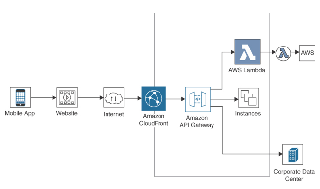

Amazon API Gateway
---

- is located `between your client applications and back-end services`.
- is a service that makes it easy to `create, publish, maintain, and secure APIs`.
- provides features such as `authentication and authorization, rate limiting, and caching`, to help ensure that APIs are secure and scalable.
- It also provides `tools for monitoring and analyzing API usage` and performance.
- supports `HTTP, REST`, and `WebSocket` APIs

# API
An application programming interface (API) is `a set of rules and protocols for building software applications`.

- **The A**, for application, could be a custom function, the entire app, or something in between.
- **The P** is related to the type of programming language or platform that created the API.
- **The I** is for interface, and API Gateway interfaces with HTTP/REST APIs and/or WebSocket APIs. Java API types can direct HTTP requests across the private AWS network. Hosted APIs are exposed publicly using HTTPS endpoints.

> Fig: API Gateway Communication Options

# Features of API Gateway

- `Security`
  - API Gateway `supports AWS IAM and Amazon Cognito` for authorizing API access.
- Traffic `throttling`
  - It is possible to cache API responses for incoming requests; cached responses can be answered for an API call with the same query. The number of requests each API can receive can be defined, with usage plans defining an API’s allowed level of traffic.
- `Multi-version support`
- `Metering`: Metering allows you to throttle and control desired access levels to a hosted API.
- `Authorized access`
  - When an AWS API is called, API Gateway checks whether authentication is required before the task that the API has requested is carried out.
  - Authentication options are an `AWS Lambda authorizer` or Amazon `Cognito user pool`.
  - API Gateway calls the selected authorizer, passing the incoming authorization token for verification.
  - An Amazon Cognito user pool can be configured for authenticating the mobile application using various methods, including single sign-on (SSO), OAuth, or an email address to access the backend application components.

<h2 style="background-color:lightgreen">API Gateway Cheat Sheet</h2>

- With API Gateway, developers can `publish, maintain, and secure` APIs at `any scale`.
- API Gateway can process hundreds of thousands of `concurrent API calls`.
- API Gateway `works together with Lambda` to create application-facing serverless infrastructure.
- Amazon CloudFront distributions can be used as a public endpoint for API Gateway requests.
- Edge-optimized APIs can be used for clients in different geographic locations. API requests are routed to the closest edge location.
- Regional API endpoints can be used by clients located in the same AWS region.
- Private API endpoints can be accessed from a VPC using an interface VPC endpoint.
- API Gateway can scale to any traffic level required.
- API Gateway logs track performance metrics for the backend, including - API calls, latency, and error rates.
- API Gateway only charges when your hosted APIs are called. Charges are based on the amount of data that is transferred outbound.
- API requests can be throttled to prevent overloading your backend services.

> Fig: A Serverless Corporate Application

