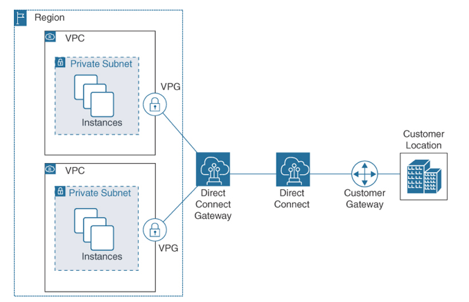

AWS Direct Connect
---

- Enables you to establish a `dedicated network connection` from your on-premises data center to AWS.
- Types of connection offered:
  - Dedicated connection
    - Provides a `dedicated, single-tenant` network connection.
    - Uses a physical network connection with a capacity of from 1 to 100 Gbps.
  - Hosted connection
    - Establish a connection to AWS `Direct Connect over public Internet`.
    - Uses a virtual interface with a capacity of 50 Mbps, 100 Mbps, or 200 Mbps.

> Fig: Direct Connect

# AWS Direct Connect Gateway

- A component of AWS Direct Connect that enables you to `connect multiple VPC to a single AWS Direct Connect` connection.
- Acts as a `central hub for the VPCs` that are connected to it, enabling the routing of traffic between the VPCs.

# AWS Direct Connect Cheat Sheet

- You can configure an AWS Direct Connect connection with one or more virtual interfaces (VIFs).
- `Public VIFs` allow access to services such as Amazon `S3` buckets and Amazon `DynamoDB` tables.
- `Private VIFs` allow access only to `VPCs`.
- An AWS `Direct Connect` connection allows connections to `all availability zones within the region` where the connection has been established.
- You are charged for AWS Direct Connect connections based on data transfer and port hours used.
- AWS Direct Connect dedicated connections are available at 1 Gbps up to 100 Gbps speeds.
- You can order speeds of 50 Mbps up to 200 Mbps through a hosted connection through AWS Direct Connect partners.
- An AWS Direct Connect gateway allows you to connect to multiple VPCs.
- An AWS Direct Connect gateway can connect to virtual private gateways and private virtual interfaces owned by the same AWS account.
- An AWS Direct Connect gateway can be associated with AWS Transit Gateway, extending an organization’s private network.
- An AWS Direct Connect connection can also be used with an IPsec VPN connection for additional security.
