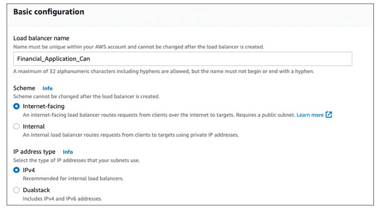
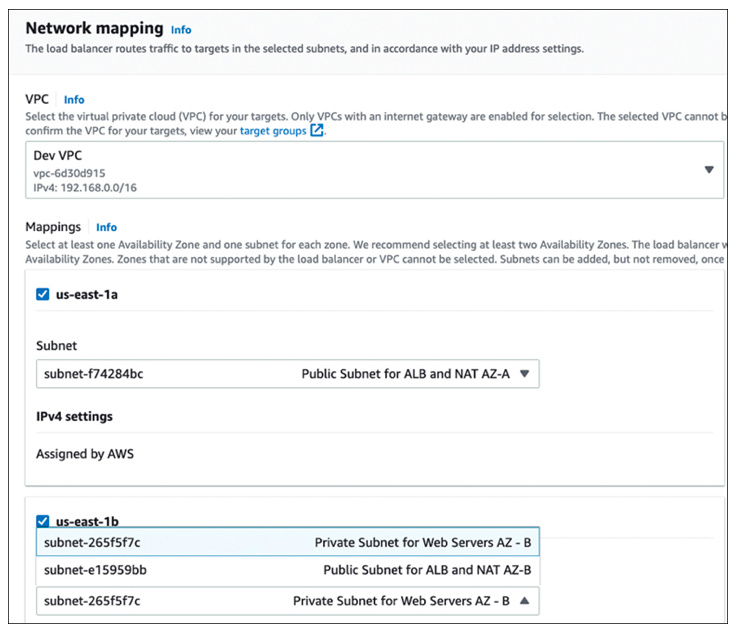
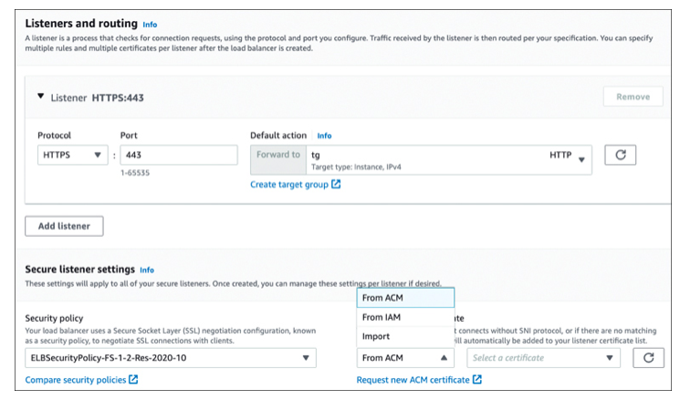
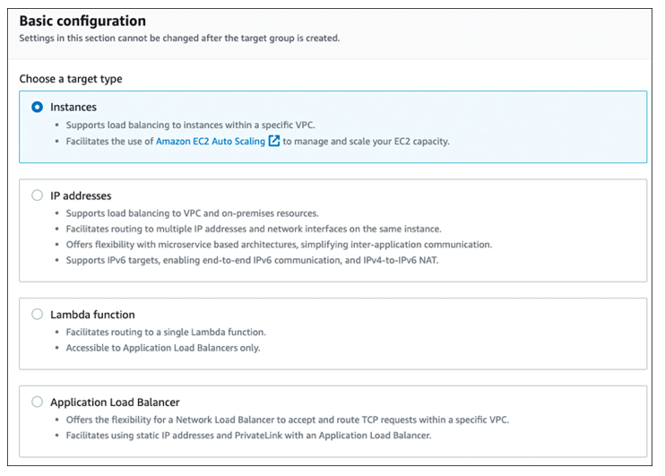
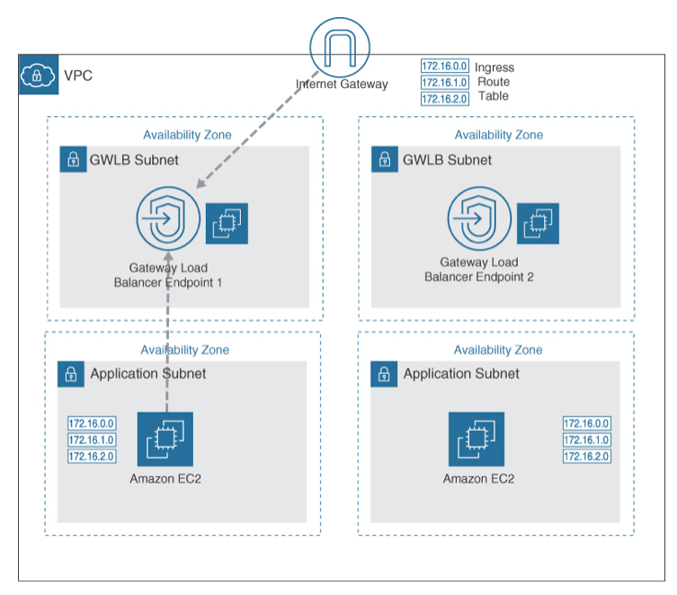

ELB Service (ELB)
---

- is a load balancing service that distributes incoming application traffic across Amazon EC2 instances, Amazon ECS containers, AWS Lambda functions, and IP addresses.
- helps to `ensure that your application is highly available and scalable by distributing incoming traffic across multiple resources`.
- help to `improve the performance` of your application by `evenly distributing traffic` across your resources and `automatically scaling` them to meet demand.
- provides the Application Load Balancer for HTTP/HTTPS workloads and the Network Load Balancer for TCP/UDP workloads.
- The `Gateway Load Balancer` can deploy and manage third-party load balancer virtual appliances such as Nginx, Cisco, and Broadcom.

> Fig: Application Load Balancer Targets

- Each load balancer ordered is assigned a traffic profile with a prescribed amount of throughput capacity.
- The ELB service monitors the performance and requirements of each online load balancer and scales the performance and capacity required based on the incoming user requests.
- For each load balancer ordered, you are charged a small monthly fee, plus data transfer charges based on the number of Load Balancer Capacity Units (LCUs) used every hour.
- The LCU is the hourly aggregate total of incoming traffic requests based on new and active connections, consumed bandwidth, and the number of listener rules evaluated.

# Application Load Balancer Features

- ALB have features used to manage and route incoming public traffic from the Internet:

## SSL/TLS traffic decryption

- ALB `deploy SSL offloading` performing decryption on the incoming connection request; `SSL traffic is terminated on the load balancer` sending the decrypted request to the registered target.

## Server Name Indication (SNI)

- ALB support `hosting multiple certificates` per ALB, enabling multiple websites with `separate domains to be hosted by a single ALB`.
- Up to 25 certificates can be attached per ALB.
- SNI enables the assignment of the correct SSL/TLS certificate to the associated server; the ALB sends the website’s or domain’s public key to the end user to establish a secure connection with the load balancer.
- ALB `supports classic Rivest-Shamir-Adleman (RSA)`, the industry standard in asymmetric keys, and the newer Elliptic Curve Digital Signature Algorithm (ECDSA) for elliptic-curve cryptography.
-  When ECDSA is compared to RSA with regard to the TLS handshake, ECDSA communication is nine times faster.
- ECDSA has become popular because it is used by Bitcoin, the Apple iOS, and iMessage.

## Dynamic port mapping

- ALB support load-balancing containers running the same service on the same EC2 instance where the containers are hosted.
- When Amazon EC2 Container Service (ECS) task definitions are launched multiple times on the same EC2 instance, the containers are running duplicates of the same service; dynamic port mapping process assigns a random port to each container task.

## Connection draining

- When an EC2 instance that is registered with a load balancer is tagged as unhealthy by failing its health checks, the connections to the instance are closed through a process called connection draining.
- From the point of view of the load balancer, the connection draining process keeps existing connections open until the client closes them but prevents new requests from being sent to the instances that are tagged as unhealthy.
- Connection draining removes select EC2 instances from a load balancer target group when maintenance is required—for example, when it’s time to update a healthy EC2 instance with a new Amazon Machine Image (AMI). Performing the de-registration process on an EC2 instance (see Figure 11-10) starts the connection draining process, keeping the existing connections open to provide enough time to complete all ongoing requests. An EC2 instance that is in the process of de-registering will not accept new connection requests.

## Cross-zone load balancing

- The nodes for the load balancers distribute incoming traffic requests evenly across the registered targets in the enabled AZs.
- If cross-zone load balancing is disabled, each load balancer node distributes traffic across the registered targets in its assigned AZ.
- `can be disabled at the target group level`; it is `enabled by default for ALBs` and `disabled by default for NLBs`.

## User authentication

- Application Load Balancer `allows you to offload the authentication process` so the load balancer can authenticate users as they request access to cloud applications.
- ALB `integrates with AWS Cognito`, which allows both web-based and enterprise identity providers to authenticate through the ALB.

## HTTP/2 and gRPC Support

- HTTP/2 `allows multiple requests to be sent across the same connection`.
- ALB can load balance gRPC traffic between microservices and gRPC-enabled clients and services.
- gRPC uses HTTP/2 for routing communications for microservice architectures.

# Application Load Balancer Deployment

- Choose whether the load balancer accepts public inbound traffic (Internet-facing) or private inbound traffic (internal).
- Select the IP address type to be used: IPv4 or Dualstack (IPv4 and IPv6).

> Fig: Initial Configuration of ALB

- Select the VPC, AZ(s), and the subnets the Application Load Balancer will be linked to.
- The ALB is always hosted in public subnets for Internet-facing applications. Public-facing load balancer deployments also require that an Internet gateway be attached to the VPC where the load balancer is being installed.
- When you enable an AZ for an ALB, the ELB service creates an ALB node in each AZ.
- For ALB deployments, at least two AZs are required, ensuring that if one AZ becomes unavailable or has no healthy targets, the ALB will route traffic to the healthy targets hosted in another AZ.

> Fig: Choosing AZs and Subnets

- A security group must be created or selected to allow traffic requests from clients to the ALB. Allowed client traffic and health check traffic is sent to the respective target groups on the listener port—for example, port 80 or port 443. The security group for the ALB controls the traffic that is allowed to reach the load balancer; it does not affect the traffic that is forwarded to the targets in the target group. The ALB must be able to communicate with registered targets on both the listener port and the defined health check port, both inbound and outbound.

## Listeners and Routing

- A listener continuously checks for incoming connection requests based on the defined ports and protocols configured. Incoming connection requests that match are forwarded to a target group. Common protocol options are port 80 and port 443 (see Figure 11-13). An ALB listener supports HTTP/HTTPS and ports from 1-65535. Redirect actions can also be deployed to redirect client requests from one URL to another, such as HTTP to HTTPS, or HTTP to HTTP.

- After an initial listener has been configured and the ALB has been launched successfully, additional listeners can be added by editing the ALB properties. ALB HTTPS listeners use a feature called SSL offload, which supports encrypted traffic between the client and the load balancer and decrypts traffic sent from the load balancer to registered targets. To ensure that registered targets decrypt HTTPS traffic instead of the ALB, create a Network Load Balancer with a TCP listener on port 443. With a TCP listener, the load balancer passes encrypted traffic directly to the targets without decrypting it first.

- ELB uses security policy to negotiate SSL connections between a client and the load balancer. For HTTPS listeners listening on port 443, an X.509 certificate must also be associated with the secure listener. Use AWS Certificate Manager (ACM) to first upload your organization’s SSL/TLS website or domain certificate; then select the certificate and select a security policy that is applied to all frontend connections. Uploading a custom security policy to secure the backend communications is not allowed. Each request accepted by the listener uses two connections:

  - A frontend connection between the client and the load balancer: Organizations choose the security policy for frontend connections. During the connection negotiation between the client and the ALB, a set of ciphers and protocols is presented by the client and ALB and a cipher is selected for the secure connection.

  - A backend connection between the load balancer and the associated target: The ELBSecurityPolicy-2016-08 security policy is always used for securing backend connections. Application Load Balancers do not support custom security policies.

- By default, when frontend or backend load balancing connections have not processed data for 60 seconds, the connections are closed. Connections can be left open for a longer time by editing the default attributes of the load balancer.

## Rules, Conditions, and Actions

A rule consists of a set of conditions and an action. When the ALB receives a request, it evaluates the conditions in the rule to determine whether the action should be taken. If the conditions are met, the action is performed and the request is routed to the specified target group. If the conditions are not met, the next rule is evaluated. Each listener has at least one default rule and action defined for routing traffic to a target group (see Figure 11-14). Default rules don’t have conditions. Additional rules can be created with defined conditions; if the conditions are met, the rules’ actions are performed; if the conditions are not met, the default rule is used instead. With multiple rules, the rules are evaluated in priority from the lowest to the highest value. Multiple rules can be created for an ALB, and each rule can have multiple conditions. The order of the rules is important because the ALB evaluates the rules in the order in which they are specified. You can specify the order of the rules being processed using the priority field.

> Fig: ALB Listener and Routing Setup

- Each rule must include one of the following actions; the action with the lowest defined value is performed first:

  - forward: This routing option forwards the request to a specific target group.
  - redirect: This routing option redirects the request from one URL to another. Usable components include the protocol (HTTP to HTTP, HTTP to HTTPS, and HTTPS to HTTPS), hostname, port, or path.
  - fixed-response: This routing option sends a custom HTTP response to the end user.

The following routing conditions are supported for rules:

- host-header: This routing option forwards requests to a target group based on the domain name contained in the host header. When the hostname in the host header matches the hostname in the listener rule, the request is routed. Wildcard characters can be used in the first part of the hostname but not in the part of the name after the period (*name*.com). For example, requests to a.example.com could be sent to one target group, and requests to b.example.com could be sent to another target group. Rules can be created that combine the path and host-based routing, allowing you to route requests to a specific path, such as /productiondocs.
- http-header: This routing option uses the HTTP headers (for example, Chrome or Safari).
- path-pattern: This routing option is based on the path pattern of the URL (for example, /images/*). If the path in the URL matches the path pattern defined in the listener’s rule, as shown in Figure 11-15, the request is routed. Instead of just the root domain used as the path to send requests, endpoints can be defined at the ALB, directing the traffic requests. Both path and host-based routing allow you to control the compute environment where the requests are being directed. Certain requests, such as API calls, could be directed to be processed on a target group of compute-optimized EC2 instances; other requests could be directed to another target group containing memory-optimized EC2 instances.
- query-string: This routing option is based on key/value pairs or values in the query name configuration.
source-ip: This routing option is based on the source IP address for each request.

There are also authentication actions for authenticating users using Cognito (authenticate-cognito) or a compliant OpenID Connect identity provider (authenticate-oidc).

## Target Groups

- `routes requests to one or more registered targets`.
- Once a registered target has passed its health checks, the load balancer will route connection requests to the target.
- There are four choices for target groups, as shown in Figure 11-16:
  - EC2 Instances: EC2 instances that are located in the AWS VPC defined by the target group. Load balancers that are linked to an Auto Scaling group use EC2 instances that are defined by instance ID.
  - IP addresses: IPv4 or IPv6 addresses for cloud hosted EC2 instances or on-premises servers.
  - Lambda function: Register a Lambda function as targets and configure a listener rule forwarding requests to the target group for the Lambda function.
  - Application Load Balancer: Associate an ALB as the target for NLB traffic.

> Fig: Adding a Target Group to ALB

## Health Checks

Health checks are used to monitor the status of targets in a load balancer’s target group. Requests for online availability status are sent to registered targets at a configured interval to verify that registered targets are available to serve traffic. If a target fails a health check, it is removed from the target group and will not receive traffic until it is deemed healthy again.

The frequency and nature of the health checks depend on the protocol and type of target group. For HTTP and HTTPS target groups, the load balancer sends a request to the target and expects a response using a certain status code. For TCP target groups, the load balancer establishes a connection to the target and verifies that it can send and receive traffic.

The health check settings for a target group can be customized to define the ping target, the interval between health checks, and the number of consecutive failures required before marking a target as unhealthy. You can also specify a healthy threshold and an unhealthy threshold, which determine the number of successful or unsuccessful health checks required before marking a target as healthy or unhealthy.

If the EC2 instance responds within the defined response timeout period, the load balancer marks the EC2 instance as in service, and incoming user requests are routed to the healthy targets. Both the ALB and NLB perform health checks against all registered EC2 instances at specific intervals. Health checks are configured during the load balancer setup and configuration and can be changed at any time. The following language is used to describe health checks:
  - A registered target is typically defined as healthy or unhealthy.
  - A target newly added to the target group is defined as initial; once its health check is successful, the target is defined as healthy.
  - When a registered target is being removed and connection draining is underway, the target is marked as draining.

### Health Check Settings

Health Check Setting  | Description
--- | --
Health Check Protocol | Either HTTP or HTTPS.
Health Check Port | The port used for performing health checks on targets. The default is the communications protocol port, which is either 80 or 443.
Health Check Path | The destination ping path on the target. The default is /.
Health Check Timeout Seconds  | The amount of time (from 2–60 seconds) after which a health check is considered failed.
Health Check Interval Seconds | The time between health checks (in the range of 5–300 seconds).
Healthy Threshold Count | The number of consecutive health checks required from an unhealthy target before the target is considered healthy.
Unhealthy Threshold Account | The number of consecutive failed health checks that result in an unhealthy target.
Status code | The HTTP code (in the range 200–499) that indicates a healthy target.

Resilient workloads use health checks to ensure that resources placed behind load balancers (ALB/NLB) are available. EC2 Auto Scaling can also monitor ELB health checks when EC2 instances are automatically scaled using Auto Scaling groups. Chapter 9 provides additional details on EC2 Auto Scaling.

### Target Group Attributes

Attribute | Description
--  | --
De-registration delay  | How much time before a target (instance or IP address) is deregistered. The default is 300 seconds.
Slow start duration | The time before a new target is sent a gradually increasing number of connection requests. It can be set to up to 15 minutes, and there is no default setting.
Round-robin load-balancing algorithm  | Enabled or disabled.
Least-outstanding requests load-balancing algorithm | Enabled or disabled.
Stickiness  | Enabled or disabled.

## Sticky Session Support

If a load balancer is supporting an application that is providing generic information, maintaining a specific user session might not be required. However, for applications where the end user begins communication with an initial server, maintaining the session between the end user and the backend resource is important. If you are buying something online, you expect your session to begin and end properly, without problems.

An ALB supports sticky sessions, which allow the load balancer to bind the user’s active session to a specific EC2 instance. With sticky sessions enabled on a load balancer, after a request is routed to a target, a cookie is generated by the load balancer or application and returned to the client, ensuring that requests are sent to the EC2 instance where the user session is located. All requests from the client to the load balancer include the identifying cookie, ensuring that all requests are routed to the same backend server. The enabling of sticky sessions and the parameters for the stickiness of the cookie are defined by editing the target group attributes tab.

ou can enable sticky sessions for an ALB by specifying a duration for the stickiness period. The stickiness period is the length of time that the ALB should route requests from the same user to the same target.

To enable sticky sessions you must define a stickiness policy when you create a target group. A stickiness policy defines the method that the ALB should use to bind a user’s session to a target. The available stickiness policies are

  - Source IP: This policy uses the client’s IP address to bind the session to a target.
  - Application-based cookies: This policy uses a cookie to bind the session to a target. You can specify the name and duration of the cookie.
What happens when the backend server that the user is connected to fails and is no longer available? The load balancer automatically chooses a new healthy EC2 instance and moves the user to a new server for the remainder of the session, even if the old instance becomes available. Sticky sessions are useful when everything works, but they’re not useful when servers fail, as the new EC2 instance knows nothing about the user’s previous session.

Instead of enabling sticky sessions, consider using a central storage location for user session information, for example a hosted ElastiCache for Redis cluster or ElastiCache for Memcached nodes. For applications with a large number of concurrent user sessions, one of these choices will be a better option to provide resilient storage for user session information.

# Access Logs

You can choose to enable access logs, which provide detailed information about all incoming requests sent to the load balancer. Once access logs are enabled, ELB captures the logging details and stores them in the desired Amazon S3 bucket. Additional security can be provided by enabling server-side encryption on the bucket to encrypt each access log file. Use S3 managed encryption keys to ensure that each log file is encrypted with a unique Amazon S3 managed key. Automatic key rotation is carried out by the Key Management Service (KMS) service.

Log files are published every 5 minutes. Log details include the type of request or connection (that is, HTTP, HTTPS, HTTP2, WebSocket, or WebSocket over SSL/TLS) and the timestamp, client port, target port, request and target processing time, and sent and received bytes. Details provided by CloudWatch logging can also be provided by access logs for a fraction of the cost of using CloudWatch metrics and alarms.

<h2 style="background-color:lightgreen"># ALB Cheat Sheet</h2>

- ALB operates at Layer 7, routing traffic to registered targets—EC2 instances, containers, and IP addresses—based on the content of the incoming request.
- ALB supports HTTP/HTTPS applications and HTTPS termination between the client and the load balancer.
- ALB supports HTTP/2, which allows multiple requests to be sent on the same connection.
- SSL/TLS certificates are managed using AWS Certificate Manager.
- Server Name Indication (SNI) enables you to secure multiple websites using a single secure listener.
- ALB supports IPv4 and IPv6 for Internet-facing load balancers; for internal load balancers, it supports only IPv4.
- ALB can be integrated with Amazon Cognito to provide end-user authentication.
- ALB uses either round-robin or a least-available-request algorithm for targeting registered EC2 instances.
- ALB supports AWS Outposts.
- AWS Certificate Manager or AWS IAM can be used to manage server certificates.

# ELB Deployments

ELB charges are for each hour or partial hour that an ELB load balancer (NLB, ALB, or GWLB) is running, including the number of Load Balancer Capacity Units (LCUs) used per hour by each deployed load balancer. Each LCU offers

  - 25 new connections per second
  - 3,000 active connections per minute
  - 1 GiB of processed bytes per second
  - 1,000 rules evaluated per second

A Gateway Load Balancer allows organizations to centrally manage a target group of third-party load balancers distributing all incoming traffic to the virtual appliances (see Figure 15-1). Gateway Load Balancers use a virtual private cloud (VPC) endpoint called a Gateway Load Balancer endpoint (GWLB endpoint) powered by AWS PrivateLink, allowing traffic across the GWLB endpoint. Each GWLB endpoint is priced per VPC attachment and per GiB of data processed through the endpoint. The supported protocol is GENEVE and the port is 6061.

A Load Balancer Capacity Unit (LCU) measures the hourly characteristics and the capacity of network traffic processed by each deployed load balancer. You are charged based on the dimension with the highest hourly usage. The four dimensions are as follows:

  - New connections: The number of newly established connections per second
  - Active connections: The number of active connections per minute
  - Processed bytes: The number of bytes processed by the load balancer in GiBps
  - Rule evaluations: The number of listener rules processed by the load balancer

> Fig: Gateway Load Balancer Deployment

