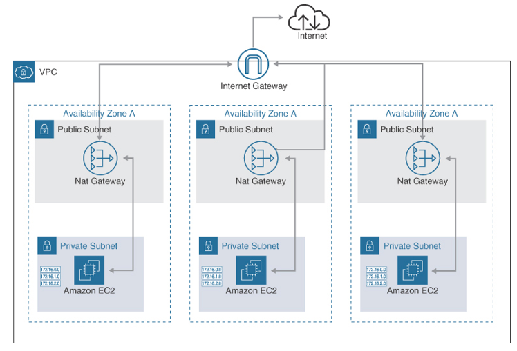

NAT Gateway
---

- Stateless

NAT devices relay packets between EC2 instances hosted on private subnets and Internet locations, returning responses back to the EC2 instance that sent the original request. There are hourly charges for each NAT gateway deployed and data processing charges for the GiBs of data transferred.

There are several use cases to consider when deploying NAT services at AWS:

# NAT gateway instance use case

- An EC2 instance that has deployed a NAT AMI. Customers that choose this option must also manage updates and scale each NAT instance when more performance is required. The performance of the NAT instance will be determined by the EC2 instance type chosen. Network performance can be increased by choosing a different EC2 instance. Many EC2 instances have up to 5 GiBps bandwidth; for example, an m5n.xl instance has 50 GiBps of network bandwidth.

# NAT gateway instance high availability

- For high-availability deployments, multiple NAT gateway instances can be deployed per availability zone (see Figure 15-2), but costs will be higher. The NAT gateway service can scale throughput up to 50 GiBps. Multiple NAT gateway service deployments per AZ provide high availability.

> Fig: NAT Gateway Service HA Deployment

Costs can be reduced for NAT services by doing the following:

- Enable NAT gateway instances during defined maintenance windows for required updates.
- Create NAT gateways in the same AZ as the instances requiring Internet access to reduce cross-AZ data transfer charges.
- If most traffic through the NAT service is to AWS services that support VPC interface endpoints, create an Interface endpoint for each service.
- If the majority of NAT service charges are to Amazon S3 or Amazon DynamoDB, set up gateway VPC endpoints. There are no charges for using a gateway VPC endpoint.

