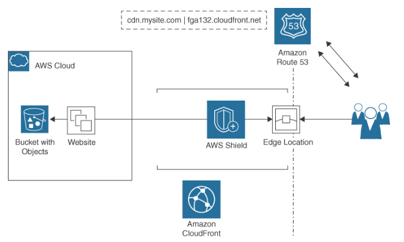
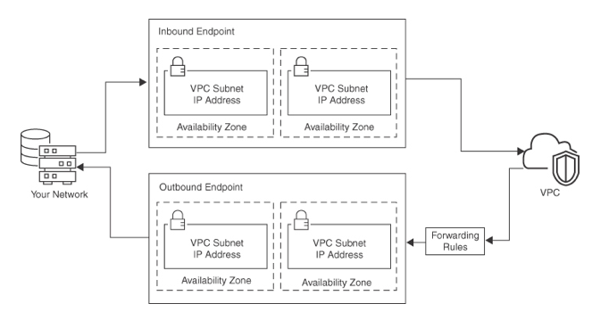
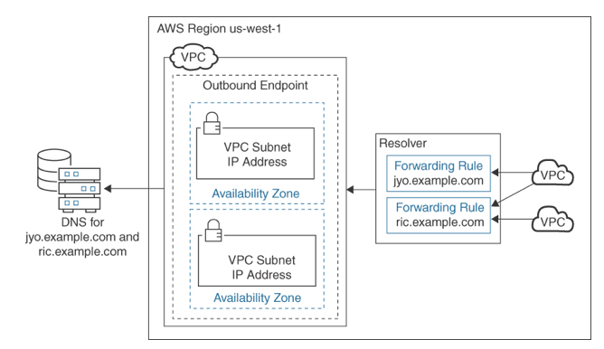

Route 53
---

- DNS services for resolving queries to Amazon CloudFront and AWS Global Accelerator deployments.
- is `named for the standard DNS port number`.
- has a public side tuned to the public edge locations that accepts incoming customer requests and resolves each query to the requested AWS resource located on Route 53’s private side.
- knows about every resource created at AWS that is hosted on the private network.
- It supports both `IPv4 and IPv6` address records, including the common `A, AAAA, CA, CNAME, MX, NS, PTR, SOA, SRV, and TXT records`.

# Routing Types

- `Latency` routing policy
  - Routes end users to the AWS region that has the lowest latency
- `Failover` routing policy
  - Routes end users to resources that are available in an active-passive or active-active design across multiple regions
- `Geo-location` routing policy
  - Routes traffic based on the `location of the end user`
- `Geo-proximity` routing policy
  - Routes traffic based on the `location of your resources`
- `Multi-value` answer routing
  - Includes health checks of resources, improving high availability

> Fig: Route 53 Operations at the Edge

# Route 53 Services

## Domain name registration

- You use Route 53 to `register the domain name` for your website or application.
- Route 53 DNS records `can also be linked to an existing domain`.
- When a domain has been registered with Route 53, it becomes the DNS service for the domain and creates a hosted zone for the domain.
- For redundancy, `Route 53 assigns four name servers to the hosted zone`; these name servers provide details about the location of your resources.

## DNS Resolution

- Route 53 routes Internet traffic to the resources for your domain both for public-facing resources and services and for AWS resources and services hosted at AWS.
- A `public hosted zone is required for public-facing resources` such as a company website.
- `Private hosted zones are created to route traffic within a VPC`.
- Each hosted zone has two records:
  - A name server (NS) record
    - identifies the four name servers available to answer queries.
  - Start of authority (SOA) record
    - indicates the authoritative location for answering queries for your domain.

## Health Checks

- `Automated health checks` can be delivered on a persistent schedule to cloud services and resources to confirm they are still available and functioning.
- When resources become unavailable, Route 53 routes requests from unhealthy resources to healthy resources.
- can monitor both the `health and the performance` of regional services including load balancers, web applications, and other external resources registered with Route 53.
- Each health check can monitor the following:
  - Health of resources
    - Health checks can monitor `selected endpoints based on their DNS name, IP address, or domain name` to verify whether resources are reachable and functioning.
  - Status of other health checks
    - Health checks can monitor multiple regional workloads to ensure that healthy resources are available across AWS regions or resources located on other public clouds or on premises.
  - Status of CloudWatch alarms
    - Route 53 can monitor the same metrics being monitored by CloudWatch and make decisions without needing to communicate directly with the CloudWatch service.

# Route 53 Policies

Routing Policy    | Function    | Use Case
--- | --  | --
Simple  | A simple DNS response matching the requested resource with the current IP address.  | A single resource, such as a web server, that is serving content for a single domain
Failover  | If the primary resource is not responding, the request is sent to the secondary location. | For active/passive failover design with multiple AWS regions
Geo-location | Choose resources based on the geographic locations of your users. | Content can be localized based on the language of your users or to restrict where content can be distributed.  | For routing traffic based on the physical location of the end user
Geo-proximity  | Route traffic to your resource based on the geographic locations of your users and requested resources. This routing requires you to create a defined Route 53 traffic policy.  | For routing traffic based on the location of your AWS resources
Latency | Use for applications hosted in multiple AWS regions. Requests are sent to the resources at the closest location with the lowest-latency route.
Multi-value answer  | Using multiple IP addresses with health checks, Route 53 will return records for healthy resources that respond successfully to health checks.  | For responding with up to eight healthy address records
Weighted  | Associate multiple resources with a single domain name and choose how much traffic is routed to each resource stack. If a weight of 64 is assigned to one stack and a weight of 255 to the other, a weight of 64 would get 25% of the traffic requests. | For routing traffic to multiple resources at defined traffic levels

# Route 53 Traffic Flow Policies

- Route 53 traffic flow provides `global traffic management services (GTMS)` using `traffic flow policies created using the traffic flow visual editor`.
- With traffic policies, you can create a `tree of alias records` and routing policies.

## Route 53 Traffic Flow Policies Editor

- This editor `enables you to create specific routing configurations` for your resources.
- You can create traffic flow policies for situations involving `geo-proximity, endpoint health, overall application load, and latency`.
- For example, you might want to route traffic based on the locations or the languages of your end users.
- In addition, you might want to control the amount of traffic sent to resources by using a bias, which enables you to change the size of the geographic region from which traffic is routed to a resource.

# Alias Record

- provide `additional workload redundancy` as multiple records can be provided for requests for AWS resources.
- When Route 53 receives a query for an AWS resource using an alias record, one or more IP addresses can return pointing to redundant AWS service locations.
- Route 53 responds with multiple IP addresses; if one IP address doesn’t work due to maintenance or failures, one of the other IP addresses will resolve the request.
- The following AWS `services support alias records`:
  - API gateway API request
    - Route 53 provides one or more IP addresses for the requested API.
  - VPC interface endpoint
    - Route 53 provides one or more IP addresses for the endpoint.
  - CloudFront distribution
    - Route 53 provides one or more IP addresses for edge servers for servicing the request.
  - Elastic Beanstalk environment
    - Route 53 provides one or more IP addresses for the environment.
  - ELB load balancer
    - Route 53 provides one or more IP addresses for the load balancer.
  - Global accelerator
    - Route 53 provides one or more IP addresses for each accelerator.
  - S3 bucket configured as a static website
    - Route 53 provides one or more IP addresses for the S3 bucket.
- enable you to `route traffic at the top node of a DNS namespace`, known as the `zone apex`.
  - For example, if the domain mydomain.com is registered with Route 53, the zone apex is mydomain.com.
  - At AWS, a CNAME record cannot be created for mydomain.com; however, an alias record can be created to route traffic to mydomain.com.

# Route 53 Resolver

- automatically answers DNS queries from the EC2 instance’s VPC-specific DNS names and Route 53 private hosted zones.
- If you have a hybrid need for communication between on-premises resources and your VPC resources at AWS or between other peered VPCs, communication can be initiated with forwarding rules.
- You first need to create `resolver inbound and/or outbound endpoints`.
- Inbound queries from the on-premises resource is provided by defining a Route 53 resolver endpoint that resolves to an AWS-hosted domain and the IP addresses of the DNS resolvers to which you want to forward the queries.

> Fig: Forwarding Rules

> Fig: Conditional Forwarding Rules

