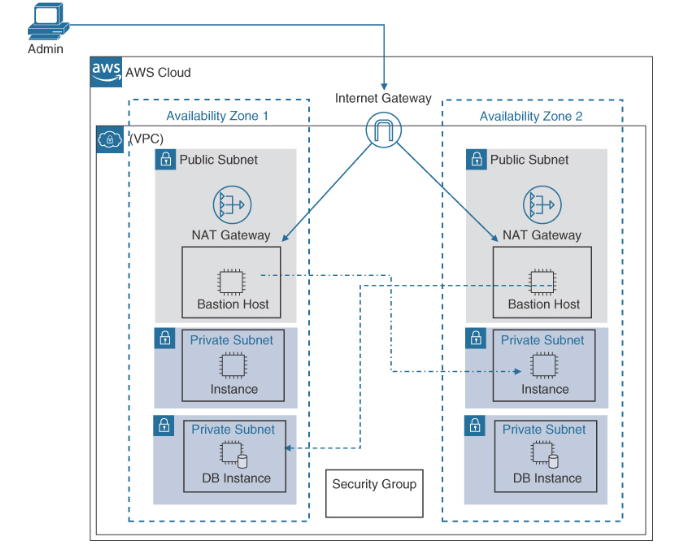
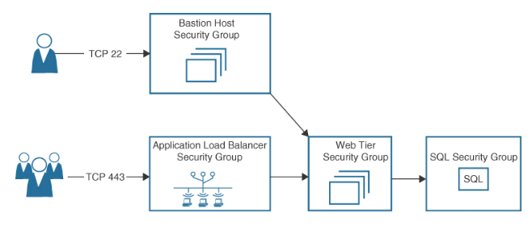

Security Group (SG)
---

- Stateful
- `Default security` group allows all outbound traffic but denies all inbound traffic.
- A `virtual software firewall` that controls the incoming and outgoing network traffic for one or more `EC2 instances` hosted in a VPC.
- Enable you to specify the protocols, ports, and `source IP ranges` that are `allowed` to reach your instances.
- Every attached elastic network interface (ENI) is protected by a security group.
- `Associated with a specific VPC` and has a set of inbound and outbound rules that designate the port(s) and protocol(s) allowed into and out of each network interface.
- EC2 instances that are associated with one security group can access EC2 instances associated with another security group.
- Inbound source could be IP or another SG
- Outbound destination could be IP or another SG
- Outbound traffic uses a dynamically assigned port called an `ephemeral port`, determined by the operating system of the server making the response.
- Security groups can be applied to:
  - Amazon Elastic Compute Cloud (EC2)
  - Amazon Elastic Kubernetes Service (EKS)
  - Amazon Elastic Container Service (ECS)
  - Amazon Relational Database Service (RDS)
  - Amazon Elastic Load Balancer (ELB)

# Custom Security Groups

- `By default`, a custom security group allows `no inbound` traffic but allows `all outbound` traffic.

# A Bastion Host

- a special purpose EC2 instance or third-party software appliance `hosted on a public subnet` exposed to the Internet, `serving as a secure gateway` or “jump box” for remote access to instances hosted on private subnets in the VPC without exposing a web or database server directly to the Internet.

Fig: Bastion Host

# Ephemeral Post

- `Temporary`, short-lived ports that are typically `used` by client applications `for outbound communications from a predefined range of port` numbers and are used for the duration of a communication session. When the session is complete, the port is released and can be used by another application.
- Ephemeral port range
  - Windows Server 2016: 49152 to 65535
  - Linux: 32768 to 61000

Fig: Security Group Design

- 

# Security Groups Cheat Sheet

- A security group acts like a firewall at the EC2 instance, protecting all attached network interfaces.
- Security groups support both IPv4 and IPv6 traffic.
- A security group controls both outgoing (egress) and incoming (ingress) traffic.
- For each security group, rules control the inbound traffic that is allowed to reach the associated EC2 instances.
- Separate sets of rules control both the inbound and the outbound traffic.
- Each security group includes an outbound rule that allows all outbound traffic by default. Outbound rules can be modified and, if necessary, deleted.
- Security groups allow traffic based on protocols and port numbers.
- Security groups define allow rules. (It is not possible to create rules that explicitly deny access.)
- Security group rules allow you to direct traffic outbound from one security group inbound to another security group within the same VPC.
- Changes made to a security group take effect immediately.
- Security groups don’t deny traffic explicitly; instead, they deny traffic implicitly by defining only allowed traffic.
- Security groups are stateful; for requests that are allowed in, their response traffic is allowed out, and vice versa.
- For each rule, you define the protocol, the port or port range, and the source inbound and output destination for the traffic.
- The protocols allowed with security groups are TCP, UDP, or ICMP.
- It is impossible to block specific IP addresses by using a security group; instead, use a network access control list to block a range of IP addresses.
