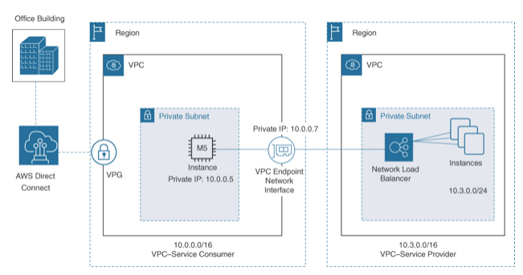
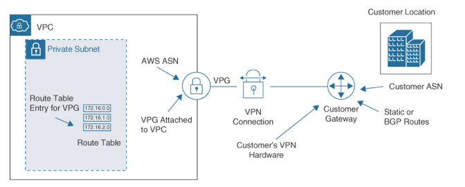

Virtual Private Gateway (`VPG`)
---

- Directly `attached to the VPC` and not subnets.
- Uses Internet Protocol Security `(IPsec) to encrypt the data transmitted` between the on-premises network and the VPC

> Fig: VPG Private Connection

> Fig: VPG Connection Components

