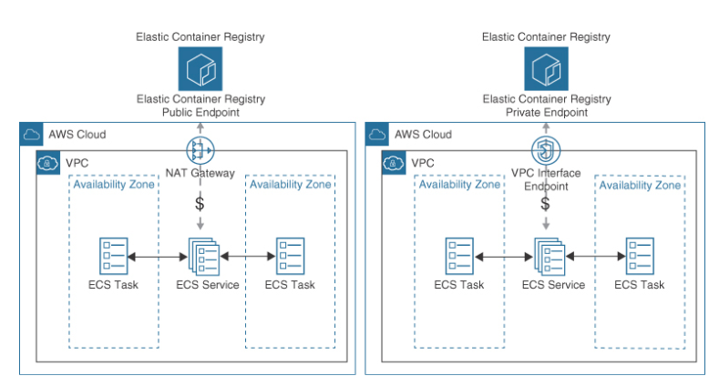
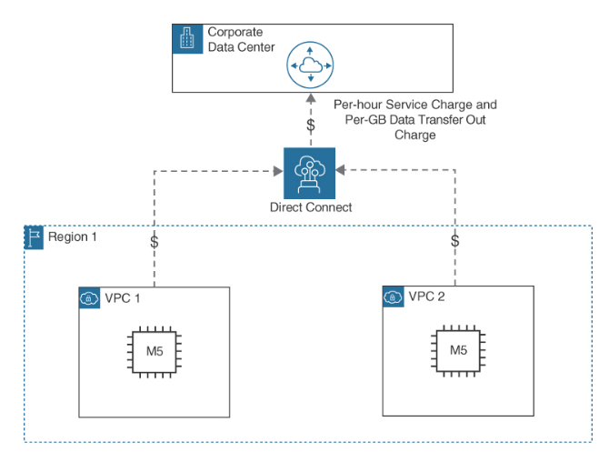
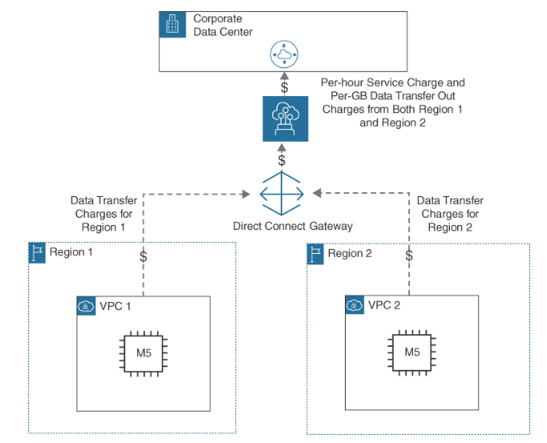
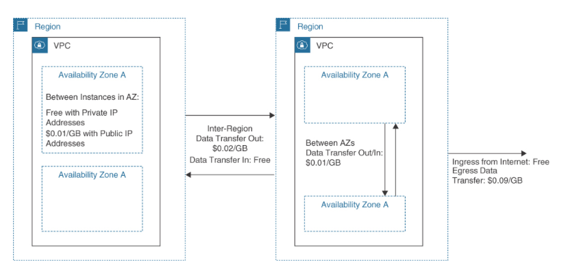
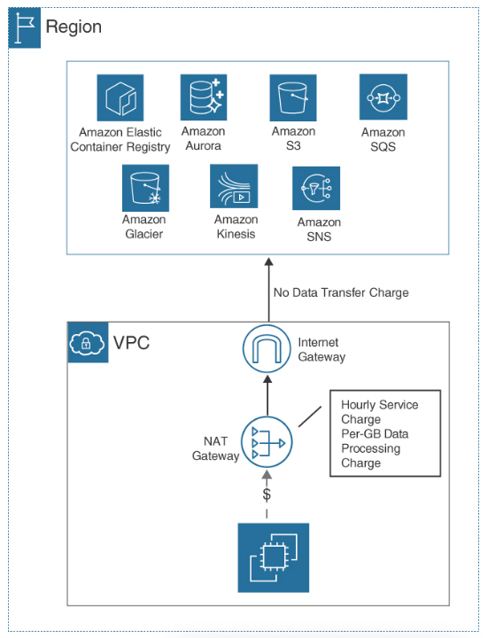
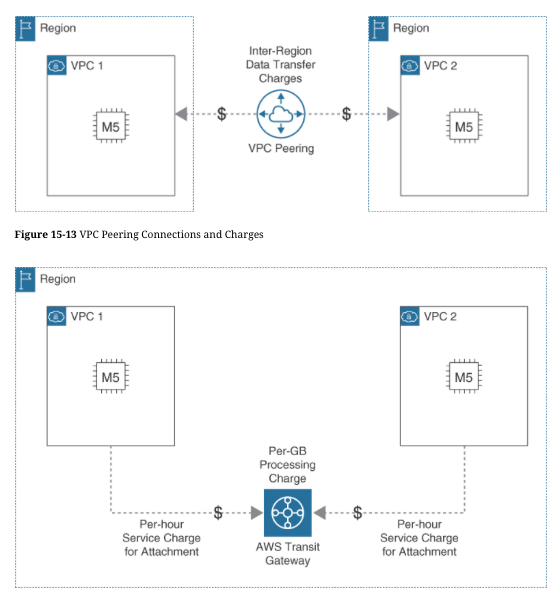
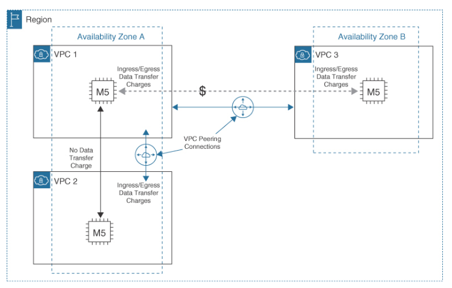
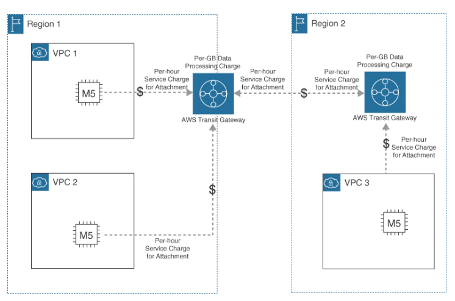
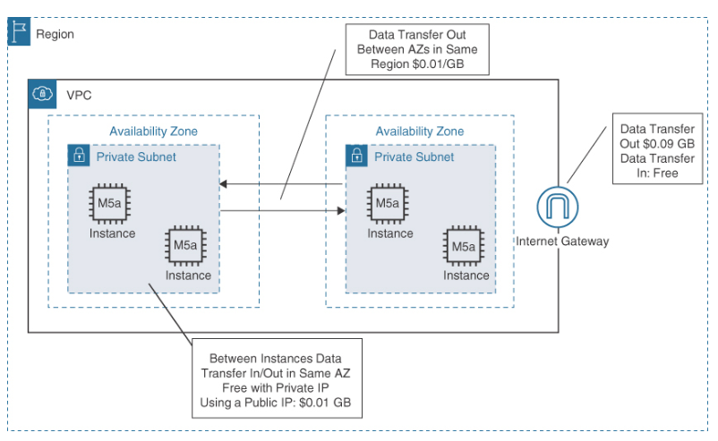

VPC Endpoints
---

- allow `private connections` `from VPC workloads` hosted on subnets to AWS services `across the AWS private network`, allowing private network communication.
- provides `secure access using either a gateway or interface connection` to an S3 bucket from applications running in a VPC without requiring an Internet Gateway or NAT gateway.
- Access to an S3 bucket using a VPC gateway endpoint connection is `not charged`.

Endpoints enable you to create a private connection between your VPC and another AWS service without the need for an Internet gateway, a NAT gateway, or a VPN connection. VPC endpoints are used to enable communication among resources in your VPC and other AWS services using private IP addresses, which can improve the security and performance of your applications. The majority of endpoint connections are interface VPC endpoints; however, there is a gateway endpoint for accessing DynamoDB.

Endpoint services allow access to most AWS services across the private AWS network, providing security and speed:

## AWS PrivateLink

- AWS PrivateLink provides private connectivity between VPCs and on-premises locations to third-party services hosted at AWS. PrivateLink endpoints can also be accessed over VPC peering, VPN, and AWS Direct Connect connections.

## VPC endpoints

- VPC interface endpoints use elastic network interfaces (ENIs) provisioned from the selected subnet in your VPC to a supported AWS service such as Amazon Elastic Container Registry (ECR) (see Figure 15-5). Communicating from a VPC directly to an AWS service across the AWS private network does not require an Internet gateway, NAT gateway services, or AWS VPN connections, thereby saving costs. VPC gateway endpoints route traffic to DynamoDB and Amazon S3 buckets. There are no processing charges when using a VPC gateway endpoint.

> Fig: Accessing Elastic Container Registry Using an Interface Endpoint

For example, using the NAT Gateway Service to pull down images from the Amazon Elastic Container Registry is five times more expensive than using a VPC interface endpoint. VPC interface endpoints are used by AWS resources within the VPC and from on-premises locations using an AWS Direct Connect or VPN connection. VPC interface endpoint pricing is $0.01 per connection hour and $0.01 per GiB processed. Table 15-3 compares the data transfer costs for the NAT gateway and VPC endpoints processing 100 TB of data in a 500-hour timeframe.

# NAT Gateway and VPC Endpoint Charges Comparison (100 TB/500 Hours)

Processing Costs by AWS Service | NAT Gateway Service | VPC Interface   Endpoint  | VPC Gateway Endpoint
--  | --  | --  | --
NAT gateway charge ($0.045) per hour  | $45.00  | $45.00  | $45.00
NAT gateway processing ($0.045) GiB | $4,626.00 | — | —
Gateway endpoint charge ($0.00) per hour  | — | — | $0.00
Gateway endpoint processing ($0.045) GiB  | — | — | $0.00
Interface endpoint charge ($0.00) per hour  | — | $10.00  | —
Interface endpoint processing ($0.045) GiB  | — | $1,028.00 | —
_ | $4,671.00 | $1,083.00 | $45.00

## VPC peering

- Point-to-point connectivity provides full bidirectional direct connectivity between two VPCs. VPC peering costs are charged only when network traffic crosses the peering connection. Best practice is to peer fewer than ten VPCs together. VPC peering has the lowest cost when compared to an AWS Transit Gateway deployment and peering has no hourly infrastructure cost. VPC peering costs are discussed in the next section, “Data Transfer Costs.”

## AWS Transit Gateway

- Hub and spoke designs can connect thousands of VPCs within the same AWS region and on-premises networks. Both VPN and AWS Direct Connect and Direct Connect gateways can be attached to a single AWS Transit Gateway deployment. AWS Transit Gateway peering allows peering Transit AWS Transit Gateway deployments within or across multiple AWS regions.

## VPC sharing

- The owner of a VPC can share a subnet and the resource hosted on the subnet to be shared, such as a database, with other participant AWS accounts. VPC sharing does not require VPC peering. There are no data transfer charges when sharing subnet resources between AWS accounts within the same AZ. VPC sharing is enabled using AWS Resource Access Manager.

# Network Services from On-Premises Locations

Workloads hosted at AWS requiring access to on-premises data centers will incur data transfer charges when connecting using an AWS Site-to-Site VPN connection or an AWS Direct Connect connection:

## Data transferred using an AWS Site-to-Site VPN connection

 Each AWS Site-to-Site VPN deployed will include an hourly charge for each connection and charges for data transferred from AWS across the connection (see Figure 15-6).

## Data transferred using an AWS Direct Connect connection

 Direct Connect provides a high-speed single-mode fiber connection for connecting on-premises networks to AWS. Direct Connect connections are charged a fee for each hour the connection port is utilized and a data transfer charge for data flowing out of AWS (see Figure 15-7). All data flowing into AWS is free ($0.00). Data transfer charges will depend on the source AWS region and the third-party AWS Direct Connect provider location. AWS Direct Connect can also connect to an AWS Transit Gateway instance using an AWS Direct Connect gateway (see Figure 15-8), allowing multiple VPCs to be connected together.

> Fig: Traffic Charges for AWS Site-to-Site VPN Connections

> Fig: Traffic Charges for AWS Direct Connect Connections

> Fig: Traffic Charges for AWS Direct Connect Gateway Connections

# Data Transfer Costs

To reduce networking costs, you need to look at network traffic flows—both egress and ingress. Data transfer costs are charges for egress (outgoing) network traffic across the AWS cloud, and when exiting the AWS cloud. AWS charges you for outbound network traffic to the Internet, across AZs or regions, or across a peered network connection. Regional data transfer costs that include networking are NAT gateway services, VPN connections, and ELB deployments. There are no data transfer costs within a single AZ. There are data transfer costs when a workload spans multiple AZs.

Your first monthly AWS bill will contain a few data transfer charge surprises. Data transfer costs are generally higher for data transfer between AWS regions than for intra-region data transfer between AZs within the same region.

It’s a good idea to subscribe to the Amazon pricing notification service to receive alerts when prices for AWS services change (which happens all the time). See https://docs.aws.amazon.com/awsaccountbilling/latest/aboutv2/price-notification.html.

Sometimes, a link to a cost calculator is present when you order AWS services, but data transfer costs will need to be calculated. Data transfer costs can be expanded into the following breakdowns:

- Data transfer costs across AZs within a region. There are no data transfer costs for data transfer within a single AZ
- Data transfer costs between AWS regions
- Data transfer costs by service for egress data sent outbound

When you transfer data into an AWS region from any service from any other AWS region, it’s free. As a rule, incoming data transfers are free for all public cloud providers. Regional data transfer costs are charged based on data transfer within a region (intra-region) or data transfer across regions (inter-region). Within each region, charges depend on whether you are communicating within an AZ or across AZs

> Fig: AWS Data Transfer Costs Comparison

# Accessing AWS Services in the Same Region

Data transfer into any AWS region from the Internet is free of charge. Data transfer out to the Internet from an AWS region is billed at a region-specific tiered data transfer rate. Current EC2 on-demand pricing rates can be found at https://aws.amazon.com/ec2/pricing/on-demand/#Data_Transfer. Data transfer from a source AWS region to another AWS region is charged at a source region–specific data transfer rate. Monthly AWS bills refer to these costs as inter-region inbound and inter-region outbound costs. If the Internet gateway is used to access the public endpoint of the AWS service in this same region, there are no data transfer charges

> Fig: Accessing Services Using an Internet Gateway

If a NAT gateway is used to access the same AWS services from a private subnet, there will be a data processing charge per GiB for any data that passes through the NAT gateway (see Figure 15-11).

> Fig: Accessing Services Using a NAT Gateway

# Workload Components in the Same Region

Data transfer between EC2 instances or containers or with ENIs in the same AZ and VPC using private IPv4 or IPv6 addresses is free. Data transfer between EC2 instances or containers and Amazon S3 storage in the same AZ from the same VPC is also free. For a custom workload design that uses multiple AZs, there will be service-specific pricing for data transfers for cross-AZ communication between the EC2 instances; however, for Amazon RDS designs deployed across multiple AZs and Aurora, replication of data records across multiple AZs is free. Data transfer charges will be charged for all ingress traffic on both sides of a peering connection that crosses AZs

> Fig: Workload Communications Across Availability Zones

A common workload design pattern is to utilize multiple VPCs in the same AWS region. Two methods of VPC-to-VPC communication are VPC peering connections or AWS Transit Gateway. Any data transfer over a VPC peering connection that stays within an AZ is free (see Figure 15-13). An AWS Transit Gateway can interconnect thousands of VPCs together. Transit Gateway costs include an hourly charge for each attached VPC, AWS Direct Connect connection VPN connection, and data processing charges for each GiB of data to the Transit Gateway

# Accessing AWS Services in Different Regions

Workloads that use services in different AWS regions will be charged data transfer fees. Charges will depend on the source and destination regions. For communication across multiple AWS regions using VPC peering connections or Transit Gateway connections, additional data transfer charges will apply. Inter-region data transfer charges will also apply for VPCs peered across regions

> Fig: Transit Gateway Charges in the Same AWS Region

For Transit Gateway deployments that are peered together (see Figure 15-16), data transfer charges will be charged on one side of the peered connection; for example, data transfer charges do not apply for data sent from the EC2 instance to the Transit Gateway.

> Fig: VPC Peering Charges Across AWS Regions

> Fig: Transit Gateway Peering Charges Across AWS Regions

# Data Transfer at Edge Locations

Viewer requests into an edge location from the Internet is free of charge. Cached data that is transferred outbound from AWS edge locations to the Internet is billed at region-specific tiered data transfer rates.

There are three services that can be deployed (at additional cost) to improve the speed of data transfer between AWS edge locations and end users:

## Amazon S3 Transfer Acceleration: Optimizes transfer of files over long distances between a client location and a single S3 bucket, taking advantage of edge locations; ingress data is routed into an edge location and across Amazon’s private network. Upload speeds comparing S3 direct upload speeds to S3 Transfer Acceleration speeds can be found here: http://s3-accelerate-speedtest.s3-accelerate.amazonaws.com/en/accelerate-speed-comparsion.html.

## AWS Global Accelerator: Route users’ requests across the AWS private network to the AWS application using the closest edge location. AWS Global Accelerator charges a fixed hourly fee and data transfer fees. Additional charges are for each accelerator provisioned and the amount of traffic that flows through the accelerator. There is also an EC2 data transfer out fee charged for application endpoints per hosted region.

## AWS Site-to-Site VPN: An AWS Site-to-Site VPN connects to a VPC or AWS Transit Gateway using IPsec tunnels. Charges are for the Site-to-Site VPN connection per hour and data transfer out charges. AWS Global Accelerator can be used with the Accelerated Site-to-site VPN option routing incoming VPN traffic from the on-premises network to the AWS edge location that is closest to your customer gateway.

Consider the following example: There is a Site-to-Site VPN connection to your Amazon VPC in us-east-2 (Ohio) from your on-premises location. The connection is active for 30 days, 24 hours a day. 2,000 GiB is transferred into the VPC; 800 GiB is transferred out through the site-to-site VPN connection.

## AWS Site-to-Site VPN connection fee: While connections are active, there is an hourly fee of $0.05 per hour; $36.00 per month in connection fees.

## Data transfer out fee: The first 100 GiB transferred out is free; you pay for 700 GiB at $0.09 per GiB, paying $63.00 per month in data transfer out fees.

## Total charges: $99.00 per month for the active AWS Site-to-Site VPN connection.

# Network Data Transfer

The design of your workload and its use of AWS network services will greatly determine your data transfer costs. Network data transfer costs to understand are as follows:

- AWS services that are hosted in the same region but that are in separate AZs are charged for outgoing data transfer at $0.01 per GiB.
- When data is transferred between AWS services hosted in different AWS regions, the data transfer charge is $0.02 per GiB.
Data is transferred within the same AWS region and staying within the same AZ is free of charge when using private IP addresses.
If you are using an AWS-assigned public IP address or an assigned elastic IP public address, there are charges for data transfer out from the EC2 instance. These charges are per GiB transfer, and the minimum charge is $0.01 per GiB.
- Data transfers between EC2 instances, AWS services, or containers using elastic network interfaces in the same AZ and same VPC using private IPv4 or IPv6 addresses are free of charge. A common example is RDS synchronous database replication from the primary database node to the standby database node. Across AZs, there are data transfer charges for RDS synchronous replication.
- Always use private IP addresses rather than public IP addresses, sending data with public IP addresses is charged.
- Different AWS regions have different egress data transfer costs. If possible, architect your applications and systems for minimal data transfer across AWS regions or AZs.

# Public Versus Private Traffic Charges

Public traffic sent to a public IP address traveling across the Internet will incur a much higher data transfer charge than private IP address traffic. Private traffic traveling within AWS is always cheaper than traffic on a public subnet. Wherever possible, AWS uses the private network for communication.

Private traffic that stays within a single subnet incurs no additional charges, whereas private traffic that travels across multiple private subnets that are hosted by different AZs incurs an egress charge of $0.01 per GiB. One of the tasks to carry out for each hosted application is to create a detailed costing of its design, including charges for the replication of the databases across AZs, the monthly charge, and the traffic flow charges

> Fig: Traffic Charges at AWS

Network traffic charges are calculated based on the location of your data records, the location of end users, and the size and volume of all data transfers.

## Data transfer modeling: It is important to understand the locations where data transfer occurs during the operation of a workload, as well as the cost of the data transfer. For example, you might have a custom database solution that replicates across multiple AZs within a single region. It would be more cost-effective to deploy a database using Amazon RDS if the database engine you are currently using is supported. One of the advantages of deploying an Amazon RDS database is that there are no additional charges for synchronous replication between the primary and standby database instances. Use AWS Cost Explorer or the AWS Cost and Usage Report to review the details of data transfer costs. (Details on AWS cost and budgeting tools are provided in Chapter 10, “Determining High-Performing Database Solutions.”)

## Use a dedicated network connection: Perhaps it would be most efficient to establish a dedicated network connection to AWS using an AWS Direct Connect connection. AWS Direct Connect can be ordered in increments from 512 Mbps up to 100 GBps. Advantages include increased security due to the fiber connection being a private connection and faster network performance. Direct Connect involves two charges: port hours used and data transfer. AWS Direct Connect charges are for the bandwidth utilized and the number of connected hours used per month. A 1-GBps connection rate would be $0.30 per hour, whereas a 10-GiBps connection would be slightly over $2.00 per hour. Perhaps the cost of deploying a faster connection is cheaper overall as more data could be processed across a high-speed AWS Direct Connect connection.

## Changing to private endpoints: VPC endpoints allow interface and gateway connectivity between most AWS services over Amazon’s private network. Data transfer over private network connections is always faster than public data transfer. There are no charges for VPC gateway connections.

# Data Transfer Costs Cheat Sheet

- Operate within the same AWS region. If possible, operate within the AWS region that has the lowest data transfer rates.
- Operate within a single AZ. Operating within the same AZ and the same VPC using private IP addresses incurs no data transfer costs.
If the users of your application are spread out across a large geographic area and access application data across the Internet, consider using AWS CloudFront. Data transferred out using AWS CloudFront will be less expensive and much faster than public data transfers across the Internet.
Capture information about IP traffic within a VPC by enabling VPC flow logs.
Use AWS CloudFront for caching content and reducing the load on the origin servers and data location.
Avoid using public IPv4 addresses or EIP addresses as costs are higher than private IPv4 addresses.
RDS Multi-AZ deployments include the data transfer costs for replication between primary and alternate database servers.
Amazon EFS deployments have both single-AZ or Multi-AZ deployment options. A single-AZ deployment can save up to 40% in storage costs.
VPC gateway endpoints have no data transfer charges when communicating with Amazon S3 and DynamoDB within the same region.
VPC interface endpoints are charged hourly service and data transfer charges.
Amazon EFS and Amazon RDS deployments have free cross-AZ data transfers.
Amazon CloudFront has free data transfers for GET requests.
AWS Simple Monthly Calculator allows you to review pricing and data transfer costs for most AWS services.
AWS Pricing Calculator helps estimate the total price for your workload deployment at AWS.

