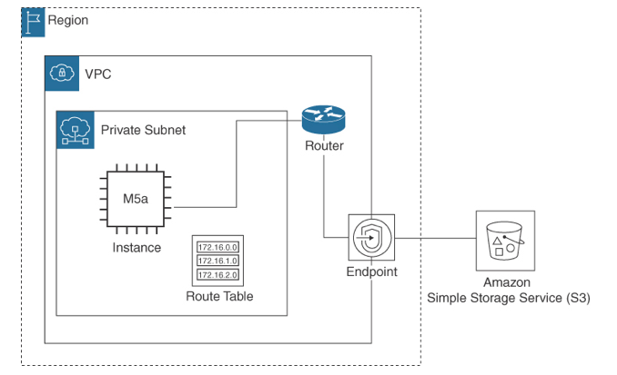

VPC Gateway Endpoint
---

# Private VPC Interface Endpoint

- Allows private access to S3
- Require route table entries

VPC Gateway endpoints are attached to your VPC and use a route in the associated subnet’s route table to connect to the target service. They can be used to connect to Amazon S3 and DynamoDB, as shown in Figure 11-35. VPC Gateway endpoints are not charged for creation and data transfer.

> Fig: Gateway Endpoint Access to S3

Endpoint policies can be deployed to further define the endpoint access rules. The default policy allows full access to the service; this default policy should be evaluated and changed if necessary. Custom endpoint policies control access from the VPC through the gateway endpoint to the service from the EC2 instance.

