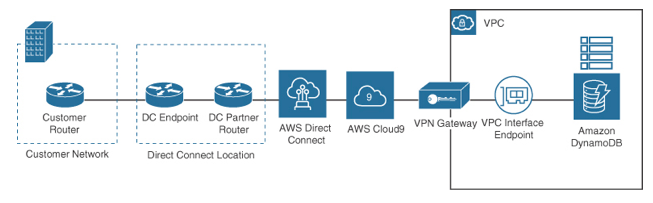

VPC Interface Endpoint
---

# Private VPC Interface Endpoint

- Allows private access to S3
- Does not need route table entries

The newest form of a VPC endpoint supported by AWS is an interface endpoint powered by a technology called PrivateLink. The “interface” is a network adapter designated with a private IP address. AWS services are not all accessible through interface endpoint connections; however, many AWS services are accessible through private interface endpoints.

AWS resources with an interface connection are accessed using a private IP address from the selected VPC subnet. If AWS resources are connected with multiple subnets, multiple private IP addresses will be used—one IP address per AZ subnet. If you are using AWS Direct Connect to link your on-premises data center with AWS resources, there is also a bonus: You can access AWS-hosted data records and AWS services from your on-premises network.

For example, a developer is sitting in an office, working on developing applications using the AWS Cloud9 IDE. The developer accesses the development portal privately across the high-speed fiber Direct Connect connection, and VPC interface connnection shown in Figure 11-36. When the application is finished and deployed in production, the application can continue to be accessed privately through the Direct Connect connection from the head office.

> Fig: Using Interface VPC Endpoints

Many large corporations considering a move to the cloud remain cautious of having corporate data records stored in the cloud. For these situations, endpoint connections combined with high-speed 100-Gbps Direct Connect connections deliver speed, security, and AWS services across a totally private environment.

With no public connectivity, the AWS services that are being accessed using an interface or gateway endpoint are fully protected from any Internet-facing attacks, including DDoS attacks, because the private interface endpoints simply cannot be reached from the Internet. When you create an endpoint inside your VPC, service names are protected; Route 53 DNS services send you to the private endpoint location and ignore any public routes that also may be advertised. Private endpoints also have regional zonal names designed for keeping traffic within the region, allowing customers to isolate traffic, if necessary, to a specific AZ. These zonal endpoints could also potentially save you additional data transfer charges and latency issues.

The hardware powering interface endpoints is publicly called PrivateLink, but internally, AWS calls this network hardware Hyperplane. Hyperplane is a massively scalable, fault-tolerant distributed system that is designed for managing VPC network connections. It resides in the fabric of the VPC networking layer, where AWS’s software-defined networking is deployed; it can make transactional decisions in microseconds. When a VPC interface endpoint is created, it is associated with several virtual Hyperplane nodes that intercept network communications at the VPC networking layer and quickly decide what to do with each request. If a request is made to a private endpoint, the transactional decision and the shared state are applied in milliseconds. Interface VPC endpoints only accept TCP traffic, and each endpoint supports a bandwidth of up to 10 Gbps per AZ. It also automatically scales up to 100Gbps.
