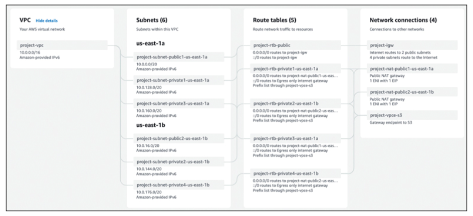
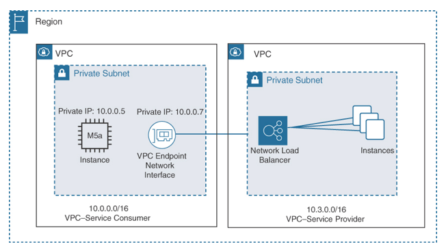

Amazon Virtual Private Cloud (VPC)
---

- allows you to provision a `private, isolated network` utilizing `multiple AZs within a single region`.
- Resiliency for private network connections at AWS, and from on-premises locations to AWS VPCs and AWS cloud services, can also be provided by the following cloud services:
  - Each subnet, route table, security group, network interface, and network ACL is assigned to a specific VPC during creation.

# <h2 style="background-color:lightgreen">VPC Cheat Sheet</h2>

- You can create private IP addresses from any private address range that adheres to RFC 1918 address allocation rules.
- You can expand your VPC by adding additional CIDR ranges.
- You can create both private and public subnets.
- It is possible to control both inbound and outbound subnet traffic by using NACLs.
- You can access most AWS services privately from your VPC by using private VPC endpoints and gateway connections.
- You can privately connect to third-party services hosted at AWS using a PrivateLink connection.
- You can connect on-premises resources privately with a VPC with a site-to-site connection.
- You create VPN connections to your VPC only after a virtual private gateway (VPG) has been installed.
- You can use VPC flow logs to log network traffic information to CloudWatch logs or S3 buckets for further analysis.
With a VPC, you can deploy both IPv4 and IPv6 addressing.
- You can connect a VPC with another VPC by using a peering connection.
- You can assign Elastic IP addresses to EC2 instances for public Internet access.
- You can assign multiple elastic network interfaces to EC2 instances.
- You can protect access to EC2 instances by using one or more security groups.
- The Network Firewall is a managed service that provides network intrusion protection for VPCs using stateful firewall rules.
- The DNS Firewall allows the filtering and protection of DNS queries to public domain names from EC2 instances hosted in a VPC.
- The VPC Reachability Analyzer performs connectivity testing between a source and destination resource hosted in a VPC providing hop-by-hop details and the blocking component.
- The Network Access Analyzer helps identify network configurations that have security issues through testing current ingress and egress paths.
- You can control subnet traffic flow by defining custom route tables and route table entries.
- You can customize DHCP options to suit your needs by using DHCP options sets.
- You can enable private subnets to get updates by using NAT gateway services or NAT EC2 instances.
- You can protect IPv6 EC2 instances from direct communication from the Internet by deploying an egress-only Internet gateway (EOIG).
- You can connect thousands of VPCs, attachments, and gateway connections together in a custom network deployment by using transit gateways, transit gateway peering, and transit gateway route tables.
- You can route multicast traffic between attached VPCs by creating a transit gateway multicast domain.
- You can capture and mirror network traffic for select EC2 instances by using VPC traffic mirroring.

> Fig: VPC Starting Design Choices

# How Many VPCs Does Your Organization Need?

Consider these criteria for calculating the number of VPCs required:

- Your organization wants to extend, or burst, into the cloud, using resources in the corporate data center and cloud services when necessary at AWS. The primary need is to deploy additional compute resources at certain times of the month when additional performance is required. For this scenario, one VPC could be enough. A single VPC can host many subnets and EC2 instances with private connectivity back to a corporate data center.
- You are an independent developer creating a SaaS application that will be available across the Internet to users around the world. You have no corporate data center. You require a separate development, testing, and production workspace—three VPCs within a single region would be a good starting point.
- You are an administrator who has been tasked with leveraging cloud storage at AWS. You need unlimited storage, and you don’t know the upper limit of your storage requirements. Your solution doesn’t require a VPC. You need storage—perhaps S3 object storage or S3 Glacier archiving. The AWS S3 storage service does not reside within a VPC.
- You work for a large company that must follow specific compliance rules that dictate that workload resources must always remain separated. Separate VPCs for each workload must be created for development, testing, and production.

# Creating the VPC CIDR Block

A VPC created using either an AWS CLI command or the Create VPC wizard is a blank slate except for the primary IPv4 Classless Inter-Domain Routing (CIDR) block and the local main routing table. Here are some CIDR details to be aware of:

- Both IPv4 and IPv6 subnets are supported within a VPC; however, a VPC or a subnet must have an initial IPv4 CIDR block defined first.
- IPv6 CIDR blocks can be associated with your VPC, but only after an initial IPv4 CIDR block has been created.
- Only IPv6 subnets can be created in a dual-stack (IPv4/IPV6 CIDR) VPC.
- CIDR blocks can’t overlap with any existing CIDR blocks associated with another VPC connected with a peering connection. Overlapping CIDR blocks are to be avoided unless it’s a deliberate decision to ensure that a VPC cannot connect to another VPC, regardless of the situation.
- The size of an existing CIDR block cannot be increased or decreased; it is locked after creation.

# Planning Your Primary VPC CIDR Block

Organizations can specify a range of IPv4 addresses for each VPC using a Classless Inter-Domain Routing (CIDR) block.

CIDR notation is a standard syntax for representing IP addresses and their associated routing prefix. It consists of an IP address and a prefix size, separated by a slash (/) character. The prefix size specifies the number of bits in the routing prefix, which determines the number of addresses in the range.

For example, the CIDR block 10.0.0.0/16 specifies a range of 256 IP addresses starting with 10.0.0.0 and ending with 10.0.255.255. The /16 prefix size indicates that the first 16 bits of the address are used for the routing prefix, and the remaining bits are used for host addresses.

For a VPC’s starting CIDR address, choosing 192.168.0.0 with a /16 network mask determines the number of possible hosts that can be contained on subnets within this single VPC (see Figure 11-26.)

## Adding a Secondary CIDR Block

- `Up to four secondary IPv4 CIDR blocks` can be associated with an existing VPC.
- After you add an additional CIDR block, the new route is automatically added to the VPC’s main route tables, enabling the additional local routes throughout the VPC.
- The additional `secondary CIDR block cannot be larger than the initial primary CIDR` block.
- For example, if you associate a primary CIDR block of 10.0.0.0/24, an additional CIDR block of the same range or larger is not allowed. However, a CIDR block of 10.0.0.0/25 is allowed because it’s a smaller range. The higher the CIDR number, the smaller the range of IP addresses available.
- The primary advantage of being able to add additional secondary CIDR blocks to an existing VPC is for future expansion when necessary. If the initial primary CIDR block faces address space limitations over time, additional secondary CIDR blocks can be added in order to increase the number of IP addresses that can be assigned to subnets within the VPC. Each VPC can have up to 64,000 network access units (NAU) by default. You can request a service quota increase of up to 256,000.

# The Default VPC

- A default VPC is created in each AWS region, with each availability zone containing a public subnet. The default VPC is available within each AWS region and is created with the IPv4 CIDR block `172.30.0.0/16`, which provides `up to 65,531 private IPv4 addresses`.
- An Internet gateway `(IG) is created and attached to the default VPC` with a route table entry that sends all IP traffic intended for the Internet to the attached Internet gateway.
- A `default security group and default network ACL` are also associated with the default VPC.
- An EC2 instance placed on the default public subnet within the default VPC receives both a public and a private IPv4 address and public and private DNS host names.
- EC2 instances deployed into the default VPC automatically have Internet access.

# Connectivity Options

There are several methods of connecting resources in VPCs across the AWS private network, as summarized in Table 11-6.

Option  | Details
--  | --
Peering VPC connections | Connect two VPCs together with a private network connection
Gateway endpoints | Connect a VPC to S3 buckets or a DynamoDB table across the AWS private network
Interface endpoints | Connect a VPC to most AWS services across the AWS private network
Transit gateway | The transit gateway is a network transit hub used to interconnect VPCs and on-premises networks privately. Traffic is encrypted automatically. Connect VPCs, Direct Connect gateways, VPN connections, and peering connections.

## VPC Peering

VPC peering enables you to connect two VPCs in the same or different regions and communicate with each other as if they were on the same network, using private IP addresses. It’s quite common to find that a single company has many AWS accounts and multiple VPCs. This can be a management nightmare, especially if separate AWS accounts and separate VPCs might need to be connected to share resources or common services, such as monitoring or authentication. Thankfully, you can create networking connections between VPCs through a process called peering, which enables you to route traffic between two VPCs that have been peered together. Route tables, security groups, and NACLs control which subnets or EC2 instances are able to connect using the peered connection with an AWS region.

A peering connection is not the same as a gateway connection or a VPN connection. Instead, peering is set up by first sending an invitation from one VPC to another VPC; the invitation must be accepted before the peering connection is established. Peering within the same AWS account involves using each VPC’s ID for identification. Peering VPCs between different AWS accounts requires both AWS account IDs and the VPC IDs.

Peering occurs between a VPC in one AWS account or between a VPC in another AWS account. Peered VPCs can also reside in completely different AWS regions. Data traffic between VPCs peered in different regions is encrypted using AEAD encryption, which uses the Authenticated Encryption with Associated Data protocol. With AEAD encryption, AWS manages the entire encryption process and supplies and rotates the encryption keys.

### Establishing a Peering Connection

The VPC that starts the peering process is called the requester VPC; it defines the owner of the VPC that would like to establish a peering connection. The accepter VPC is the VPC and account owner that needs to accept the request to establish a peer (see Figure 11-34). Here are the basic steps involved in peering:

Step 1. The owner of the requester VPC sends a request to the owner of the accepter VPC.

Step 2. The owner of the accepter VPC accepts the VPC peering connection request.

Step 3. The peering connection is activated.

Step 4. Security group rules are updated within each VPC to ensure proper traffic routing to and from the VPCs that have been peered together.

Step 5. Route tables are updated with entries to allow the flow of traffic to enable communications between the two VPCs.

The accepter VPC might be a VPC that is in your AWS account and therefore one of your own, or it could be another AWS account’s VPC. This relationship flexibility is important because single companies can have many developers with VPCs created within their AWS accounts. A VPC could also be from a third-party service provider that has developed an application that’s entirely hosted in a separate private VPC infrastructure, such as a monitoring service or a disaster recovery service.

The following are some additional considerations for VPC peering:

- VPC peering connections cannot be created between VPCs that have matching or overlapping IPv4 or IPv6 CIDR blocks.
- More than one VPC peering connection between the same two VPCs is not allowed.

The following are some inter-region VPC peering limitations to be aware of:

- Public IPv4 DNS host names cannot be resolved from EC2 instances on one side of the peered connection to a private IPv4 address on the other side of the peered connection.
- VPC peering supports both IPv4 and IPv6 addresses, enabling you to connect VPCs that use either protocol.
- The maximum transmission unit (MTU) across the VPC peering connection is 1500 bytes; jumbo frames are not supported.
- Security group rules cannot reference a VPC security group across a peered connection; directing outbound traffic from one side of a peered connection to a security group on the other side of the peered connection is not allowed. A VPN or a Direct Connect connection to a corporate network across a peered connection is not allowed.
- An Internet connection from a private subnet to a NAT device in a public subnet cannot travel across a peered connection to an AWS service such as DynamoDB or S3. For example, VPC A is connected to the corporate network using a Direct Connect connection. Users at the head office cannot connect through the Direct Connect connection to VPC A and across the peered connection to VPC B.
- A VPC peering connection is always a one-to-one relationship between two VPCs. Transitive peering relationships are not supported.
- A VPC can have multiple peering relationships with other VPCs, but each peering relationship is always a direct, one-to-one relationship.

# Endpoint Services

Using the PrivateLink technology, AWS hopes to help provide private SaaS services to corporations that are currently using AWS services, as shown in Figure 11-37. The owner of a private SaaS service hosted at AWS is called a service provider, and the owner of an interface endpoint is called a service consumer because it is the consumer of the service. Private SaaS services could include monitoring services and disaster recovery services.

> Fig: PrivateLink Endpoints

A customer who wants to access the third-party SaaS service creates a VPC gateway or interface endpoint connecting to the service provider’s endpoint service. To handle network access to the subscribed service, behind the “interface” connection is a private NLB positioned at the entrance to the hosted SaaS service.

Third-party microservice architectures could also be hosted within the third party’s private VPC. The service provider VPC can follow the same best practices as recommended by AWS for creating fault-tolerant applications hosted in a VPC. Amazon uses this process to provide network load-balancing services to multiple customers within each region. Applications can be designed with availability targets located across multiple AZs.

Depending on the tenancy requirements of the customer, for a single-tenant mode of operation, a private NLB could be created for every client customer. Multi-tenant designs could allow multiple customers to use the same NLB service. There are several additional choices available to separate endpoint traffic from VPCs in a multi-tenant design:

- Use separate account/password security tokens at the application level.
- Use separate NLBs and different listener ports.
- Use the Proxy Protocol V2 preamble, which adds a header to each connection that lists the ID of the destination endpoint.

The costs for PrivateLink are split between the provider and the customer. The provider side pays for the NLB costs. The client side pays for the PrivateLink endpoint costs.

