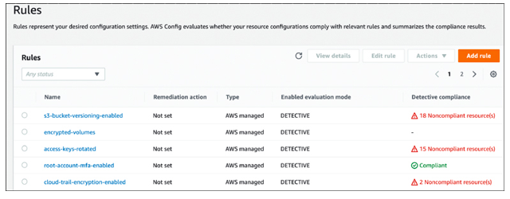

AWS Config
---

- Enables customers to `monitor, audit, and evaluate the deployed configurations` of deployed IaaS resources, including EC2 instances, VPCs and components, IAM permissions, and S3 buckets deployed in a single AWS account or AWS accounts managed by an AWS organization.
- Provides `detailed records of resource inventory, configuration history, and changes`.
- Configuration data collected by AWS Config is `stored in Amazon S3` buckets and Amazon `DynamoDB`.

# Features of AWS Config:

- Resource inventory
  - Up-to-date inventory of selected AWS resources is recorded on an automated schedule.
- Configuration History
  - Configuration changes to AWS resources are tracked and stored, providing a historical view of changes over time.
- Configuration Compliance
  - Resources can be evaluated against predefined or custom rules, assessing the compliance of deployed AWS infrastructure components.
- Management of Resources
  - Centrally storing AWS resources helps an organization manage compliance and security standards.
- Rules
  - Managed rules created by AWS (see Figure 4-34) and custom rules can be used to evaluate resource configurations against predefined or custom criteria. Organizations can create their own custom AWS Config rules based on specific governance requirements such as security policies, compliance standards, or adhering to best practices. Custom rules are created using the AWS Lambda functions. Resource-specific rules could be created to evaluate the capacity of EC2 instances, the configuration of S3 buckets, or the configuration of a VPC.
- Event Management
  - SNS events can be generated when resource configurations change.

> Fig: AWS Config Managed Rules

