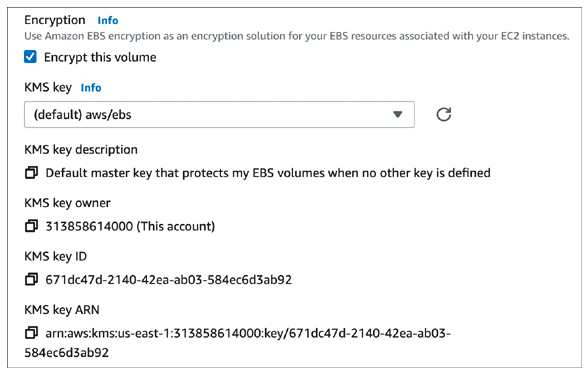
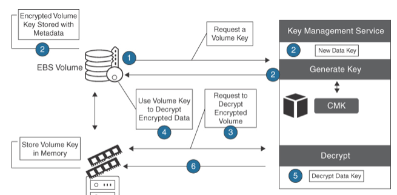

Amazon EBS
---

- Provide `persistent block-level storage volumes for EC2 instances`.
- Used to store a wide variety of data, including operating system files, application data, and database records.
- Automatically `replicated within their AZ` to protect against data loss due to failure, and support a range of performance levels and storage options to meet the needs of different workloads.
- Provides the `option to encrypt EBS volumes` to protect the data records.

# Amazon EBS Security

- EBS Encryption
  - Performed using a `customer master key` and `data key managed by the AWS Key Management Service (KMS)`, which provides a secure and auditable encryption service for managing data encryption at AWS using encryption keys.
  - EBS volumes can be encrypted when first created or after they have been created.
  - EBS also provides the option to `encrypt snapshots` of EBS volumes, enabling you to create encrypted backups of your EBS volumes.
- Both EBS boot and data volumes can be encrypted.
- Most EC2 instances support EBS volumes’ encryption, including the C4, I2, I3, M3, M4, R3, and R4 families. AWS has made the encryption process incredibly easy to deploy; when creating an EBS volume, merely `checking off the option to enable encryption starts the encryption process`, which is managed by AWS Key Management Service (KMS).
- EBS Volume Encryption Process:
  - A CMK can be created by AWS and stored in AWS KMS.
  - Optionally, organizations can choose to specify the key material for the CMK, which can be generated by KMS or imported from your own key management infrastructure.
  - After a CMK has been created, you can create an encrypted EBS volume using the EC2 dashboard and specifying the ID of the CMK when creating the volume.
  - The EBS volume will be encrypted using the specified CMK, and the data on the EBS volume will be encrypted at rest on the underlying storage.
- The default setting for each AWS region is that EBS encryption is not enabled. To enable EBS encryption in the AWS region, open the EC2 dashboard, and in the upper-right corner under Account Attributes click EBS Encryption. Click Manage and choose the desired AWS-managed CMK or another CMK. Next, click Enable and then click Update EBS encryption. Once encryption is enabled for the AWS region, all new EBS volumes and snapshots will be encrypted at creation.

> Fig: EBS KMS Encryption

> Fig: EBS Encryption Steps

