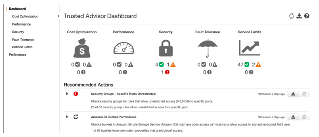

AWS Trusted Advisor
---

- A built-in management service that executes several essential checks against your AWS account resources.
- Every AWS account has access to several core AWS Trusted Advisor checks, and access to the `AWS Personal Health Dashboard`, which alerts you when specific resources you are using at AWS are having issues.
- The following are core AWS Trusted Advisor checks:
  - Security checks include permission checks for EBS and RDS snapshots that are marked public, S3 buckets that have open access, checking for the creation of at least one IAM user, and root accounts that don’t have MFA enabled.
  - AWS Trusted Advisor checks various AWS services and alerts when usage is greater than 80% of the current service quota limits in force, including IAM users, Amazon S3 buckets created, VPCs created, and Auto Scaling groups.
- Can also provide `additional checks` if your organization has purchased `Business or Enterprise support`.
- Full AWS Trusted Advisor checks provide recommendations for improving `performance, security, fault tolerance, and cost-effectiveness`.
- Useful to run against AWS account resources to review current security issues and any flagged service quotas.

> Fig: Trusted Advisor Security Checks

# Trusted Advisor Business and Enterprise Support Features:

- Reserved Amazon EC2 instances
  - Can `calculate the optimized number of partial upfront reserved instances required` based on an analysis of your usage history for the past month.
- AWS ELB load balancers
  - Checks current AWS ELB load balancing usage.
- EBS volume check
  - Warns if AWS EBS volumes in your AWS account are unattached or have low access rates.
- Elastic IP addresses
  - Warns if any Elastic IP addresses assigned to your account have not been associated. (Charges apply if Elastic IP addresses in your account are not used.)
- Amazon RDS instances
  - Checks for idle AWS RDS database instances.
- Route 53 records
  - Checks whether the creation of latency record sets has been properly designed to replicate end-user requests to the best AWS region.
- Reserved reservation expiration check
  - Warns you if your current reserved reservation is scheduled to expire within the next month. (Reserved reservations do not automatically renew.)
  