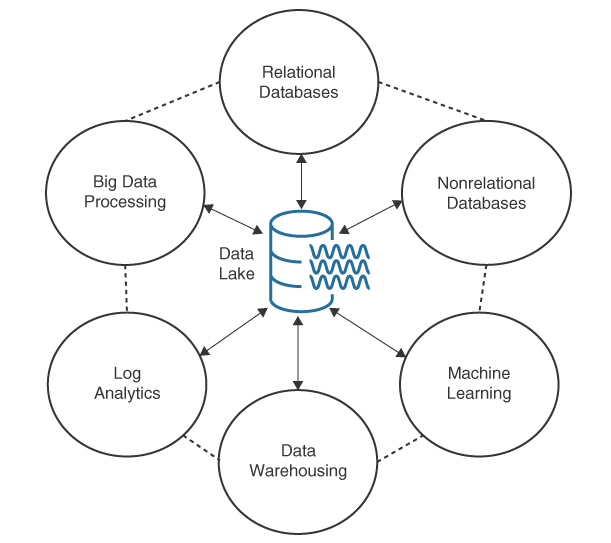
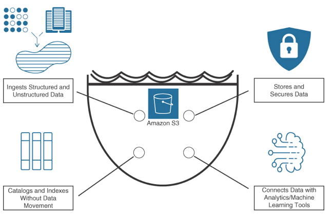
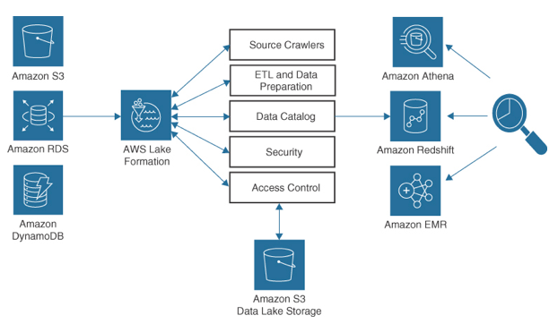

AWS Data Lake
---

- is a `central repository` that enables you to `store all your structured and unstructured data at any scale`.
- Data records stored in a data lake come from a variety of sources, such as transactional databases, log files, sensors, and social media feeds.
- One of the key benefits of a data lake is that it enables organizations to store data in its native format, without the need to transform or structure it upfront.
- Many different types of `analytics can be performed on stored data`, including data visualizations and dashboard views, big data processing, and machine learning.

# Key Features

## Multiple data sources

- Data is collected in real time from multiple sources, including relational databases, business applications, and nonrelational data types such as IoT devices, social media, and mobile applications (see Figure 8-24).

## Catalog

- A centralized catalog presents data lake content built from analyzing, cataloging, and indexing data records in multiple locations.

## Analysis

- Data scientists, developers, and analysts can access the data lake using a variety of analytic tools and frameworks such as Apache Hadoop, Apache Spark, and Presto.

## Machine Learning

- Generate insights on historical data using models that can forecast outcomes.

## Combine customer data

- Retail sales can be compared against incident tickets for additional customer insights.

## Improve operational efficiencies

- Collect and analyze real-time data from connected IoT devices.

> Fig: Corporate Data Sources

# Amazon Redshift Compared to AWS Data Lake

Characteristics | Data Warehouse (Amazon Redshift)  | AWS Data Lake
--  | --  | --
Data types  | Relational data for transactional systems, databases, and LOB applications  | Both relational and nonrelational (social media, mobile apps, websites, IoT devices)
Schema  | Designed before deployment  | Defined when analyzed
Cost and performance  | Fast queries require high IOPS storage  | Fast queries use low-cost storage
Quality of data records | Central source of truth | Curated and noncurated (raw) data
End users | Business analysts | Data scientists, data developers, and business analysts
Analytics | Business intelligence (BI), batch reporting, data visualizations  | Machine learning, predictive analysis

# AWS Lake Formation

- Today’s modern data lake architecture enables customers to integrate an on-premises data lake, a data warehouse, and custom data stores into a unified data lake stored in Amazon S3.
- A data lake provides secure data access utilizing compliance and governance across an organization.
- Deploying AWS Lake Formation, data can be connected from external data silos into a data lake for analytics and machine learning analysis.

- AWS Lake Formation `automates the creation of a secure centralized data lake` that stores all customer data in its original format and is prepared for analysis.
- AWS Lake Formation uses Amazon S3 storage to create the data lake, ensuring unlimited storage and durable storage across multiple AZs.
- AWS Lake Formation does the work of loading selected data from source locations, turning on encryption and key management, and reorganizing data into a columnar format for analysis by various analytical tools.

> Fig: AWS Lake Formation

> Fig: Data Lake Services

# Analytical Tools and Datasets

- After the data lake has been created, administrators can set up access to existing datasets and analytical tools.
- End users access the centralized data catalog that lists the available datasets.
- Each dataset can then be used with a choice of analytics and machine learning services.

## Tools for Analytics, Data Movement, and AWS Data Lake

Category  | Use Case  | AWS Service
--  | --  | --
Analytics | Interactive analytics  Big data, Data warehouse, Operational analysis, Data visualizations, Data preparation  | Amazon Athena, Amazon Kinesis, Amazon EMR, Amazon Redshift, Amazon OpenSearch Services, Amazon Quicksight, AWS Glue DataBrew
Data movement | Real-time data movement | AWS Glue, Amazon Managed Streaming for Apache Kafka (MSK), Amazon Kinesis Data Streams, Amazon Kinesis Data Firehose, Amazon Kinesis Video Streams, Amazon Kinesis
AWS data lake | Object storage, Backup and archive, Data catalog, Third-party data  | Amazon S3, Amazon S3 Glacier, AWS Backup, AWS Glue, AWS Lake Formation, AWS Data Exchange
Predictive analysis and machine learning  | Frameworks ML Service  | AWS Deep Learning AMIs, Amazon SageMaker

