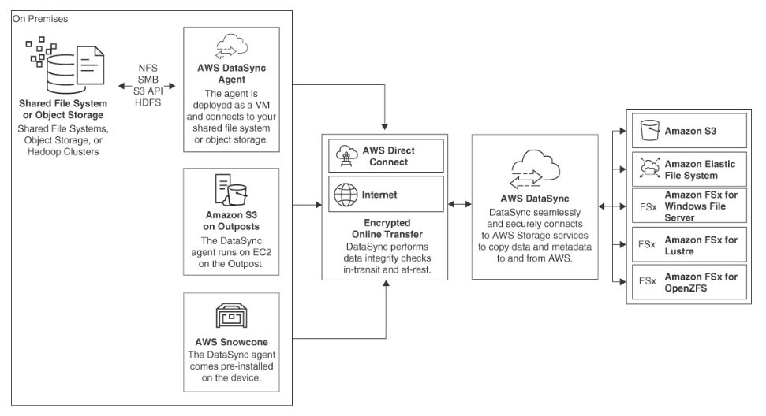

Amazon Static Storage Service (S3)
---

- provides `unlimited storage` in a `logical container called a bucket`.
- provides `read-after-write consistency for PUTS of new objects`
- provides`eventual consistency for PUTS and DELETES`.
  - When an S3 object is overwritten or deleted, it can take some time for the updated version to be reflected when reading the object.
- S3 objects are `replicated to multiple locations`; eventually, all locations will be updated with the new or changed object.
- This replication process is defined as eventual consistency.
- Objects stored in Amazon S3 are also subjected to `continuous integrity checks through checksums`, from the source upload to the final bucket destination.

- Use cases:
  - Data lakes
  - Websites
  - Mobile applications
  - Backups
  - Archived data
  - Big data Analysis

> Fig: Amazon Simple Storage Service

# Amazon S3 Bucket Concepts

## Buckets
  - are the `containers that store S3 objects`.
  - do not have item or size limits.
  - Use the `multipart upload API to upload single objects larger than 5 MIB`; once the upload is complete, the file components are combined into a single object.

## Objects

- consists of the object data (the file itself) and associated `metadata` that describes the stored object, such as date and content type.
- Each object is identified within each S3 bucket by a `unique key name`.

## Keys

- Each object key name `uniquely identifies each object stored in an S3 bucket`.

## Access Levels

- You can define public or private access levels to S3 buckets and objects with AWS Identity and Access Management (`IAM`) users and security policies, bucket policies, and access Control lists (`ACLs`).

## Service Quotas

- `100 Amazon S3 buckets can be created per AWS account`

## Object size limit

- There is no limit to the number of objects stored in a single S3 bucket; however, each individual object `size is limited to 5 TiB`.

## AWS Region

- Before selecting a particular AWS `region for an S3 bucket`, consider factors such as `compliance, latency, and cost of the S3 service` based on bucket/region location.
- As part of the S3 SLA with AWS, objects stored in a specified AWS region never leave the region unless you decide to transfer them to another location.

## S3 Bucket Names

- All names for S3 buckets are Domain Name System (DNS) names stored in Route 53, AWS’s global DNS service.
- S3 bucket names are therefore DNS names and `must be globally unique` across all AWS customers.

## S3 Object Metadata

- You can add additional custom metadata to each object when stored.
- Custom `metadata is not encrypted`.
- Review the mapping for each object with the bucket/key/version of objects.

# S3 Bucket Configuration Options

S3 Feature    |   Details
--            |    --
AWS Region  | The region where the Amazon S3 bucket is created.
S3 bucket policy  | Bucket policies allow or deny requests to IAM users and groups and can grant cross-account access to other AWS accounts. Only the owner of the bucket can associate a bucket policy with an Amazon S3 bucket.
IAM policies  | Create IAM users within your AWS account to grant access to Amazon S3 buckets and objects.
S3 Block Public Access  | Block Public Access settings are enabled at the bucket level. There are three options that can be individually selected: Grant access with IAM identities, Bucket policies, or Buckets in a VPC setting.
S3 Access Points  | Simplify data access for any AWS service or customer application that requires access to shared datasets stored in an S3 bucket. Separate S3 access points can be created and tailored for application access or groups of IAM users. Access points can be configured to restrict access to a specific virtual private cloud (VPC).
Access Control Lists  | ACLs can be used to grant read and write permissions to authorized users, groups, or AWS accounts for individual buckets and objects. AWS recommends that ACLs be disabled and to use the Bucket Owner Enforced setting for S3 object ownership.
Website hosting | An S3 bucket can be configured to host a static website that does not require service-side processing.
Logging | Track access requests to Amazon S3 buckets using Amazon CloudTrail, Amazon S3 Access Logs, AWS CloudWatch S3 metrics, or AWS GuardDuty analysis of S3 data events. Server access logging provides detailed records of requests made to an Amazon S3 bucket, assisting in security and access audits.
SNS notifications | Receive notifications when S3 bucket events (such as GET, PUT, and DELETE) occur.
S3 Versioning | Store multiple versions of the same object within a single Amazon S3 bucket. Versioning must be enabled for many other Amazon S3 features including Lifecycle policies and Bucket replication options.
Lifecycle policies  | Create lifecycle rules for Amazon S3 controlling object retention and movement to other Amazon S3 storage classes to help manage storage costs.
Bucket replication  | Automatically replicate objects to other Amazon S3 buckets hosted in the same region (Same Region Replication) or other Amazon S3 regions (Cross Region Replication) to help with disaster recovery. Replication can also be to another AWS account.
Server-Side Encryption (SSE)  | As of January 5, 2003, all new object uploads to Amazon S3 will be automatically encrypted with Amazon S3 Managed keys (SSE-S3). Other choices are AWS-Key Management Service Keys (SSE-KMS) or SSE with customer provided keys (SSE-C).
Object tagging  | Add up to ten tags to each Amazon S3 object to assist in controlling access with bucket or IAM policies. Tags can be used in lifecycle and replication policies. To ensure that the latest version of an object is always available for reading, S3 provides a mechanism called object tagging, which allows users to specify a version of an object to be the current version. This can be useful in scenarios where read-after-write consistency is required.
Requester pays  | Charge the data transfer costs to the end user that requests the object.
Object lock | Enable write-once/read-many (WORM) policies on objects or buckets to manage compliance requirements. Define a “retain until date” or “legal hold” protection.
S3 Transfer acceleration  | Speed up the transfer of larger Amazon S3 objects over long distances from the end user to the S3 bucket using CloudFront global edge locations and the AWS private network for uploads and downloads.
Multi-Region access point | Define a global endpoint to access data sets stored in Amazon S3 buckets located in multiple AWS regions. Multi-Region access uses the AWS Global Accelerator to select the S3 bucket with the lowest network latency.
AWS PrivateLink for Amazon S3 | AWS PrivateLink for S3 provides private connectivity between Amazon S3 and on-premises locations using interface VPC endpoints for S3 in your VPC to connect your on-premises applications directly to S3 over AWS Direct Connect or AWS VPN.

# Amazon S3 Data Consistency

- Objects stored in an Amazon S3 bucket are replicated many times to at least three other separate physical storage locations (AZs) within the AWS region where your Amazon S3 bucket is located, providing a high level of durability for each stored object.
- After a new object has been written to an Amazon S3 bucket, read requests retrieve the latest version of the object.
- Working with multiple copies of data, replicating updates and deletions takes some time to complete. All S3 objects eventually in all linked storage locations will be the same.

# Amazon S3 Storage Classes

Storage Class | S3 Standard | S3 Intelligent-Tiering  | S3 Standard-IA (Infrequent Access)  | S3 One Zone-IA  | Glacier | Glacier Deep Archive
--  | --  | --  | --  | --  | --  | --
Access frequency  | No restrictions | Automatically moves objects to the Standard-Infrequent Access tier after 30 days  | Infrequent; minimum 30 days | 30 days | 90 days | 180 days
Access speed  | Milliseconds  | Milliseconds  | Milliseconds  | Milliseconds  | Instant Retrieval (milliseconds); Flexible Retrieval (minutes to hours) | Within12 hours
Minimum Number of AZs | 3 | 3 | 3 | 1 | 3 | 3
Retrieval cost  | N/A | N/A | Per GB  | Per GB  | Per GB  | Per GB
Minimum duration (days) | None  | 30  | 30  | 30  | 90  | 180
Availability  | 99.99%  | 99.9% | 99.9% | 99.5% | 99.9% | 99.9%
Minimum object size | N/A | N/A | 128 KB  | 128 KB  | 40 KB | 40 KB

## Amazon S3 Standard

- Designed for `data regularly accessed` by online cloud-hosted applications.
- It is designed for `high performance and durability`, offering `eleven 9s durability` and `four 9s availability`.
- Exact pricing depends on the amount you store and the Amazon S3 bucket’s region.
- There are also `charges for querying and retrieving objects`.
- Amazon S3 Standard supports `SSL for data in transit and data encryption` can be enabled for objects at rest.

## Amazon S3 Intelligent-Tiering

- Rules for intelligent-tiering analyze and `move less frequently accessed objects to lower-cost storage` classes from Amazon S3 Standard to Amazon S3, Amazon S3-IA, One Zone-IA, or Amazon S3 Glacier (Instant Retrieval, Flexible Retrieval, or Deep Archive).
- `optimizes your storage costs by monitoring your access patterns at the object level`, automating cost savings for your stored objects.
- After `30 days of inactivity`, your objects are automatically moved from the Frequent Access tier to the Infrequent Access tier on an object-by-object basis.
- If the infrequently accessed data objects begin to be accessed more frequently, they are `moved back to the Frequent Access tier`.
- might save organizations a great deal of money after deploying one of these use cases:
  - Moving all objects older than `90 days to Amazon S3-IA`
  - Moving all objects after `180 days to Amazon S3 Glacier`
  - Moving all objects over `365 days to Amazon S3 Glacier Deep Archive`

## Amazon S3 Standard-Infrequent-Access (IA)

- Designed for `less frequently accessed data` while maintaining `eleven 9s durability`.
- If you don’t need to access your data frequently and object access is `greater than 30 days`, Amazon S3 Standard-IA is a cheaper option than Amazon S3 Standard.

## Amazon S3 One Zone-IA

- provides `less durability` than Amazon S3 Standard-IA because the `data is stored in a single AZ` instead of across three or more AZs.
- The price point of Amazon S3 Standard-IA is `20% less than Amazon S3-IA`.

## Amazon S3 Glacier

- `Long-term data archival` storage stored in `archives and vaults`.
- You can retrieve it `within minutes`—but you pay `additional fees for expedited access`.
  - `Glacier Instant Retrieval`
    - has a minimum storage requirement of `90 days`.
    - Retrievals are carried out in `milliseconds and are allowed once a month` for objects that might need to be accessed quickly, such as medical images or news media assets.
  - `Glacier Flexible Retrieval`
    - storage has a minimum storage requirement of `90 days`.
    - Retrievals are carried out in `minutes of large archived datasets` such as backup or disaster recovery records, or using free bulk retrievals, which take `5 to 12 hours`.

## S3 Glacier

- `Cheapest` archive option at AWS: just $0.00099 per gigabyte per month with a minimum storage requirement of 180 days.
- Retrieval times are `within 12 hours or less`.
- Organizations can `request faster retrieval times`, but `additional fees` apply.

# Amazon S3 Management

## S3 Batch Operations

- can be used to `perform operations on a large number of objects`, making it an efficient way to manage data in S3.
- It can be particularly useful for scenarios where administrators need to `perform the same operation on a large number of objects`, such as migrating data between S3 buckets or applying data retention policies.

## S3 Object Lock

- Organizations can enforce retention policies based on defined “`retain until`” dates or `legal hold dates`.
- All storage classes can enable S3 Object Lock settings; however, `versioning must also be enabled at the Amazon S3 bucket level` before the Object Lock feature can be enforced.
  - Retention period
    - Specifies a `fixed period of time in which an S3 object remains locked`.
    - During this period, the object is WORM-protected and can’t be overwritten or deleted.
  - Legal Hold
    - Adds S3 Object Lock protection to an Amazon S3 object that remains until it is explicitly removed by an authorized administrator.

## S3 Replication

- This feature provides replication of objects between buckets within the same AWS region or across different AWS regions. Two-way replication between two or more buckets within the same or different AWS region is also supported. Predictable replication times can be accomplished by using Replication Time Control (RTC), which replicates objects in less than 15 minutes.

## Cross-Region Replication (CRR)

- can be used from any AWS region to any other region to any Amazon S3 storage class and across AWS accounts.
- The replication process is carried out by enabling CCR at the source bucket for the entire bucket contents or by a prefix or tag.
- In addition, lifecycle rules control the replication of objects stored in Amazon S3 Standard to other Amazon S3 storage classes on the destination bucket or, optionally, to Amazon S3 Glacier.
- CCR replication is encrypted to maintain data security. The cost for using CRR is calculated based on the copy request and the inter-region data transfer charge for each replicated object.

## Same-Region Replication (SRR)

- This feature allows you to achieve data compliance for storing your data in a separate AWS account within the same region as the original bucket contents. SRR can be used within any AWS region to any Amazon S3 storage class and across AWS accounts. The replication process enables SRR at the source bucket for the entire bucket contents or based on a prefix or tag. Configure lifecycle rules to replicate objects stored in Amazon S3 Standard to other Amazon S3 storage classes on the destination bucket or to Amazon S3 Glacier. To ensure data security, SRR replication is encrypted.

## S3 Storage Lens

- This feature allows you to gain visibility into your Amazon S3 storage usage and activity across your entire AWS organization or AWS account. Amazon S3 Storage Lens provides recommendations to improve your cost efficiency and the data security of your stored objects.

## S3 Inventory

- If you want to find details about your current object inventory in Amazon S3, you can run an inventory process using S3 Inventory. After you select the source bucket for analysis, S3 Inventory creates a flat CSV file based on your query criteria and stores the inventory listing in a specified destination Amazon S3 bucket. The inventory listing encompasses current objects and their associated metadata, including the object’s key name, version ID, encryption and replication status, retention date, storage class, object hold status, and object size. The inventory list file can be encrypted using S3-managed or KMS-managed keys.

## Storage Class Analytics

- Through machine learning processes, your Amazon S3 storage is categorized into groups of less frequently accessed data based on an analysis of retrievals against the stored objects. Analysis can also be performed based on Amazon S3 buckets or object tags.

## Object tags

- Up to ten tags can be added to each Amazon S3 object. The following are some of the actions that can be performed based on the assigned S3 object tag:
  - Searching and filtering: S3 enables users to search for and filter objects based on their tags.
  - Lifecycle management: S3 enables users to define lifecycle policies that automatically transition objects to different storage classes or delete them based on the object’s tags.
  - Access control: S3 enables users to specify access controls on objects based on the object’s tags.
  - Cost optimization: S3 enables users to optimize storage costs by transitioning objects to different storage classes using lifecycle policies that are based on the object’s tags.
  - Auditing and compliance: S3 enables users to use object tags to track and audit data access and usage.

# S3 Bucket Versioning

- Versioning can be `enabled on each Amazon S3 bucket` to further protect your objects from `accidental deletion`.
- As a best practice, versioning could be enabled before any objects are stored in an Amazon S3 bucket to ensure that all objects will be protected from deletion.
- Enabling versioning guarantees the following:
  - New PUT of an existing object is created as a new object with a `new version ID`.
  - The newest version is defined as the `current version`, and the previous versions are retained and `not overwritten`.
  - When you request just the S3 key name of an object, you are presented with the current version of the versioned object.
- After versioning has been enabled, additional `lifecycle management rules for the versioned content can be created`.
- These rules can define a lifecycle expiration policy that dictates the `number of versions that you want to maintain`.
- Lifecycle rules help you manage previous versions of objects by transitioning or expiring specific objects after a defined number of days.

# Multi-Region Access Points

- provide a `global endpoint`, allowing applications to request content from S3 buckets located in multiple AWS regions.
- Multiple AWS regions are selected where the replicated S3 buckets will be served through a global endpoint. 
- Application requests use the `AWS Global Accelerator` service `to route requests across the private AWS global network` to the S3 bucket with the lowest network latency.

# Preselected URLs for S3 Objects

- Preselected URLs `can be shared with others`, enabling them to access the S3 object.

## Methods to generate preselected URLs for objects:

### Query String Authentication

- enables users to generate a `time-limited URL for an object` that `includes a signature` calculated using the user’s AWS secret access key.

### Presigned URLs

- enable users to generate a `time-limited URL` that can be used to access an object or `perform an operation on the object`, such as uploading or downloading it.
- are signed using the user’s AWS access key and secret access key.

### Object URLs

- can be used to access objects stored in S3 using the S3 endpoint and the object’s key.
- Object URLs can be accessed by anyone with the URL, but they do not include any security or access controls.

<h2 style="background-color:lightgreen"># S3 Cheat Sheet</h2>

- An Amazon S3 bucket is a flat container that contains file objects.
- Amazon S3 buckets cannot be nested.
- Amazon S3 buckets are region-specific.
- Amazon S3 bucket names must be unique globally across the AWS cloud, as the S3 namespace is actually a DNS namespace hosted by Route 53.
- Objects stored in Amazon S3 storage can be addressed through a service endpoint, by bucket name, by object name, and by object version.
- There are five methods for controlling access to Amazon - S3 storage
  - Bucket policies
  - IAM policies
  - Access control lists
  - Presigned URLs
  - Query-string authentication.
- An Amazon S3 bucket owner can define cross-account permissions for controlling access from another AWS account.
- Membership in the Authenticated Users group allows S3 bucket access from any AWS account. By default, this group includes all AWS accounts.
- Membership in the All Users group allows anyone outside AWS to access the S3 Bucket. Requests can be signed or unsigned.
- Multipart uploads should be used for objects larger than 5 GB. Uploads occur synchronously and in parallel.
- Amazon S3 Transfer Acceleration uses edge locations to speed up transfers of files over long distances from the end user’s location to the selected S3 bucket.
- An Amazon S3 bucket can be used to host a static website.
- A custom domain name can be used with a Route 53 alias record for an Amazon S3 bucket that is hosting a static website.
- Versioning stores all versions of an object and protects against accidental deletion or overwrites.

