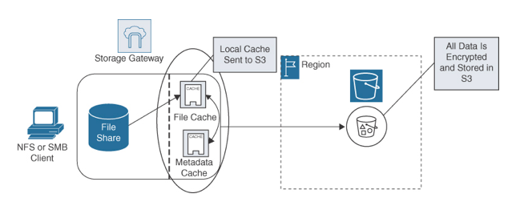

AWS Storage Gateway
---

AWS Storage Gateway is a hybrid storage solution that allows you to integrate your on-premises network with AWS storage and allows your on-premises applications and utilities to seamlessly store data records to Amazon S3, Amazon S3 Glacier, and FSx or Windows Fire Server storage. AWS Storage Gateway can be used for backing up and archiving documents, storage migration, and storing on-premises tiered storage at AWS as a background process. The actual AWS Storage Gateway gateway device can be a hardware device such as a Dell EMC PowerEdge server with Storage Gateway preloaded, or a virtual machine image that can be downloaded and installed in VMware or Hyper-V environments. There are four configuration choices available for deploying AWS Storage Gateway:

- Amazon S3 File Gateway: File Gateway interfaces directly into Amazon S3 storage and allows you to store and retrieve files using either NFS or SMB, as shown in Figure 12-18. Access S3 storage from EC2 instances or from on premises.
- File Gateway—Amazon FSx for Windows File Server: Begin Windows file-based storage migration to AWS for data that is frequently accessed. Supports the SMB protocol.

> Fig: Storage Gateway: File Gateway Architecture

- Volume Gateway: Volume Gateway provides Amazon S3 cloud storage that can be mounted as an on-premises iSCSI device. Data is stored in Amazon S3 with a copy of frequently accessed data cached locally with the iSCSI volumes asynchronously backed up to Amazon S3 using incremental snapshots, as shown in Figure 12-19.

- Tape Gateway: Tape Gateway is a virtual tape drive that supports a wide variety of third-party backup applications and allows you to store and archive virtual tapes in Amazon S3 storage using the iSCSI protocol. Virtual tape backups can also be moved to Amazon S3 Glacier using lifecycle rules.

> File: Storage Gateway: Volume Gateway Architecture

# AWS Storage Gateway Cheat Sheet

AWS Storage Gateway provides hybrid storage between on-premises environments and AWS.
AWS Storage Gateway stores frequently accessed content on premises while storing data securely and durably in S3 storage.
AWS Storage Gateway is useful for on-premises disaster recovery solutions.
AWS Storage Gateway is useful for cloud migrations of data records.
AWS Storage Gateway supports three storage interfaces: File Gateway, Volume Gateway, and Tape Gateway.
AWS File Gateway allows on-premises servers to store content in S3 buckets using NFSv4 or SMB mount points.
AWS File Gateway allows on-premises servers to store content in FSx for Windows File Server.
AWS Volume Gateway Stored mode provides asynchronous replication of on-premises data to Amazon S3.
AWS Volume Gateway Cached mode stores your primary data in Amazon S3; frequently used data is cached locally.
Tape Gateway allows you to use your existing tape software and store backups in Amazon S3 storage.
With AWS Storage Gateway, data transfer is encrypted with SSL/TLS.
With AWS Storage Gateway, data storage is encrypted with server-side encryption keys (SSE-S3).
Storage Gateway pricing includes request, data transfer, and storage charges.

