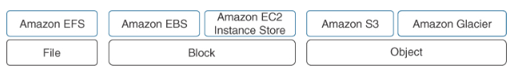

AWS Storage
---

- AWS offers a wide breadth of storage options—for `block, object, and file storage`— that are similar to but not the same as your on-premises storage options.

# AWS Storage Options

> Fig: AWS Storage Options

## Sharable file system for Linux environment using Amazon EFS

- EFS `scales on-demand from gigabytes to petabytes` accessed through using `NFSv4 mount points` from selected VPC/subnets by Amazon Elastic Compute Cloud (EC2) instances, Amazon Elastic Container Service (ECS), Amazon Elastic Kubernetes Services (EKS), or from on-premises servers.

## Object

- Object storage at AWS is the Amazon `Simple Storage Service (S3)`.
- Amazon S3 storage is `accessed and managed through simple API` (application programming interface) calls, such as GET and PUT.
- Each file stored in an S3 bucket is called an object, and each S3 object is identified and accessed by a `unique key`.
- The original design for S3 was for accessing content across the Internet.
- S3 is `scalable, durable, and highly cost-effective` object storage.
- When an object is stored in S3, the `entire object is uploaded`.
- Changes to existing objects result in `updating the entire object`.
- S3 buckets can host a `website’s static content` and media files and static websites that do not require server-side processing.
- S3 provides storage for `big data analytics and machine learning` and EBS snapshots, Amazon CloudWatch logs, and AWS Backup backups.

## Block Storage

- Block storage volumes are provided by Amazon `EBS for Windows, Linux, or macOS` instances.
- Formatted block storage is accessed at the block level by the operating system and applications.
- AWS block storage describes Amazon `EBS volumes`, and ephemeral storage SSD storage volumes that are attached directly to the bare-metal servers that host EC2 instances.
- Amazon `EBS arrays` use solid-state drives (SSDs) or hard disk drives (HDDs), providing persistent block storage only accessible across the private AWS network.
- Enabling direct `public access` to EBS storage volumes is `not possible`.

### Instance Storage

- Direct-attached storage as local storage volumes called ephemeral storage (or instance storage).
- Ephemeral storage is `located on the bare-metal` server that hosts the EC2 instance; therefore, it’s `incredibly fast`.
- However, ephemeral storage has `no long-term durability`; it is temporary storage.
- It `can survive an EC2 instance reboot` but is `deleted when the EC2 instance is powered off or fails`.

## Sharable file system for Windows File Server

- Amazon `FSx for Windows` File Server provides fully managed native Microsoft Windows SSD or HDD storage accessible using Windows file shares.
- Amazon FSx for Windows File Server supports the Server Message Block (`SMB`) protocol.
Note

# Storage Requirements
---

Workload Requirements   |   Storage Solution
--  | --
Operating system support  | AWS supports the Linux, Windows, and macOS operating systems. Linux EC2, Windows, and macOS instances support EBS volumes and Amazon EFS shared storage and also can attach to FSx for Windows File Server shared storage.
File-sharing protocols  | Amazon EFS supports the Network File System (NFSv4) versions 4.0 and 4.1, and Amazon FSx for Windows File Server supports the service message protocol SMB.
Performance requirements  | Shared storage solutions such as EFS and FSx provide baseline performance that can burst or scale up dramatically or be mapped to a defined throughput capacity. EBS General Purpose SSD 2 (gp2) volumes provide 3,000 IOPS and 125 MIB/s of consistent performance. EBS Io2 Block Express volumes offer sub-millisecond latency up to 256,000 IOPS and 4,000 MIB/s throughputs and up to 64 TiB in size for a single volume.
Compliance requirements | Cloud storage solutions at AWS support various levels of compliance. As discussed in Chapter 7, you might need to follow your organization’s compliance requirements, such as PCI DSS, FedRAMP requirements, or internal rules and regulations. Use AWS Artifact in the AWS Management Console to review the currently supported compliance standards.
Capacity requirements | What are your daily, monthly, and yearly storage requirements? EBS volumes have capacity size limits ranging from 1 TiB up to 64 TiB.
Data encryption | What needs to be encrypted for compliance—data records at rest or data in transit across the network? All data storage options can be encrypted using AES 256-bit encryption; Amazon S3 and S3 Glacier storage is encrypted by default.
Concurrent access | Do virtual servers need to access shared storage? Amazon EFS and FSx for Windows File Server provide shared storage services.
Input/output (I/O) requirements | What is a workload’s percentage of reading and writing files? Is it balanced or unbalanced? Provisioned input/output requirements are supported by EBS gp3, io1, and io2 volumes, and Amazon EFS and FSx for Windows File Server throughput modes.
I/O performance requirements  | What input/output performance is required? EBS Block Express volumes offer up to 256,000 IOPS. Amazon EFS and FSx for Windows File Server offer adjustable performance modes.
Number of files | How many files will you be storing in the cloud daily, weekly, or for the long term? Amazon S3 offers unlimited storage. Amazon EFS and FSx for Windows File Server support petabyte storage.
File size per directory | What’s the largest required file size? For example, EFS storage has a maximum file size of 49 TiB. Amazon EBS volumes using the third extended file system (efs3) and 4 KB block size have a maximum 2 TiB file size.
Throughput for on-premises storage  | What are your average data throughput requirements on premises? Are you expecting these or higher levels of performance at AWS? Do your workloads have specific IOPS requirements? Amazon EBS Block Express volumes offer up to 256,000 IOPS. Amazon EFS and FSx for Windows File Server offer burst and adjustable throughput performance levels. Amazon EBS Throughput Optimized HDDs provide a baseline for the performance of 40 MIB per TiB of storage.
Latency | What latency can your workload handle? Test workload latency using EC2 optimized instances with dedicated, high-bandwidth connections to EBS storage, which enables them to fully utilize the I/O capacity of the attached EBS volumes. This can significantly improve the performance of EBS-intensive workloads, such as databases, big data processing, and media processing.

